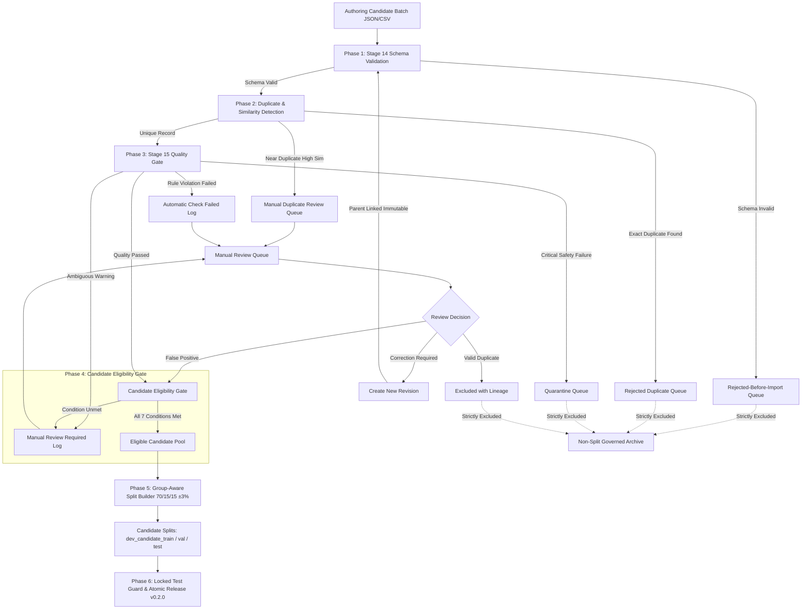
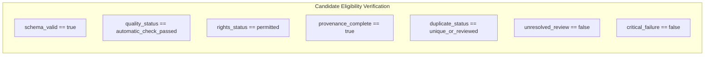

# Stage 20 Implementation Plan: Expand and Balance the Internal English Dataset (Enhanced)

**Project:** AI-Powered Adaptive Child-Friendly Language Simplification System  
**Component:** Component 3 — AI/NLP-Based Language Simplification  
**Scope:** English, Children aged 4–8 (Preschool to Early Elementary)  
**Stage Type:** Internal dataset expansion, balancing, and governed release  
**Reference Document:** Stage 20 Specification (`STAGE_20_EXPAND_AND_BALANCE_INTERNAL_ENGLISH_DATASET.md`)  

---

## 1. Executive Summary & Core Principles

Stage 20 expands the internal English datasets into a balanced, reproducible, and strictly governed corpus for subsequent NLP preprocessing, complexity classification, baseline experiments, and model development.

### Core Principles & Governance Rules
1. **Dynamic Version Derivation**: Release versions are determined dynamically from previous Stage 14/15 manifests. For content expansion without schema breaking changes, the dataset minor version is incremented (e.g., `0.1.0` $\rightarrow$ `0.2.0`), while `schema_version` remains `1.0.0`.
2. **Three Distinct Record Types & Relationships**: Adaptation Activities, Original Educational Items, and Simplification Pairs are explicitly decoupled and linked via foreign keys to prevent double-counting.
3. **Corrected Batch Progression Mathematics**: Expansion proceeds across 5 batches: $80 + 50 + 50 + 50 + 70 = 300$ source items ($900$ simplification pairs) and $120–140$ adaptation activities.
4. **Correction & Re-Entry Lifecycle**: Failed and manual-review records remain immutable in the historical audit log. Corrections generate new revisions with full parent lineage, repeating schema and quality gates.
5. **Candidate Eligibility Gate**: Explicit pre-split gate validating 7 conditions (`schema_valid`, `quality_status`, `rights_status`, `provenance_complete`, `duplicate_status`, `unresolved_review: false`, `critical_failure: false`).
6. **Two Distinct Test Concepts**: Strict separation between the **Adaptation Test Set** (runtime application validation) and the **Simplification Corpus Candidate Test Split** (`development_candidate_test` for model evaluation).
7. **Locked Test Access Guard**: The test manifest contains only IDs and hashes. Data loaders, prompt engineering scripts, and threshold tuners enforce strict programmatic rejection guards with access audit logs.
8. **Group-Aware Splitting Tolerance**: Target ratio of 70/15/15 with a $\pm 3$ percentage point tolerance, where source-group containment strictly takes priority over exact numerical equality.

---

## 2. Record Taxonomy & Explicit Relationships

To eliminate ambiguity and prevent double-counting across the pipeline:

| Record Type | Formal Definition | Primary Key | Key Relationship Fields |
| :--- | :--- | :--- | :--- |
| **Adaptation Activity** | Complete educational task with instructions, expected response, protected answer, and scoring metrics. | `activity_id` (`C3-EN-...`) | `source_item_id`, `simplification_pair_ids` |
| **Original Educational Item** | Source instruction, passage, or sentence requiring simplification. | `source_item_id` (`SRC-EN-...`) | `activity_id`, `derived_pair_ids` |
| **Simplification Pair** | One original item paired with one support-level simplification (Mild, Moderate, Strong). | `pair_id` (`SIMP-EN-...`) | `source_item_id`, `activity_id`, `support_level` |

### Concrete Cross-Reference JSON Schema
```json
{
  "activity_id": "C3-EN-GRA-0101",
  "source_item_id": "SRC-EN-GRA-0101",
  "simplification_pair_ids": [
    "SIMP-EN-000301",
    "SIMP-EN-000302",
    "SIMP-EN-000303"
  ],
  "schema_version": "1.0.0",
  "dataset_version": "0.2.0",
  "language": "en",
  "age_min": 5,
  "age_max": 6,
  "primary_domain": "grammar",
  "content_type": "word_order",
  "source_difficulty": "medium",
  "original_text": "Put the red ball beside the small box.",
  "protected_meaning_units": ["red ball", "beside", "small box"],
  "expected_response_mode": "action",
  "source_type": "team_authored",
  "validation_status": "draft",
  "research_eligible": false,
  "approved_for_child_delivery": false,
  "requires_expert_review": true
}
```

---

## 3. Controlled Batch Progression & Mathematics

Expansion is organized into 5 discrete, gated batches that separate source items from complete activities:

| Batch | Source Items | Simplification Pairs | Adaptation Activities | Lexicon Entries | Batch Purpose / Focus |
| :--- | :---: | :---: | :---: | :---: | :--- |
| **Pilot** | 80 | 240 | 40 | 60 | Initial multi-domain gate across Vocab, Grammar, Comp, Instruction |
| **Batch 2** | 50 | 150 | 20 | 60 | Age 4–5 foundational vocabulary and simple grammar |
| **Batch 3** | 50 | 150 | 20 | 60 | Age 6–7 multi-step instruction-following and grammar ordering |
| **Batch 4** | 50 | 150 | 20 | 60 | Age 7–8 short passage comprehension and complex syntax |
| **Batch 5** | 70 | 210 | 20–40 | 110+ | Targeted gap-filling across underrepresented domain/difficulty slices |
| **TOTAL** | **300** | **900** | **120–140** | **350+** | **Fully balanced and governed Stage 20 release foundation** |

$$\text{Total Source Items} = 80 + 50 + 50 + 50 + 70 = 300$$
$$\text{Total Simplification Pairs} = 300 \times 3 = 900$$

Every batch must receive:
1. Stage 14 schema validation
2. Multi-strategy duplicate detection
3. Stage 15 quality validation
4. Balance and coverage analysis
5. Mutually exclusive accounting
6. Dedicated batch manifest

---

## 4. Multi-Level Mutually Exclusive Accounting

Accounting is strictly separated into three non-overlapping tiers to prevent double-counting:

### Tier 1: Authoring Accounting
$$\text{Submitted Records} = \text{Accepted for Import} + \text{Rejected Before Import} + \text{Pre-Import Manual Review}$$

### Tier 2: Validation Accounting
$$\text{Imported Records} = \text{Automatic Pass} + \text{Automatic Fail} + \text{Manual Review Required} + \text{Quarantined}$$

### Tier 3: Release & Split Accounting
$$\text{Candidate Records} = \text{Included in Provisional Split} + \text{Excluded from Provisional Split}$$

Where:
- $\text{Candidate Records} = \text{Automatic Pass (Schema Valid} \land \text{Quality Pass} \land \text{No Duplicates} \land \text{Rights Recorded)}$
- $\text{Excluded Records} = \text{Automatic Fail} + \text{Manual Review Required} + \text{Quarantined} + \text{Unresolved Duplicates}$
- $\text{Provisional Split Total} = \text{dev\_candidate\_train} + \text{dev\_candidate\_validation} + \text{dev\_candidate\_test}$

$$\text{Unaccounted Records} \equiv 0$$

---

## 5. End-to-End Data Pipeline & Correction Re-Entry Lifecycle



### Correction & Revision Invariants
1. **Original Record Immutability**: The initial failed or flagged record remains permanently preserved in the historical triage database.
2. **Revision Lineage Tracking**: Corrected records must be authored as a new revision:
   - `revision_id`: `REV-002`
   - `parent_record_id`: ID of the original record
   - `authoring_method`: `human_authored` or `human_authored_with_ai_assistance`
   - `human_edited`: `true`
3. **Re-Entry Verification**: New revisions re-enter at Phase 1 (Schema Validation) and must pass all subsequent duplicate and quality checks.

---

## 6. Pre-Split Candidate Eligibility Gate

Passing automated quality checks alone does not automatically grant split eligibility. Records must pass an explicit 7-point validation check:



### Invariant Governance Status:
```json
{
  "validation_status": "draft",
  "research_eligible": false,
  "approved_for_child_delivery": false,
  "requires_expert_review": true
}
```
*(Records may enter `development_candidate_*` splits for internal model development while remaining unapproved drafts).*

---

## 7. Group-Aware Splitting & Tolerance Policy

### Splitting Targets & Tolerances
- **Target Ratio**: 70% Train / 15% Validation / 15% Test
- **Accepted Numerical Tolerance**: $\pm 3$ percentage points:
  - `development_candidate_train`: 67% – 73%
  - `development_candidate_validation`: 12% – 18%
  - `development_candidate_test`: 12% – 18%
- **Core Priority Principle**: **Source-group containment strictly takes priority over exact numerical split percentages.** Under no circumstances may an original item and its simplified variants be separated across splits to achieve exact ratios.

### Multidimensional Split Balance Checks
The split generator also validates balance across:
- **Domain Distribution** (Vocabulary, Grammar, Comprehension, Instruction-Following)
- **Age Bands** (4, 5, 6, 7, 8)
- **Source Difficulty Tiers** (Easy, Medium, Hard)

---

## 8. Two Distinct Test Concepts & Locked-Test Access Guards

### 1. Adaptation Test Set (40 Activities)
- **Primary Purpose**: Evaluates application runtime behavior, dynamic task adaptation, child-safe view rendering, answer protection, and Component 1/2/4 integration fixtures.
- **Isolation Constraint**: Must **never** enter model-training splits (`development_candidate_train`).

### 2. Simplification Corpus Candidate Test Split (`development_candidate_test`)
- **Primary Purpose**: Used in later stages to benchmark and compare simplification approaches (rule engine, generic LLM, fine-tuned NLP models, personalized adapters).
- **Isolation Constraint**: Locked at release creation time with seed `42`.

### Locked Test Set Manifest Specification
Stored at: `data/simplification_corpus/releases/0.2.0/splits/locked_test_manifest.json`

**Contents Restricted To**:
- `record_id`
- `source_group_id`
- `content_hash` (SHA-256)
- `split_version`
- `creation_seed`
- `creation_timestamp`
- `dataset_version`

> [!IMPORTANT]
> The locked test manifest **must never contain** raw test sentences, simplified references, protected answers, or expected outputs. Documentation references the file without embedding test data.

### Programmatic Access Guards
1. **Training Data Loaders**: Must check input batch IDs against `locked_test_manifest.json` and throw a runtime exception if any test ID is present.
2. **Prompt-Development Scripts**: Must reject test IDs to prevent prompt over-fitting.
3. **Threshold-Tuning Scripts**: Must reject test IDs to prevent hyperparameter leakage.
4. **Audit Logging**: Any programmatic access attempt generates a timestamped entry in `docs/stage20_test_access_audit.log`.
5. **Authorized Unlocking**: Test data evaluation can only execute with a documented evaluation run ID (`--eval-run-id`).

---

## 9. Protected Meaning Units & Multidimensional Monotonicity

### Meaning Preservation Invariant
> **Invariant**: All annotated protected meaning units (entities, objects, colours, quantities, negation polarity, action order, spatial/temporal relationships) must be preserved across all support tiers.  
> **Rule**: If preservation cannot be confirmed automatically, the record is assigned `manual_review_required`.

### Multidimensional Monotonicity Evaluation
1. **Lexical Difficulty**: $\text{Strong} \le \text{Moderate} \le \text{Mild}$ (vocabulary age-of-acquisition, syllable length).
2. **Syntactic Complexity**: $\text{Strong} \le \text{Moderate} \le \text{Mild}$ (parse tree depth, subordinate clauses).
3. **Instruction Step Clarity**: $\text{Strong} \ge \text{Moderate} \ge \text{Mild}$ (explicit numbering, atomic step segmentation).
4. *Structural length increases (e.g. from numbered steps or child-friendly explanations) produce `manual_review_required` rather than immediate failure if meaning and safety remain preserved.*

---

## 10. Complete Embedding Reproducibility Metadata

All advisory sentence embedding similarity parameters are recorded in `docs/stage20_reproducibility_evidence.json`:

```json
{
  "embedding_library": "sentence-transformers",
  "embedding_library_version": "3.0.1",
  "model_name": "sentence-transformers/all-MiniLM-L6-v2",
  "model_revision": "fa979f7764422d64a50d27ae85e50529e843666b",
  "model_artifact_hash": "e4ce9877abf616632f65a6b674041d4711fc0698",
  "device": "cpu",
  "normalization": "l2_norm",
  "threshold": 0.92,
  "threshold_role": "advisory",
  "seed": 42
}
```

---

## 11. Record Lineage & Provenance Metadata

Every authored record includes provenance metadata:

```json
{
  "provenance": {
    "authoring_method": "human_authored_with_ai_assistance",
    "created_by": "research_team_author_01",
    "created_at": "2026-09-27T10:00:00Z",
    "source_record_id": "SRC-EN-GRA-0101",
    "parent_record_id": null,
    "generation_model": "gemini-1.5-flash",
    "prompt_template_version": "v1.2.0",
    "human_edited": true,
    "rights_status": "internal_team_owned",
    "source_reference": "Stage 20 Pilot Batch 01",
    "batch_id": "STAGE20-BATCH-PILOT",
    "revision_id": "REV-001"
  }
}
```

### Permitted Values for `authoring_method`
- `human_authored`: Written 100% by human authors with no generative AI.
- `human_authored_with_ai_assistance`: Generated with AI assistance and reviewed/edited by a team member.
- `rule_generated`: Produced deterministically by rule templates.
- `llm_generated_draft`: Raw LLM generation awaiting human review.
- `derived_from_internal_source`: Transformed from existing Stage 14 internal datasets.

---

## 12. Balancing Tolerances & Minimum Coverage Floors

| Balance Dimension | Target Distribution | Acceptable Provisional Range | Minimum Coverage Floor |
| :--- | :---: | :---: | :--- |
| **Vocabulary Domain** | 25% | 20% – 30% | $\ge 75$ original items / $\ge 225$ pairs |
| **Grammar Domain** | 25% | 20% – 30% | $\ge 75$ original items / $\ge 225$ pairs |
| **Comprehension Domain** | 25% | 20% – 30% | $\ge 75$ original items / $\ge 225$ pairs |
| **Instruction-Following Domain** | 25% | 20% – 30% | $\ge 75$ original items / $\ge 225$ pairs |
| **Age 4** | 20% | 15% – 25% | $\ge 50$ items |
| **Age 5** | 20% | 15% – 25% | $\ge 50$ items |
| **Age 6** | 20% | 15% – 25% | $\ge 50$ items |
| **Age 7** | 20% | 15% – 25% | $\ge 50$ items |
| **Age 8** | 20% | 15% – 25% | $\ge 50$ items |
| **Difficulty: Easy** | 33% | 25% – 40% | $\ge 80$ items |
| **Difficulty: Medium** | 34% | 25% – 40% | $\ge 80$ items |
| **Difficulty: Hard** | 33% | 25% – 40% | $\ge 80$ items |
| **Support: Mild** | 33.3% | 33.3% (Exact) | 1 per original item |
| **Support: Moderate** | 33.3% | 33.3% (Exact) | 1 per original item |
| **Support: Strong** | 33.3% | 33.3% (Exact) | 1 per original item |

---

## 13. Acceptance Gate Criteria for Pilot Batch (Phase 4 Gate)

To unlock expansion batches 2–5, the Pilot Batch must achieve:
- [x] **100% Schema-valid** records under Stage 14 schemas.
- [x] **Zero protected-answer leakage** in instructions or student-facing text.
- [x] **Zero privacy violations** or personal identifiers.
- [x] **Zero unaccounted records** ($\text{Submitted} = \text{Imported} + \text{Rejected}$).
- [x] **Zero unresolved exact duplicates**.
- [x] **Zero train/test split leakage**.
- [x] **100% preservation** of failed/review records in triage queues.
- [x] **Multidimensional support monotonicity** verified across all 80 trios.
- [x] **$\ge 85\%$ automatic-pass rate** (or formal documented justification).
- [x] Systematic failure patterns reviewed and documented in guidelines before Batch 2.

---

## 14. CLI Tools, Dry-Run Support & Atomic Releases

All pipeline scripts under `scripts/stage20/` support standard execution flags:

```powershell
python scripts/stage20/build_stage20_release.py `
    --input-path data/dataset_expansion/stage20/authoring_batches/ `
    --batch-id STAGE20-BATCH-01 `
    --output-version 0.2.0 `
    --seed 42 `
    --dry-run `
    --no-write
```

### Atomic Release Construction Process
1. Build release assets in sandbox staging folder: `data/_staging_release_v0.2.0/`.
2. Compute file counts, row accounting, and SHA-256 hashes.
3. Validate invariants (zero unaccounted rows, no test leakage, checksum verification).
4. If validation fails: Delete staging folder and leave existing release directories untouched.
5. If validation passes: Atomically publish to `data/simplification_corpus/releases/0.2.0/` and write manifest.

---

## 15. Comprehensive Automated Test Suite (18 Test Modules)

The testing suite under `backend/tests/datasets/expansion/` covers:

1. `test_inventory.py`: Manifest-derived inventory parsing and schema conformance.
2. `test_gap_analysis.py`: Gap matrix calculation and underrepresented slice detection.
3. `test_target_planner.py`: Mathematical calculation of expansion targets ($80+50+50+50+70=300$).
4. `test_authoring_validator.py`: Pydantic authoring schema validation and invariant defaults.
5. `test_record_lineage.py`: Provenance metadata verification and AI-assisted label checking.
6. `test_duplicate_detector.py`: Normalized exact match, character Levenshtein, token Jaccard, and MinHash clustering.
7. `test_meaning_preservation.py`: Entity, quantity, colour, and negation preservation across support tiers.
8. `test_support_monotonicity.py`: Multidimensional lexical, syntactic, and structural clarity checks.
9. `test_leakage_detector.py`: Source-group split containment and Adaptation Test Set isolation.
10. `test_split_builder.py`: Deterministic seed reproduction and 70/15/15 ($\pm 3\%$) group-aware splitting.
11. `test_split_eligibility.py`: 7-condition candidate eligibility check and strict exclusion of failed/unresolved records.
12. `test_locked_test_set.py`: Immutability, content restrictions, and programmatic access rejection guards.
13. `test_balance_analyzer.py`: Distribution calculations and tolerance verification (20%–30% per domain).
14. `test_accounting_reconciliation.py`: Mutually exclusive 3-tier accounting verification.
15. `test_version_calculator.py`: Dynamic version derivation logic from previous manifests.
16. `test_atomic_release.py`: Staging build, rollback on failure, and old release byte-level immutability.
17. `test_batch_idempotency.py`: Verification that re-running batches produces identical deterministic results.
18. `test_stage20_end_to_end.py`: Full end-to-end integration test from authoring batch to verified release.

---

## 16. Path-Safe Execution Commands

All verification commands must execute using path-safe PowerShell cmdlets:

```powershell
# Run Stage 20 Dataset Expansion Tests
Push-Location backend
python -m pytest tests/datasets/expansion/ -v
Pop-Location

# Run All Dataset Tests
Push-Location backend
python -m pytest tests/datasets/ -v
Pop-Location

# Run Full Backend Test Suite
Push-Location backend
python -m pytest tests/ -v
Pop-Location

# Run Frontend Production Build
Push-Location frontend
npm run build
Pop-Location
```

---

## 17. 16-Point Manual Verification Checklist

1. [ ] Confirm inventory counts match the latest governed Stage 14/15 manifests.
2. [ ] Confirm the gap matrix identifies underrepresented domain, age, and difficulty groups.
3. [ ] Confirm every record contains full lineage and provenance metadata.
4. [ ] Confirm Vocabulary, Grammar, Comprehension, and Instruction-Following domains are represented within 20%–30%.
5. [ ] Confirm age bands 4, 5, 6, 7, and 8 meet minimum coverage floors.
6. [ ] Confirm Mild, Moderate, and Strong support tiers remain grouped with their parent item.
7. [ ] Confirm entities, quantities, negation, and protected meaning units remain intact.
8. [ ] Confirm protected answers are completely absent from child-safe views.
9. [ ] Confirm an intentional exact duplicate is flagged and rejected.
10. [ ] Confirm an intentional near-duplicate generates a review cluster.
11. [ ] Confirm an original item and its variants cannot cross dataset splits.
12. [ ] Confirm the Adaptation Test Set remains 100% isolated from candidate training data.
13. [ ] Confirm failed, quarantined, and review records are excluded from candidate splits.
14. [ ] Confirm automatic passes remain unapproved drafts (`approved_for_child_delivery: false`).
15. [ ] Confirm earlier releases (`v0.1.0`) remain byte-for-byte unchanged.
16. [ ] Confirm release manifests and SHA-256 hashes verify with 100% integrity.
