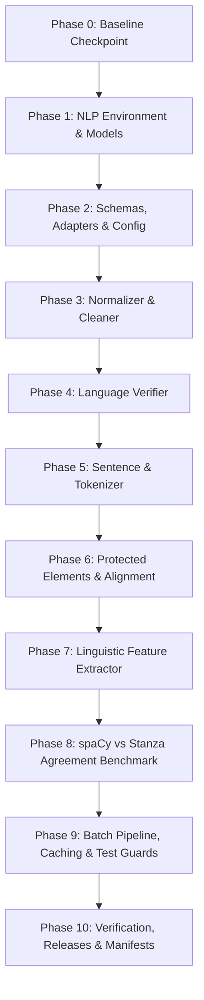

# Stage 21 Implementation Plan — Finalize the English NLP Preprocessing Pipeline

**Project:** AI-Powered Adaptive Child-Friendly Language Simplification System  
**Component:** Component 3 — AI/NLP-Based Language Simplification  
**Scope:** English, children aged 4–8  
**Prerequisites:** Stage 20 formally completed, reconciled, and sealed (`v0.2.0`, commit `c17542e`)  
**Stage type:** Deterministic NLP preprocessing, linguistic feature extraction, and governed feature release  
**External datasets:** Strictly excluded in this stage (ASSET / TurkCorpus reserved for benchmark stages)  

---

## 1. Executive Summary & Objective

Stage 21 constructs a deterministic, reproducible, and traceable **English NLP Preprocessing Pipeline** that transforms governed educational text (from Stage 20 release `v0.2.0`) into rich, versioned linguistic feature representations. These representations serve as the foundational input for downstream complexity classification (Stage 22) and adaptive simplification algorithms (Stage 23+).

```text
               Governed Raw English Text (v0.2.0)
                               ↓
         Dataset-Specific Adapters (Source, Pair, Act, Lex)
                               ↓
          TextInstance Extraction & Deduplication
                               ↓
                 Strict Schema Validation (Pydantic v2)
                               ↓
                 Unicode Normalization (NFC Default)
                               ↓
                 Conservative Text Cleaning
                               ↓
         Language Verification (fastText / Pinned Heuristic)
                               ↓
              Sentence Segmentation & Tokenization
                               ↓
                 Lemmatization & POS Tagging
                               ↓
                     Dependency Parsing
                               ↓
          Protected-Element Extraction & Alignment
                               ↓
             Raw Linguistic Feature Extraction
                               ↓
     Versioned Feature Release (source-0.2.0/pipeline-1.0.0)
```

> [!IMPORTANT]
> **Boundary Constraint:** Stage 21 extracts observable linguistic and syntactic features. It **must not** assign final difficulty levels, generate complexity predictions, or perform text simplification / rewriting.

---

## 2. Technology Stack & Decision Paths

| Component | Primary Engine | Fallback / Comparison Engine | Selection Justification |
|---|---|---|---|
| **English Language Verification** | Pinned offline fastText language identification model | Deterministic Latin-character & English function-word heuristic | Primary provides fast statistical language verification; deterministic heuristic ensures offline fallback; mixed or $<0.80$ routed to manual review |
| **Sentence Segmentation** | spaCy (`en_core_web_sm`) | Rule-based sentence splitter | Robust handling of abbreviations, punctuation, and multi-line instruction steps |
| **Tokenization & Lemmatization** | spaCy (`en_core_web_sm`) | Normalized surface form / regex tokenizer | Provides deterministic token boundaries, lemmas, POS tags and dependency annotations for English text |
| **POS Tagging & Dependency Parsing** | spaCy (`en_core_web_sm`) | Stanza English package (`en`) | Fast CPU inference; Stanza provides controlled developmental benchmark agreement |
| **Protected-Element Alignment** | Custom rule-based extractor + spaCy matcher | Exact substring matcher | Authoritative precedence given to human-annotated protected meaning units |
| **Data Models & Validation** | Pydantic v2 (Mandatory) | No silent dataclass fallback | Strict validation with `extra='forbid'`, explicit validation errors |
| **Caching Engine** | Content-hash deterministic cache | Local JSON file cache | Avoids redundant re-processing; invalidates on config, pipeline, model, or lexicon change |

---

## 3. Data Contracts & Preprocessing Units

### 3.1 Common `TextInstance` Contract
To avoid conflating original text with instructions, prompts, definitions, or examples, all raw text records are extracted via dataset-specific adapters into canonical `TextInstance` units prior to preprocessing:

```python
from typing import Literal, List, Dict, Any, Optional
from pydantic import BaseModel, ConfigDict, Field

DatasetSplit = Literal[
    "development_candidate_train",
    "development_candidate_validation",
    "development_candidate_test",
    "adaptation_test",
    "legacy_excluded",
    "unassigned",
]

class TextInstance(BaseModel):
    model_config = ConfigDict(extra="forbid")
    
    text_instance_id: str
    parent_record_id: str
    parent_record_type: Literal[
        "source_item",
        "simplification_pair",
        "adaptation_activity",
        "lexicon_entry",
    ]
    text_role: Literal[
        "source_text",
        "simplified_text",
        "activity_instruction",
        "activity_prompt",
        "lexicon_definition",
        "lexicon_example",
    ]
    text: str
    language: Literal["en"] = "en"
    source_group_id: Optional[str] = None
    dataset_split: DatasetSplit
    protected_meaning_units: List[str] = Field(default_factory=list)
    protected_answer_ref: Optional[str] = None
    protected_answer_hash: Optional[str] = None
    provenance: Dict[str, Any]
```

### 3.2 Dataset-Specific Adapters
1. **`SourceItemAdapter`**: Extracts `original_text` with role `source_text`.
2. **`SimplificationPairAdapter`**: Extracts both `original_text` (role `source_text`) and `simplified_text` (role `simplified_text`), preserving parent `pair_id` and `source_group_id`.
3. **`AdaptationActivityAdapter`**: Extracts `original_instruction` (role `activity_instruction`) and `child_friendly_instruction` (role `activity_prompt`).
4. **`LexiconEntryAdapter`**: Extracts `child_definition` (role `lexicon_definition`) and `example_sentence` (role `lexicon_example`).

### 3.3 Text-Level Deduplication & Many-to-Many Relational Mappings
To eliminate redundant computational overhead when identical text strings appear across multiple parent records:
- **Deduplication Key:** `text_hash = SHA256(normalized_text)`.
- **Many-to-Many Mapping Registry:** Parent-to-text associations are preserved in a relational mapping table where one parent record can point to multiple `TextInstance` records, and identical text instances can be referenced by multiple parent records.
- **Deduplication Accounting:** Preprocessing reports:
  - `raw_text_instance_count`: Total text instances extracted from parent records.
  - `unique_normalized_text_count`: Unique text instances processed by the NLP pipeline.
  - `duplicate_text_instance_count`: Repeated text instances resolved via cache/mapping.
  - `parent_text_mapping_count`: Total verified parent-to-text associations preserved.

---

## 4. Protected Answer Boundary & Multi-Tier Hashing

### 4.1 Protected Answer Invariant
- Raw answer text is **never** stored in preprocessing records or emitted in feature releases.
- Preprocessing models store strictly:
  - `protected_answer_ref: Optional[str] = None`
  - `protected_answer_hash: Optional[str] = None`
- Answer text is accessible only through restricted evaluation fixtures and is never exposed to public logs, language verifiers, or child APIs.

### 4.2 Multi-Tier Content & Cache Hashing
To guarantee reproducible caching and determinism:
1. **`text_hash`**: `SHA256(normalized_text)`
2. **`feature_hash`**: `SHA256(canonical linguistic feature serialization)` (excluding timestamps)
3. **`record_hash`**: `SHA256(feature_hash + parent_record_id + text_role + dataset_split + pipeline_version)`
4. **`processing_cache_key`**:
   $$\text{SHA256}(\text{normalized\_text} + \text{language} + \text{pipeline\_version} + \text{config\_hash} + \text{spacy\_model\_hash} + \text{lexicon\_version})$$

---

## 5. Unicode Normalization & Cleaning Policy

### 5.1 Normalization Policy
- **Default Stored Normalization:** **NFC** (Canonical Decomposition followed by Canonical Composition).
- **NFKC Policy:** NFKC is reserved for diagnostic comparisons only and is **disabled by default** to protect mathematical symbols, ordinal indicators, formatting distinctions, and AR identifiers.
- **Prohibited Silent Alterations:**
  - Numbers and quantities (e.g., `4`, `four`, `7`);
  - Negation markers (`not`, `never`, `no`, `without`, `except`, `otherwise`, `if not`);
  - Proper nouns, colors, animal terms, and educational target vocabulary;
  - Multi-step numbering and sequencing (`1.`, `2.`, `First`, `Then`).

### 5.2 Character-Offset Traceability Invariant
- For every token $T$ and sentence $S$:
  $$\text{normalized\_text}[S.\text{normalized\_start\_char} : S.\text{normalized\_end\_char}] \equiv S.\text{text}$$
  $$\text{normalized\_text}[T.\text{normalized\_start\_char} : T.\text{normalized\_end\_char}] \equiv T.\text{text}$$
- An original-to-normalized offset map is generated whenever normalization alters character length.

---

## 6. Language Verification Decision Model

```python
class LanguageVerificationRecord(BaseModel):
    model_config = ConfigDict(extra="forbid")
    
    verification_engine: Literal["fasttext", "deterministic_heuristic"]
    model_version: str
    confidence: float
    decision: Literal["verified", "manual_review_required", "rejected"]
    fallback_reason: Optional[str] = None
```

- **Primary:** Pinned offline fastText language identification model (`lid.176.ftz` / `lid.176.bin`).
- **Fallback:** Deterministic Latin-character ratio & English function-word heuristic.
- **Decision Path:**
  - Confidence $\ge 0.80$ & English $\to$ `verified`
  - Confidence $< 0.80$, mixed-language, or fallback degraded $\to$ `manual_review_required`

---

## 7. Token, Sentence & Linguistic Feature Schemas

```python
class TokenRecord(BaseModel):
    model_config = ConfigDict(extra="forbid")
    
    index: int
    text: str
    lemma: str
    pos: str
    tag: str
    dependency: str
    head_index: int
    is_stop: bool
    is_punct: bool
    is_num: bool
    syllable_count: int
    original_start_char: int
    original_end_char: int
    normalized_start_char: int
    normalized_end_char: int

class SentenceRecord(BaseModel):
    model_config = ConfigDict(extra="forbid")
    
    sentence_id: str
    sentence_index: int
    text: str
    original_start_char: int
    original_end_char: int
    normalized_start_char: int
    normalized_end_char: int
    tokens: List[TokenRecord]

class SurfaceFeatures(BaseModel):
    char_count: int
    token_count: int
    word_count: int
    sentence_count: int
    punct_count: int
    avg_word_length: float
    avg_sentence_length: float
    unique_token_count: int
    type_token_ratio: float
    syllable_count: int
    avg_syllables_per_word: float
    long_word_count: int  # Words >= 7 characters

class LexicalFeatures(BaseModel):
    content_word_count: int
    function_word_count: int
    noun_count: int
    verb_count: int
    adj_count: int
    adv_count: int
    pronoun_count: int
    prep_count: int
    finite_verb_count: int
    auxiliary_verb_count: int
    out_of_lexicon_count: int
    internal_lexicon_tier_counts: Dict[str, int]
    internal_lexicon_matches: List[str]
    difficult_candidate_words: List[str]

class SyntacticFeatures(BaseModel):
    max_dependency_depth: int
    avg_dependency_depth: float
    clause_count: int
    subordinate_conjunction_count: int
    passive_voice_detected: bool
    coordination_count: int
    avg_noun_phrase_length: float
    svo_triplets_available: bool
    root_count: int
    parse_failure_count: int
    fragment_detected: bool
    imperative_detected: bool

class ProtectedMeaningFeatures(BaseModel):
    negation_markers: List[str]
    quantity_numbers: List[str]
    named_entities: List[Dict[str, str]]
    spatial_prepositions: List[str]
    temporal_connectives: List[str]
    action_verbs: List[str]
    aligned_protected_units: List[Dict[str, Any]]

class LinguisticFeatureSet(BaseModel):
    surface: SurfaceFeatures
    lexical: LexicalFeatures
    syntactic: SyntacticFeatures
    protected_elements: ProtectedMeaningFeatures

class PreprocessedRecord(BaseModel):
    model_config = ConfigDict(extra="forbid")
    
    text_instance_id: str
    parent_record_id: str
    parent_record_type: str
    text_role: str
    source_dataset_version: str = "0.2.0"
    pipeline_version: str = "1.0.0"
    schema_version: str = "1.0.0"
    language: str = "en"
    dataset_split: DatasetSplit
    source_group_id: Optional[str] = None
    original_text: str
    normalized_text: str
    language_verification: LanguageVerificationRecord
    sentences: List[SentenceRecord]
    features: LinguisticFeatureSet
    processing_status: Literal["success", "fallback_success", "manual_review_required", "failed", "skipped_locked_test"]
    text_hash: str
    feature_hash: str
    record_hash: str
```

---

## 8. Dual Execution Modes & Locked-Test Anti-Leakage Guard

### 8.1 Mode A: Stage 21 Development Release (Default)
- **Target:** `development_candidate_train`, `development_candidate_validation`, and permitted adaptation test fixtures.
- **Anti-Leakage Invariant:** Development loaders strictly **reject and skip** any record belonging to `development_candidate_test`.
- **Status:** Automatically marked `processing_status = "skipped_locked_test"` with 0 test text exposed.

### 8.2 Mode B: Authorized Final Verification Run
- **Execution Requirement:** Must be explicitly triggered via command line with authorized run ID:
  ```powershell
  python scripts/stage21/preprocess_stage20_corpus.py --mode final-verification --evaluation-run-id EVAL-FINAL-01 --allow-locked-test
  ```
- **Auditing & Output:** Writes exclusively to `protected_test/` under cryptographic run audit. Test results are never surfaced in development logs or used to tune heuristics. Stage 21 closeout requires only Run A.

---

## 9. Safe Feature-Release Directory Structure

```text
data/preprocessed_features/en/
└── source-0.2.0/
    └── pipeline-1.0.0/
        ├── train/
        │   └── preprocessed_train_features.json
        ├── validation/
        │   └── preprocessed_val_features.json
        ├── protected_test/
        │   ├── preprocessed_test_features.json
        │   └── locked_test_manifest.json
        ├── mappings/
        │   └── parent_to_text_mappings.json
        ├── manifests/
        │   ├── run_manifest.json
        │   └── stage21_manifest.sha256
        └── reports/
            ├── preprocessing_summary.csv
            └── accounting_reconciliation.csv
```

---

## 10. Controlled spaCy vs Stanza Stratified Comparison

Evaluates **inter-parser agreement** across a governed 50-record development sample drawn from `development_candidate_train` and `development_candidate_validation` (Seed: `2026`):

### Stratification Matrix (50 Records):
- **Domains:** 13 Vocabulary, 13 Grammar, 12 Comprehension, 12 Instruction-Following.
- **Age Bands:** 10 Age-4, 10 Age-5, 10 Age-6, 10 Age-7, 10 Age-8.
- **Difficulty Tiers:** 20 Easy, 20 Medium, 10 Hard.
- **Linguistic Phenomena:** Short fragments, multi-sentence passages, numbered instructions, negation, quantities, spatial prepositions, temporal sequencing.

### Agreement & Performance Metrics:
- Token-boundary agreement (%)
- Universal POS tag agreement (%)
- Dependency root agreement (%)
- Manually verified negation/quantity detection precision (%)
- Processing throughput (records / second)
- Memory footprint & model initialization time

Output documented in `docs/stage21_spacy_stanza_comparison.md`.

---

## 11. Implementation Phases (0 to 10)



### Phase 0 — Baseline Checkpoint & Safety Guard
- Verify `stage-20-complete` tag at commit `c17542e`.
- Run full backend test suite (184/184 tests) and frontend build.
- Create git tag `stage-21-start`.

### Phase 1 — NLP Environment & Offline Model Setup
- Inspect Python environment (Python 3.11.9, spaCy, Stanza, fastText).
- Download and verify offline model packages: `en_core_web_sm` (spaCy) and `en` (Stanza).
- Pin exact model package hashes in `backend/app/nlp_preprocessing/version.py`.
- Create `scripts/stage21/inspect_nlp_environment.py`.

### Phase 2 — Core Schemas, Dataset Adapters & Versioning
- Implement `backend/app/nlp_preprocessing/schemas.py` with strict Pydantic v2 models (`extra="forbid"`).
- Implement `TextInstance` and adapters (`SourceItemAdapter`, `SimplificationPairAdapter`, `AdaptationActivityAdapter`, `LexiconEntryAdapter`).
- Implement `config.py`, `version.py` (`PIPELINE_VERSION = "1.0.0"`), and `registry.py`.

### Phase 3 — Unicode Normalization (NFC) & Conservative Cleaning
- Implement `normalizer.py` supporting deterministic NFC normalization and quote standardization.
- Implement `cleaner.py` for whitespace and control character normalization while logging audit trails.
- Implement character-offset transformation mapping table.

### Phase 4 — Language Verification & Review Routing
- Implement `language_verifier.py` with fastText / deterministic English heuristic.
- Implement `LanguageVerificationRecord` schema and review routing for confidence $< 0.80$.

### Phase 5 — Sentence Segmentation & Tokenization
- Implement `sentence_segmenter.py` and `tokenizer.py`.
- Implement `linguistic_analyzer.py` extracting base lemmas, universal/detailed POS tags, syllable counts, and dependency trees with valid head indices.

### Phase 6 — Protected-Element Extraction & Alignment
- Implement `protected_elements.py`:
  - Entities, numbers, colors, negation markers (`not`, `never`, `no`, `without`, `except`, `otherwise`, `if not`).
  - Spatial prepositions (`under`, `above`, `beside`, `between`, `behind`, `in`, `on`).
  - Temporal connectives (`before`, `after`, `first`, `then`, `next`, `finally`).
  - Strict alignment with human-annotated `protected_meaning_units`.

### Phase 7 — Raw Linguistic Feature Extractor
- Implement `feature_extractor.py` producing `SurfaceFeatures`, `LexicalFeatures`, `SyntacticFeatures`, and `ProtectedMeaningFeatures`.
- Generate and publish `docs/stage21_feature_dictionary.csv`.
- Invariant check: Assert that no difficulty label (`easy`, `medium`, `hard`) is produced.

### Phase 8 — spaCy vs Stanza Inter-Parser Agreement Benchmark
- Implement `scripts/stage21/compare_spacy_stanza.py`.
- Run comparison on the stratified 50-record development sample.
- Generate `docs/stage21_spacy_stanza_comparison.md`.

### Phase 9 — Batch Processing, Caching & Anti-Leakage Guards
- Implement `cache.py` with multi-tier hash keys (`text_hash`, `feature_hash`, `record_hash`, `processing_cache_key`).
- Implement `pipeline.py` with deduplication, batch execution, resumability, and error isolation.
- Implement **Locked Test Guard**: Hard rejection of candidate test IDs in development mode.

### Phase 10 — Corpus Execution, Release Artifacts & Sign-Off
- **Run A (Development Release):** Execute `scripts/stage21/preprocess_stage20_corpus.py` on training, validation, activities, and lexicons from release `v0.2.0`.
- Run `verify_preprocessing_accounting.py` confirming:
  $$\text{Total Records} = \text{Success} + \text{Fallback Success} + \text{Review} + \text{Failed} + \text{Skipped Locked Test}$$
  $$\text{Unaccounted Records} \equiv 0$$
- Generate release in `data/preprocessed_features/en/source-0.2.0/pipeline-1.0.0/`.
- Seal `docs/stage21_manifest.sha256` and `docs/stage21_reproducibility_evidence.json`.
- Generate `docs/stage21_completion_record.md`.
- Run complete backend test suite and frontend build.
- Create git tag `stage-21-complete`.

---

## 12. Automated Test Matrix — Exactly 28 Test Modules

```text
backend/tests/nlp_preprocessing/
├── test_schemas.py                      # 1. Strict Pydantic v2 schema validation with extra='forbid'
├── test_text_instance_adapters.py       # 2. Source, Pair, Activity, and Lexicon adapter correctness
├── test_unique_text_deduplication.py    # 3. Text-level hash deduplication logic
├── test_parent_text_mappings.py         # 4. Validates complete, non-duplicated many-to-many mappings
├── test_normalizer.py                   # 5. NFC Unicode normalization determinism
├── test_normalization_policy.py         # 6. NFKC restriction & prohibited character mutation guards
├── test_cleaner.py                      # 7. Safe whitespace normalization & control char audit trails
├── test_language_verifier.py            # 8. English confidence scoring & review queue routing
├── test_sentence_segmentation.py        # 9. Sentence boundary detection on complex instructions
├── test_tokenization.py                 # 10. Token boundary extraction and token properties
├── test_lemmatization.py                # 11. Accurate lemmas for regular/irregular child vocabulary
├── test_pos_tagging.py                  # 12. Universal and detailed POS tagging parity
├── test_dependency_parsing.py           # 13. Dependency trees, root identification & head bounds
├── test_negation_extraction.py          # 14. Detection of all explicit negation markers and conditionals
├── test_number_extraction.py            # 15. Numeric digit and spelled-out quantity extraction
├── test_entity_extraction.py            # 16. Named entity, color, and educational object extraction
├── test_protected_element_alignment.py  # 17. Alignment with Stage 20 human-authored protected units
├── test_answer_data_protection.py       # 18. Answer hash/ref security & absence in preprocessed output
├── test_character_offsets.py            # 19. Character offset span reconstruction (normalized_text[start:end] == text)
├── test_fallback_pipeline.py            # 20. Deterministic degraded-mode fallback pipeline
├── test_cache_invalidation.py           # 21. Cache key invalidation on config, version, or model change
├── test_determinism.py                  # 22. Idempotent reruns yielding bitwise identical content hashes
├── test_locked_test_guard.py            # 23. Hard assertion that development mode rejects locked test IDs
├── test_final_verification_mode.py      # 24. Declared final verification mode access & audit logging
├── test_batch_processing.py             # 25. Batch processing failure isolation and resumability
├── test_feature_release_versioning.py   # 26. Safe feature release directory structure (source-0.2.0/pipeline-1.0.0)
├── test_accounting.py                   # 27. Zero-loss 3-tier accounting reconciliation
└── test_stage21_end_to_end.py           # 28. Complete end-to-end preprocessing pipeline execution
```

---

## 13. Definition of Done & Stage Exit Criteria

Stage 21 will be considered complete when:
- [x] Implementation plan updated with all review refinements.
- [ ] Phase 0 safety baseline established and tagged `stage-21-start`.
- [ ] Offline spaCy/Stanza environment verified and documented.
- [ ] All 16 backend pipeline modules implemented in `backend/app/nlp_preprocessing/`.
- [ ] All 28 test modules in `backend/tests/nlp_preprocessing/` passing 100%.
- [ ] spaCy vs Stanza inter-parser agreement benchmark completed on stratified dev sample and documented in `stage21_spacy_stanza_comparison.md`.
- [ ] Preprocessed feature release `data/preprocessed_features/en/source-0.2.0/pipeline-1.0.0/` published with locked test manifest.
- [ ] 3-tier accounting reconciled with **0 unaccounted records**.
- [ ] Full backend test suite passing with all discovered tests.
- [ ] Frontend production build verified (`npm run build`).
- [ ] `stage21_manifest.sha256` and `stage21_completion_record.md` sealed.
- [ ] Git commit and tag `stage-21-complete` finalized.
