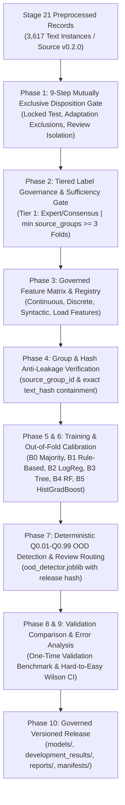

# Stage 22 Implementation Plan — Develop English Complexity Analysis and Difficulty Classification

**Project:** AI-Powered Adaptive Child-Friendly Language Simplification System  
**Component:** Component 3 — AI/NLP-Based Language Simplification  
**Scope:** English educational content for children aged 4–8  
**Prerequisites:** Stage 21 completed, reconciled, and sealed (`stage-21-complete`)  
**Baseline Git Commit:** `2c19a669d7bc05c88e92c2f1e153b7bd3d25e00c` (Tag: `stage-21-complete`)  
**Source Dataset Version:** `0.2.0`  
**Preprocessing Pipeline Version:** `1.0.0`  
**Planned Classifier Version:** `1.0.0`  
**Stage Type:** Complexity-feature engineering, difficulty-label governance, model comparison, explainable classification, and governed release  

---

## 1. Stage Objective & Linguistic Difficulty Definitions

Stage 22 develops, evaluates, and releases a deterministic, explainable English linguistic-complexity classification system that categorizes educational text into three discrete linguistic complexity tiers:

- **`easy`**: Low lexical and syntactic complexity, short structures, and limited relational or instructional load.
- **`medium`**: Moderate vocabulary, sentence structure, clause complexity, and instructional load.
- **`hard`**: High lexical, syntactic, or semantic-processing complexity, such as advanced vocabulary, embedded clauses, multiple relations, or multi-step load.

### 1.1 Strict Separation of Concepts
Text difficulty, age suitability, and personalized support are distinct dimensions owned by separate architectural layers:

```python
# Output Schema Separation
predicted_difficulty: Literal["easy", "medium", "hard"]  # Owned & produced by Stage 22
age_suitability: Optional[str] = None                    # Pedagogical metadata; separate from difficulty
recommended_support_level: Optional[str] = None          # NOT produced by Stage 22; owned by Personalization Engine
```

The classifier strictly consumes governed linguistic representations and observable features produced by Stage 21 (`data/preprocessed_features/en/source-0.2.0/pipeline-1.0.0/`). It characterizes the difficulty of the **educational text**, not the ability, diagnosis, or clinical screening status of a child.



---

## 2. Mandatory Responsibility Boundaries

Stage 22 strictly enforces the system-wide architecture and separation of concerns established in Stage 12:

### 2.1 Explicit System Boundaries
| Boundary Dimension | Component 3 (Stage 22 Classifier) | Other System Components / Layers |
|---|---|---|
| **Primary Task** | Classify linguistic complexity of English educational text (`easy`, `medium`, `hard`) | Simplify text (Stage 23+); Deliver UI (Frontend) |
| **Clinical Diagnosis** | **Strictly Prohibited:** Zero clinical or DLD diagnosis claims | Component 1 (Child screening assessment) |
| **Screening Risk Level** | Read-only / Excluded from model features | Component 1 owns `screening_risk_level` |
| **Performance Scores** | Excluded from features; text-level difficulty only | Component 3 scoring / Component 4 longitudinal trends |
| **Personalization** | Evaluates static text complexity; no learner profile inputs | Personalization Engine (recommends support tiers) |
| **Evaluation Isolation** | Locked test split quarantined; Adaptation Test Set excluded | Benchmarking & independent verification |

### 2.2 Entity Separation Matrix
- `text_difficulty`: Intrinsic linguistic complexity of source/target text (`easy`, `medium`, `hard`) $\leftarrow$ **Stage 22 Owner**
- `screening_risk_level`: Screening classification from standardized tasks $\leftarrow$ **Component 1 Owner (Read-only)**
- `recommended_support_level`: Scaffolding recommendation (`mild`, `moderate`, `strong`) $\leftarrow$ **Personalization Engine**
- `performance_score`: Evaluated skill mastery evidence $\leftarrow$ **Component 3 Scoring $\to$ Component 4**

---

## 3. Exact Classification Unit & Tiered Label Governance

### 3.1 Classification Unit Rule
**Every training label must apply directly to exactly one `text_instance_id`.**
- Source-item difficulty labels label `source_text` instances only.
- Simplified texts require their own independently reviewed difficulty labels.
- Support levels (`mild`, `moderate`, `strong`) must **never** be converted directly into difficulty labels.
- Any simplified text instance lacking an independent expert/provisional difficulty label is excluded from primary supervised training until annotated.

### 3.2 Tiered Label Governance Matrix
To avoid mixing unverified authoring assumptions with ground truth, data modeling operates under strict governance tiers:

| Label Status Tier | Primary Supervised Training | Secondary Sensitivity Experiment | Final Benchmark Evaluation | Reporting Role |
|---|---|---|---|---|
| **`expert_verified`** | **Yes** | **Yes** | **Yes** | Headline Gold-Standard Benchmark |
| **`reviewer_consensus`** | **Yes** | **Yes** | **Yes** | Headline Gold-Standard Benchmark |
| **`provisional`** | **No** | **Yes** | **No** | Exploratory / Data-Volume Sensitivity Report |
| **`rule_seeded`** | **No** | **No** | **No** | Label-Agreement Audit Only (Zero Training) |
| **`conflicting_or_missing`** | **No** | **No** | **No** | Excluded (Adjudication Queue) |

### 3.3 Anti-Circular Leakage Audit
If a Stage 20 provisional label was assigned using a heuristic based on surface features (e.g., word count or syllable count), using those same features to predict the label constitutes circular leakage. All label provenance records are audited, flagged as `rule_seeded`, and segregated into an independent agreement audit.

### 3.4 Label-Sufficiency Stop Condition (Mandatory Training Gate)
Primary model training may begin **only when all of the following conditions are met**:
1. `easy`, `medium`, and `hard` classes are all represented among Tier 1 (`expert_verified` / `reviewer_consensus`) labels;
2. Every class contains enough independent source groups for group-aware cross-validation;
3. No class is represented only by duplicated variants or single-source expansions;
4. The selected number of CV folds ($K$) does not exceed the smallest class-specific source-group count.

**Deterministic Stop Condition Logic:**
```python
maximum_valid_folds = min(
    distinct_easy_source_groups,
    distinct_medium_source_groups,
    distinct_hard_source_groups,
)

if maximum_valid_folds < 3:
    stop_stage(
        f"Insufficient independently labeled groups for 3-fold CV: "
        f"min group count across classes is {maximum_valid_folds}. "
        f"Stage 22 paused for annotation."
    )
```

> [!CRITICAL]
> If expert/consensus labels are insufficient ($\text{maximum\_valid\_folds} < 3$), Stage 22 **must pause for annotation**. It must **never** promote provisional or support-tier labels to ground truth to bypass this gate.

---

## 4. Mutually Exclusive Training Eligibility & Disposition Precedence

To eliminate accounting ambiguities where records satisfy multiple conditions (e.g., locked test and unlabeled, adaptation activity and manual review), Stage 22 enforces a **strict 9-step hierarchical precedence order**.

### 4.1 Hierarchical Disposition Precedence Order
Every `text_instance_id` is assigned **exactly one primary disposition**:

1. **`locked_test`**: Text instance belongs to quarantined candidate test split (`dataset_split == "development_candidate_test"`).
2. **`adaptation_test_excluded`**: Text instance originates from an adaptation activity parent record (`parent_record_type == "adaptation_activity"` or `dataset_split == "adaptation_test"`).
3. **`preprocessing_failed`**: Text instance failed Stage 21 preprocessing (`processing_status == "failed"`).
4. **`stage21_manual_review`**: Text instance was flagged for manual review during Stage 21 (`manual_review_required == True`).
5. **`missing_or_conflicting_label`**: Text instance has no difficulty label or has an unresolved multi-annotator conflict (`label_status in ["missing", "conflicting"]`).
6. **`provisional_secondary_only`**: Text instance holds a provisional authoring label; eligible only for secondary sensitivity analysis (`label_status == "provisional"`).
7. **`rule_seeded_audit_only`**: Text instance holds a heuristic rule-derived label; eligible only for circular-leakage agreement audit (`label_status == "rule_seeded"`).
8. **`primary_train_eligible`**: Text instance has Tier 1 label and is assigned to `development_candidate_train`.
9. **`primary_validation_eligible`**: Text instance has Tier 1 label and is assigned to `development_candidate_validation`.

Secondary status flags (e.g., specific review reasons) are preserved in auxiliary audit metadata without altering the unique primary disposition.

### 4.2 Eligibility Data Contract (`backend/app/complexity_analysis/schemas.py`)
```python
class ComplexityTrainingEligibility(BaseModel):
    model_config = ConfigDict(extra="forbid")

    text_instance_id: str
    parent_record_id: str
    parent_record_type: str
    text_role: str
    source_group_id: str
    dataset_split: Literal[
        "development_candidate_train",
        "development_candidate_validation",
        "development_candidate_test",
        "adaptation_test",
        "legacy_excluded",
        "unassigned",
    ]
    preprocessing_status: str
    label_status: Literal[
        "expert_verified",
        "reviewer_consensus",
        "provisional",
        "rule_seeded",
        "conflicting",
        "missing",
    ]
    primary_disposition: Literal[
        "locked_test",
        "adaptation_test_excluded",
        "preprocessing_failed",
        "stage21_manual_review",
        "missing_or_conflicting_label",
        "provisional_secondary_only",
        "rule_seeded_audit_only",
        "primary_train_eligible",
        "primary_validation_eligible",
    ]
    eligible_for_primary_training: bool
    eligible_for_secondary_experiment: bool
    exclusion_reasons: List[str] = Field(default_factory=list)
```

---

## 5. Feature Engineering Matrix & Registry

Stage 22 consumes Stage 21 raw linguistic features and constructs a standardized, immutable numerical matrix:

### 5.1 Governed Observable Feature Set
Governed observable feature set derived from the Stage 21 feature registry (`stage22_feature_dictionary.csv` provides the authoritative final feature count):

1. **Surface & Structural Complexity:**
   - `char_count`, `token_count`, `word_count`, `sentence_count`, `punct_count`
   - `avg_word_length`, `avg_sentence_length`
   - `syllable_count`, `avg_syllables_per_word`, `long_word_count`, `long_word_ratio`
   - `type_token_ratio` (lexical diversity)
2. **Lexical & Part-of-Speech Complexity:**
   - `content_word_ratio`, `function_word_ratio`
   - `noun_ratio`, `verb_ratio`, `adj_ratio`, `adv_ratio`, `pronoun_ratio`, `prep_ratio`
   - `finite_verb_count`, `auxiliary_verb_count`
   - `out_of_lexicon_ratio`, `internal_lexicon_tier_counts` (`easy`, `medium`, `hard` vocabulary density)
3. **Syntactic & Parse-Tree Complexity:**
   - `max_dependency_depth`, `avg_dependency_depth`
   - `clause_count`, `subordinate_conjunction_count`, `coordination_count`
   - `passive_voice_detected` (boolean indicator)
   - `avg_noun_phrase_length`, `root_count`, `fragment_detected`, `imperative_detected`
4. **Semantic & Pedagogical Load Complexity:**
   - `negation_count` (explicit and conditional negation markers)
   - `quantity_count` (numeric digits and spelled number words)
   - `spatial_relation_count`, `temporal_connective_count`
   - `action_verb_count`, `named_entity_count`, `protected_meaning_unit_count`

### 5.2 Missingness & Transformation Protocol
- Missing values explicitly tracked via binary indicator features (`*_is_missing`).
- Scalers (`StandardScaler`/`RobustScaler`) and imputers fitted **strictly on `development_candidate_train`**; validation/test data transformed using stored training parameters.
- Feature allowlist strictly enforced: 0 learner, screening, answer, or label leakage columns.

---

## 6. Baseline & Candidate Model Architectures

| Model ID | Model Name | Architecture / Description | Role & Selection Criteria |
|---|---|---|---|
| **B0** | **Majority-Class Baseline** | Predicts modal training class (`easy`, `medium`, or `hard`) | Statistical lower bound |
| **B1** | **Transparent Rule-Based Classifier** | Deterministic decision rules based on fitted training thresholds (word length, syllable count, clause depth, lexicon tiers) | Interpretable non-ML baseline with complete rule trace |
| **B2** | **Multinomial Logistic Regression** | L2/L1 regularized multinomial logistic regression with standardized features (`scikit-learn`) | Primary interpretable linear candidate |
| **B3** | **Constrained Decision Tree** | Shallow decision tree ($\text{max\_depth} \le 4$, $\text{min\_samples\_leaf} \ge 10$) | Directly visualizable hierarchical rule candidate |
| **B4** | **Random Forest Classifier** | Ensemble of shallow trees (100 estimators, out-of-bag scoring) | Non-linear interaction candidate with feature importances |
| **B5** | **HistGradientBoosting Classifier** | `scikit-learn` `HistGradientBoostingClassifier` (pinned standard dependency) | Strong non-linear benchmark candidate |

**Model Selection Principle:** Select the simplest model meeting the declared accuracy, calibration, and safety criteria.

---

## 7. Cross-Validation & Anti-Leakage Workflow

To prevent calibration and model-selection data leakage, the evaluation workflow separates training out-of-fold estimation from validation benchmarking:

```text
Training Split (development_candidate_train)
├── 1. Check Label-Sufficiency Stop Condition (min groups per class >= 3)
├── 2. Group-aware Stratified K-Fold CV (by source_group_id)
├── 3. Out-of-fold (OOF) cross-validation predictions
├── 4. Fit probability calibration models (Platt / Isotonic) on OOF predictions
└── 5. Fit final candidate model packages on full training split

Validation Split (development_candidate_validation)
├── 1. One-time model comparison across B0–B5
├── 2. Final ECE calibration assessment
└── 3. Decision threshold & review-routing margin confirmation

Locked Test Split (development_candidate_test)
└── Authorized final evaluation only (Mode B)
```

### Leakage Verification Gates
1. **Group-Aware Splitting:** Grouped strictly by `source_group_id`. All records originating from the same source item or activity reside in the same split.
2. **Exact Hash Containment:** 0 overlapping normalized `text_hash` values between train and validation splits.
3. **Locked Test Split Quarantine:** Zero access to `development_candidate_test` during feature selection, model training, hyperparameter tuning, or calibration.
4. **Data Preprocessing Pipeline Isolation:** Imputers and scalers fitted on train data only; parameters serialized as `.joblib` artifacts.

---

## 8. Deterministic Out-of-Distribution (OOD) Detection & Review Routing

### 8.1 Deterministic OOD Detection Policy (`ood_detector.py`)
To prevent implementation ambiguity, OOD scoring follows a deterministic feature-type policy:

1. **Numeric Continuous / Count Features:**
   - Envelope defined strictly by training empirical quantiles: $[Q_{0.01}, Q_{0.99}]$.
   - Any test/runtime feature value falling outside $[Q_{0.01}, Q_{0.99}]$ triggers a feature violation.
2. **Binary Features:**
   - Excluded from numerical IQR/quantile tests; values must be in $\{0, 1\}$.
3. **Constant Features:**
   - Excluded from range-based OOD scoring.
4. **Categorical / Text-Role Values:**
   - Explicit membership check against observed training vocabulary/roles. Unseen categories trigger immediate OOD flag.
5. **Missing Critical Feature Block / Parser Failure:**
   - Immediate OOD and review-required flag.

The learned bounds are serialized inside `ood_detector.joblib` and their SHA-256 hash is recorded in `stage22_manifest.sha256`.

### 8.2 Probability Calibration & Review Routing Policy (`review_router.py`)
- Calibrate model probabilities using Platt Scaling (Sigmoid) or Isotonic Regression fitted on training OOF predictions.
- Routing Logic:
```text
IF max(P(easy), P(medium), P(hard)) >= confidence_threshold (tau, e.g., 0.80)
   AND (top_class_prob - second_class_prob) >= margin_threshold (Delta, e.g., 0.15)
   AND is_out_of_distribution == False
   AND parser_failure == False:
      -> Status: ACCEPTED_AUTOMATIC_CLASSIFICATION
ELSE:
      -> Status: MANUAL_REVIEW_REQUIRED
      -> Route to Review Queue with explicit review reasons
```

---

## 9. Explainable Output Contract

Every classification produces a structured, human-interpretable result defined in `schemas.py`:

```python
class ComplexityFactor(BaseModel):
    model_config = ConfigDict(extra="forbid")

    feature_name: str
    observed_value: Union[float, int, bool]
    contribution_direction: Literal["reduces", "increases", "neutral"]
    importance: Optional[float] = None
    explanation_code: str

class ComplexityClassificationResult(BaseModel):
    model_config = ConfigDict(extra="forbid")

    classification_id: str
    text_instance_id: str
    source_group_id: Optional[str] = None
    predicted_difficulty: Literal["easy", "medium", "hard"]
    class_probabilities: Dict[str, float]
    confidence: float
    confidence_threshold: float
    review_required: bool
    review_reasons: List[str] = Field(default_factory=list)
    complexity_factors: List[ComplexityFactor]
    model_name: str
    model_version: str
    feature_schema_version: str
    preprocessing_pipeline_version: str
    source_dataset_version: str
    record_hash: str
```

**Standard Explanation Codes:**
- `LONG_AVERAGE_SENTENCE`, `SHORT_SIMPLE_STRUCTURE`
- `HIGH_DEPENDENCY_DEPTH`, `MULTIPLE_SUBORDINATE_CLAUSES`
- `ADVANCED_LEXICON_DENSITY`, `BASIC_VOCABULARY_DOMINANT`
- `MULTI_STEP_INSTRUCTION`, `NEGATION_LOAD`, `TEMPORAL_RELATION_LOAD`

---

## 10. Evaluation Framework & Safety-Critical Metrics

### 10.1 Primary Quantitative Metrics
- **Macro-F1 Score:** Target $\ge 0.80$ across `easy`, `medium`, `hard`.
- **Balanced Accuracy:** Target $\ge 0.80$.
- **Per-Class Recall:** Target $\ge 0.75$ on each class.
- **Expected Calibration Error (ECE):** Target $\le 0.10$.
- **Zero-Loss Accounting:** 100% of candidate records accounted for (0 unaccounted).
- **Leakage Violations:** Exactly 0.

### 10.2 Safety-Critical Hard-to-Easy Error Metric
Classifying a genuinely hard educational text as easy poses the highest educational risk (overwhelming child with unsimplified text):

$$\text{Hard-to-Easy Rate} = \frac{\text{Count of Actual Hard predicted as Easy}}{\text{Total Actual Hard Records}}$$

- **Target:** Research goal $\le 2.0\%$ on validation set.
- **Reporting:** Point estimate, absolute error count, and 95% Wilson score binomial confidence interval.

---

## 11. Codebase Architecture & File Structure

```text
backend/app/complexity_analysis/
├── __init__.py
├── schemas.py                 # Pydantic v2 data contracts (Eligibility, ClassificationResult, ComplexityFactor)
├── config.py                  # ComplexityConfig (thresholds, model selection, calibration mode)
├── version.py                 # PIPELINE_VERSION = "1.0.0", MODEL_VERSION = "1.0.0"
├── eligibility.py             # 9-step mutually exclusive disposition gate
├── label_auditor.py           # Label governance, sufficiency gate, circular leakage detection
├── feature_builder.py         # Tabular feature transformation & imputation pipeline
├── feature_registry.py        # Governed feature registry & allowlist validation
├── leakage_guard.py           # Group & text hash anti-leakage verification
├── ood_detector.py            # Deterministic Q0.01-Q0.99 Out-of-Distribution detector
├── review_router.py           # Threshold-based review routing & margin checks
├── explanation.py             # Complexity factor explanation generator
├── calibration.py             # Platt / Isotonic probability calibrator (OOF trained)
├── evaluator.py               # Comprehensive multi-class evaluation & confusion matrix
├── pipeline.py                # Master ComplexityAnalysisPipeline coordinator
├── models/
│   ├── __init__.py
│   ├── base.py                # Abstract BaseComplexityClassifier
│   ├── majority.py            # B0 Majority Class Baseline
│   ├── rule_based.py          # B1 Transparent Rule-Based Baseline
│   ├── logistic_regression.py # B2 Multinomial Logistic Regression
│   ├── decision_tree.py       # B3 Constrained Decision Tree
│   ├── random_forest.py       # B4 Random Forest Classifier
│   └── gradient_boosting.py   # B5 HistGradientBoosting Classifier (scikit-learn)
└── repositories/
    ├── __init__.py
    ├── feature_repository.py  # Loads Stage 21 preprocessed feature records
    ├── label_repository.py    # Governs difficulty labels & audit trail
    └── model_repository.py    # Serializes & loads .joblib model packages

scripts/stage22/
├── snapshot_stage21.py             # Verifies clean Stage 21 inputs
├── audit_training_eligibility.py   # Produces mutually exclusive eligibility accounting report
├── audit_difficulty_labels.py       # Audits labels, label sufficiency gate, and circular leakage
├── build_feature_matrix.py         # Generates feature matrices and scalers
├── train_rule_baseline.py          # Fits and evaluates B1 rule baseline
├── train_ml_candidates.py          # Trains B0, B2, B3, B4, B5 models with OOF calibration
├── calibrate_models.py             # Evaluates probability calibration
├── compare_models.py               # Produces model_comparison.csv
├── run_error_analysis.py           # Generates detailed error analysis & Wilson CIs
├── verify_leakage.py               # Verifies group and hash containment
├── build_stage22_release.py        # Packages models and release artifacts
├── run_final_evaluation.py         # Mode B locked test evaluation runner
└── generate_stage22_report.py      # Generates completion record and SHA-256 manifest

backend/tests/complexity_analysis/
├── test_schemas.py
├── test_eligibility.py
├── test_mutually_exclusive_eligibility_accounting.py
├── test_label_audit.py
├── test_label_sufficiency_gate.py
├── test_rule_seeded_label_detection.py
├── test_feature_builder.py
├── test_feature_allowlist.py
├── test_missingness.py
├── test_group_split_integrity.py
├── test_hash_leakage.py
├── test_majority_baseline.py
├── test_rule_baseline.py
├── test_logistic_regression.py
├── test_tree_models.py
├── test_random_forest.py
├── test_gradient_boosting.py
├── test_ood_detection.py
├── test_calibration.py
├── test_review_routing.py
├── test_explanations.py
├── test_evaluation_metrics.py
├── test_locked_test_guard.py
├── test_determinism.py
├── test_model_serialization.py
├── test_accounting.py
└── test_stage22_end_to_end.py
```

---

## 12. Governed Release Directory Hierarchy

```text
data/complexity_analysis/en/source-0.2.0/preprocessing-1.0.0/classifier-1.0.0/
├── models/
│   ├── selected_model.joblib
│   ├── preprocessing_transformer.joblib
│   ├── calibration_model.joblib
│   └── ood_detector.joblib
├── feature_registry/
│   ├── feature_allowlist.json
│   ├── feature_schema.json
│   └── stage22_feature_dictionary.csv
├── development_results/
│   ├── validation_predictions.json
│   ├── model_comparison.csv
│   ├── confusion_matrix.csv
│   └── error_analysis.csv
├── protected_test/
│   └── locked_test_manifest.json
├── manifests/
│   ├── run_manifest.json
│   └── stage22_manifest.sha256
└── reports/
    ├── eligibility_accounting.csv
    ├── label_audit.csv
    └── complexity_release_summary.md
```

---

## 13. Step-by-Step Implementation Phases

- **Phase 0: Baseline Safety Checkpoint & Verification**  
  Verify `stage-21-complete` tag (`2c19a669d7bc05c88e92c2f1e153b7bd3d25e00c`), full test suite (224/224 passed), and frontend build. Create git tag `stage-22-start`.

- **Phase 1: Training Eligibility Gate & Mutually Exclusive Accounting**  
  Filter Stage 21 preprocessed records via the 9-step disposition precedence. Exclude locked test split (315 instances), Adaptation Test Set (377 instances), and Stage 21 review records (163 instances). Generate `eligibility_accounting.csv`.

- **Phase 2: Tiered Label Governance, Sufficiency Gate & Audit**  
  Audit label provenance across simplification pairs and source items. Enforce the label-sufficiency stop condition ($\min(\text{groups\_per\_class}) \ge 3$). Segregate provisional and rule-seeded labels. Create `label_audit.csv`.

- **Phase 3: Governed Feature Matrix & Registry**  
  Implement `FeatureBuilder` and `FeatureRegistry`. Fit scalers and imputers on training data only. Export `stage22_feature_dictionary.csv`, `feature_allowlist.json`, and `feature_schema.json`.

- **Phase 4: Group-Aware Anti-Leakage Verification**  
  Verify zero `source_group_id` overlap and zero `text_hash` leakage between train and validation splits.

- **Phase 5: Baseline Models (B0 & B1)**  
  Implement Majority Baseline (B0) and Transparent Rule-Based Classifier (B1) with full decision traces.

- **Phase 6: Interpretable ML Candidates (B2–B5)**  
  Implement Multinomial Logistic Regression (B2), Decision Tree (B3), Random Forest (B4), and HistGradientBoosting (B5) with Stratified Group K-Fold cross-validation.

- **Phase 7: Out-of-Fold Probability Calibration & Deterministic OOD Routing**  
  Fit Platt Scaling / Isotonic Regression on training OOF predictions. Implement `OODDetector` ($Q_{0.01}-Q_{0.99}$) and `ReviewRouter`.

- **Phase 8: Model Comparison & Selection**  
  Benchmark all candidates on validation split against primary and secondary metrics. Select the optimal champion model based on simplicity, calibration, and safety.

- **Phase 9: Explainability & Safety-Critical Error Analysis**  
  Implement `ComplexityFactor` generator. Perform error analysis across domains, age groups, text roles, and safety-critical Hard $\to$ Easy misclassifications with 95% Wilson CIs.

- **Phase 10: Governed Release, Tests, Manifest & Tagging**  
  Serialize model artifacts to `data/complexity_analysis/`. Run all unit, integration, and regression tests. Verify frontend build. Generate `stage22_manifest.sha256` and `stage22_completion_record.md`. Commit and tag `stage-22-complete`.

---

## 14. Separate Parent vs. Text-Instance Accounting Invariants

### 14.1 Parent-Record Accounting
The cumulative Stage 20 release contains **2,050 parent records**:

$$\text{Cumulative Governed Parent Records (2,050)} = 370\text{ (Sources)} + 1,110\text{ (Pairs)} + 192\text{ (Activities)} + 378\text{ (Lexicons)}$$

Stage 21 directly ingested only 300 of the 370 source records because the 70 legacy source texts were preserved through carried simplification pairs:

$$\text{Cumulative Governed Parents (2,050)} = \text{Directly Ingested Stage 21 Parents (1,980)} + \text{Legacy Source Parents (70)}$$

$$\begin{aligned}
\text{Cumulative Governed Parents} &: 2,050 \\
\text{Directly Ingested Stage 21 Parents} &: 1,980 \quad (300\text{ Sources} + 1,110\text{ Pairs} + 192\text{ Activities} + 378\text{ Lexicons}) \\
\text{Legacy Source Parents Not Directly Adapted} &: 70 \\
\text{Legacy Source Texts Preserved Through Pairs} &: 70/70 \\
\text{Unaccounted Governed Parents} &: 0
\end{aligned}$$

### 14.2 Text-Instance Accounting
Every text instance extracted in Stage 21 receives **exactly one primary disposition**:

$$\begin{aligned}
\text{Total Stage 21 Text Instances (3,617)} &= \text{Locked Test (315)} \\
&+ \text{Adaptation Test Excluded (377)} \\
&+ \text{Preprocessing Failed (0)} \\
&+ \text{Stage 21 Manual Review Excluded (163)} \\
&+ \text{Missing / Conflicting Label Excluded} \\
&+ \text{Provisional Secondary Only} \\
&+ \text{Rule-Seeded Audit Only} \\
&+ \text{Primary Train Eligible} \\
&+ \text{Primary Validation Eligible} \\
&+ \text{Unaccounted Instances (0)}
\end{aligned}$$

---

## 15. Verification Commands

```powershell
# Stage 22 tests
Push-Location backend
python -m pytest tests/complexity_analysis/ -v

# Dataset, Stage 21 and responsibility-boundary regression tests
python -m pytest tests/datasets/ tests/nlp_preprocessing/ tests/test_responsibility_boundaries.py -v

# Complete backend suite
python -m pytest tests/ -v
Pop-Location

# Frontend build
Push-Location frontend
npm run build
Pop-Location
```

---

## 16. Required Documentation Deliverables

- `docs/stage22_implementation_plan.md`
- `docs/stage22_label_governance_policy.md`
- `docs/stage22_feature_dictionary.csv`
- `docs/stage22_training_eligibility.csv`
- `docs/stage22_label_audit.csv`
- `docs/stage22_leakage_report.md`
- `docs/stage22_model_comparison.csv`
- `docs/stage22_calibration_report.md`
- `docs/stage22_error_analysis.md`
- `docs/stage22_reproducibility_evidence.json`
- `docs/stage22_manifest.sha256`
- `docs/stage22_completion_record.md`

---

## 17. Definition of Done

Stage 22 is complete only when:

- [ ] Stage 21 baseline commit `2c19a669d7bc05c88e92c2f1e153b7bd3d25e00c` and checkpoint verified.
- [ ] Linguistic difficulty defined intrinsically without age or support level confounding.
- [ ] TextInstance-level classification unit strictly enforced (no automatic inheritance for simplifications).
- [ ] Tiered label governance enforced (Headline: Expert/Consensus; Secondary: Provisional; Audit: Rule-seeded).
- [ ] Label-sufficiency stop condition ($\min(\text{groups\_per\_class}) \ge 3$) verified before model training.
- [ ] 9-step hierarchical mutually exclusive disposition precedence verified with 0 double-counting.
- [ ] Training OOF probability calibration fitted without validation leakage.
- [ ] Deterministic $Q_{0.01}-Q_{0.99}$ OOD detector (`ood_detector.py`) implemented with hash in release manifest.
- [ ] Adaptation Test Set instances (377) and Stage 21 review records (163) excluded from training.
- [ ] Group-aware anti-leakage checks pass with 0 leakage.
- [ ] Baselines B0, B1 and ML models B2, B3, B4, B5 (`HistGradientBoostingClassifier`) trained and compared.
- [ ] Hard-to-Easy safety error rate reported with point estimate and 95% Wilson score CI.
- [ ] Explainable `ComplexityFactor` outputs produced with evidence codes.
- [ ] Governed feature set derived with authoritative count in `stage22_feature_dictionary.csv`.
- [ ] Parent-record ($2,050 = 1,980 + 70$) and text-instance ($3,617$) zero-loss accounting verified.
- [ ] `test_mutually_exclusive_eligibility_accounting.py` and `test_label_sufficiency_gate.py` passing.
- [ ] All Stage 22 unit, boundary, and integration tests pass.
- [ ] Full backend test suite passes (100% green) and frontend builds.
- [ ] Sealed release artifacts and manifest generated.
- [ ] Git commit and tag `stage-22-complete` created.
