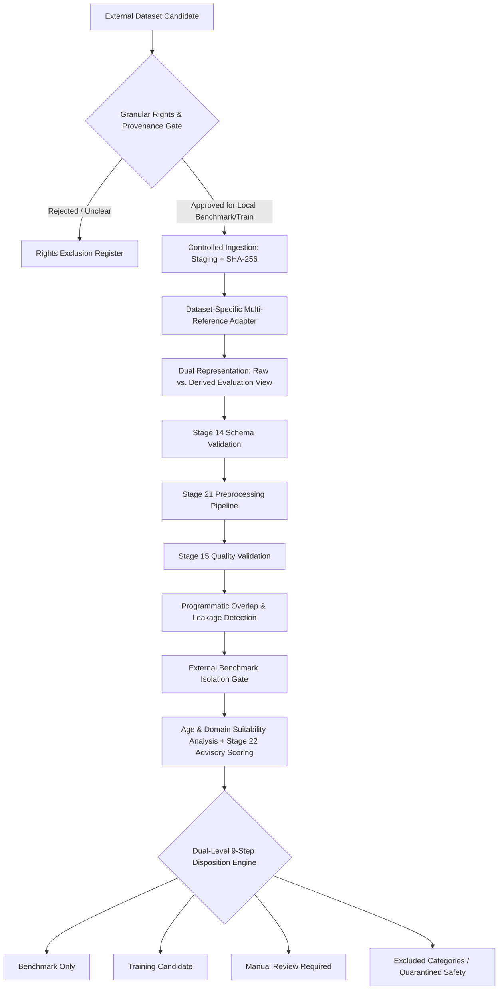

# Stage 23 Implementation Plan — Integrate and Evaluate External English Datasets

**Project:** AI-Powered Adaptive Child-Friendly Language Simplification System  
**Component:** Component 3 — AI/NLP-Based Language Simplification  
**Scope:** External English datasets; target population remains children aged 4–8  
**Prerequisites:** Stages 11–22 completed and Stage 22 sealed (`stage-22-complete`)  
**Internal Dataset Release:** `0.2.0` (Protected & Unmodified)  
**External Dataset Release:** `0.1.0` (Planned)  
**Stage Type:** Dataset integration, rights governance, preprocessing, and comparative benchmark evaluation  
**Document Version:** `2.1` (Formally Corrected & Governed)  
**Status:** Plan Proposed — Awaiting User Approval  

---

## 1. Executive Summary & Research Objective

Stage 23 establishes a strictly governed, legally verified, and physically isolated external dataset subsystem for English sentence simplification. It ingests approved external datasets ([ASSET](https://github.com/facebookresearch/asset), [TurkCorpus](https://github.com/cocoxu/simplification), [OasisSimp-English](https://OasisSimpDataset.github.io/), and an optional isolated [WikiLarge](https://github.com/XingxingZhang/dress) pilot), runs them through the frozen Stage 14 (schema), Stage 15 (quality), and Stage 21 (linguistic preprocessing) pipelines, evaluates their relevance to child-friendly educational language simplification (ages 4–8), assesses advisory Stage 22 complexity, checks for cross-dataset and locked-test data leakage, isolates external benchmark test sets from training candidates, and assigns every record a mutually exclusive use disposition.

Stage 23 answers the research question:
> *Which external English datasets are legally usable, technically reliable, and relevant enough to support training or evaluation of an English child-friendly simplification system for ages 4–8?*



---

## 2. Non-Negotiable Governance Boundaries

1. **Physical & Logical Isolation:** External datasets reside in `data/external_english/` and are never mixed with the internal child-oriented educational corpus (`data/simplification_corpus/`).
2. **No Assumed Rights from Code Licences:** Repository code licences (*e.g.*, MIT, GPL-3.0) do not imply dataset content permissions. Rights status begins as `pending_content_rights_verification` and must be verified against primary dataset publication/licence sources.
3. **Zero Inferred Child Suitability:** External simplifications from general domains (*e.g.*, Wikipedia) are not assumed to be child-friendly, DLD-oriented, or appropriate for ages 4–8.
4. **Training vs. Benchmark Separation:** Training eligibility and benchmark eligibility are distinct decisions.
5. **Immutable Raw Snapshots:** Raw downloads are preserved bitwise without modification and verified via SHA-256 checksums.
6. **Dual Text Representation & Benchmark Reference Invariance:** Official benchmark test references are never edited or modified. The system preserves `raw_source_text` / `raw_references` alongside `evaluation_source_text` / `evaluation_references` with:
   - `raw_text_preserved: true`
   - `evaluation_view_derived: true`
   - `official_benchmark_files_overwritten: false`
7. **External Benchmark Isolation:** Source groups assigned to ASSET, TurkCorpus, or OasisSimp benchmark evaluation must never enter any Stage 23 training-candidate collection (`evaluation_protected = true`, `training_eligible = false`, `protection_reason = "external_benchmark_source"`).
8. **OasisSimp-English Role Lock:** OasisSimp-English remains `benchmark_only` in external release `0.1.0`. Any future training subset must be created as a separate governed release after rights, split, and expert-review approval.
9. **Strict Protected Test Isolation:** Any external record matching internal locked test data or the Adaptation Test Set is assigned `excluded_leakage` and cannot become a training candidate.
10. **Advisory Complexity Scoring:** Stage 22 difficulty predictions are advisory features only and do not establish clinical suitability or child delivery approval.
11. **Universal Safety Lock:** Every external record is initialized with:
    - `approved_for_child_delivery = false`
    - `research_eligible = false`
    - `expert_dld_validated = false`
12. **Zero Learner Data Transmission:** No learner interaction records are shared with external APIs or providers.
13. **Internal Release Immutability:** Internal release `0.2.0` files remain byte-for-byte unmodified.
14. **Model Fine-Tuning Deferred:** Transformer fine-tuning (mT5, mBART) is deferred to subsequent modeling stages.

---

## 3. Dataset Scope, Official Sources, and Initial Rights Status

| Priority | Dataset | Official Acquisition Source | Initial Rights Status | Stage 23 Role | Target Accounting Units |
|:---:|---|---|---|---|---|
| **1** | **ASSET** | Official GitHub Repository (`facebookresearch/asset`) | `pending_content_rights_verification` | Primary multi-reference evaluation benchmark | 2,359 source groups<br>(23,590 references) |
| **2** | **TurkCorpus** | Official Simplification Repository (`cocoxu/simplification`) | `pending_content_rights_verification` | Standard SARI-compatible evaluation benchmark | 2,359 source groups<br>(18,872 references) |
| **3** | **OasisSimp-English** | Official Website (`https://OasisSimpDataset.github.io/`) | `pending_content_rights_verification` | Cross-domain & future English–Sinhala bridge (Benchmark only) | Source groups with multi-ref `simple` list |
| **4 (Opt)** | **WikiLarge (Pilot)** | Author-Recommended Links (`XingxingZhang/dress`) | `pending_lineage_and_rights_verification` | Optional filtered pilot training reference (Non-blocking) | Controlled sample; `OPTIONAL_NOT_EXECUTED` allowed |
| **Excl** | **Newsela** | Commercial / Restricted Repository | `excluded_rights` | Formally excluded without written permission | 0 records |

### Exact Source-Group & Reference Accounting Units
To prevent misrepresenting multi-reference benchmarks as tens of thousands of independent pairs, accounting tracks `source_groups` and `reference_instances`:

| Dataset Partition | Source Groups | References per Source | Total Reference Instances | Default Disposition |
|---|---:|:---:|---:|---|
| **ASSET Validation** | 2,000 | 10 | 20,000 | `benchmark_only` |
| **ASSET Test** | 359 | 10 | 3,590 | `benchmark_only` |
| **ASSET Total** | **2,359** | **10** | **23,590** | `benchmark_only` |
| **TurkCorpus Validation** | 2,000 | 8 | 16,000 | `benchmark_only` |
| **TurkCorpus Test** | 359 | 8 | 2,872 | `benchmark_only` |
| **TurkCorpus Total** | **2,359** | **8** | **18,872** | `benchmark_only` |

### Critical ASSET–TurkCorpus Shared Source Linking
ASSET and TurkCorpus share the identical 2,359 source sentences drawn from Simple English Wikipedia. They must share deterministic `source_group_id` values (*e.g.*, `EXT-GROUP-ASSET-TURK-000001`) and inherit cross-dataset benchmark protection.

---

## 4. Architecture & Repository Layout

```text
data/external_english/
├── registry/
│   ├── external_dataset_registry.json
│   └── rights_decisions.json
├── asset/
├── turkcorpus/
├── oasissimp_en/
├── wikilarge_pilot/
├── review_queues/
│   ├── quality_review_queue.jsonl
│   └── age_domain_review_queue.jsonl
├── reports/
│   ├── rights_and_permissions.csv
│   ├── dataset_selection_report.md
│   ├── acquisition_report.md
│   ├── preprocessing_report.md
│   ├── quality_report.csv
│   ├── duplicate_and_leakage_report.csv
│   ├── age_domain_suitability_report.csv
│   ├── comparative_evaluation.md
│   └── accounting_summary.csv
└── releases/0.1.0/
    ├── normalized_records.jsonl
    ├── benchmark_only_ids.json
    ├── training_candidate_ids.json
    ├── manual_review_ids.json
    ├── excluded_records.json
    ├── overlap_report.json
    ├── dataset_statistics.json
    └── release_manifest.sha256

backend/app/datasets/external_english/
├── __init__.py
├── schemas.py
├── registry.py
├── rights_gate.py
├── provenance.py
├── downloader.py
├── adapters/
│   ├── __init__.py
│   ├── base_adapter.py
│   ├── asset_adapter.py
│   ├── turkcorpus_adapter.py
│   ├── oasissimp_adapter.py
│   └── wikilarge_adapter.py
├── normalization.py
├── quality_gate.py
├── duplicate_detector.py
├── leakage_detector.py
├── suitability_analyzer.py
├── disposition_engine.py
├── evaluator.py
└── release_builder.py

scripts/stage23/
├── snapshot_stage22.py
├── register_external_sources.py
├── verify_rights.py
├── acquire_approved_datasets.py
├── normalize_external_datasets.py
├── preprocess_external_datasets.py
├── validate_external_datasets.py
├── detect_duplicates_and_leakage.py
├── evaluate_age_domain_suitability.py
├── run_benchmark_evaluation.py
├── reconcile_stage23_accounting.py
├── build_stage23_release.py
└── generate_stage23_report.py

backend/tests/datasets/external_english/
├── __init__.py
├── conftest.py
├── test_dataset_registry.py
├── test_rights_gate.py
├── test_provenance_and_hashes.py
├── test_downloader_safety.py
├── test_asset_adapter.py
├── test_turkcorpus_adapter.py
├── test_oasissimp_adapter.py
├── test_wikilarge_adapter.py
├── test_multireference_grouping.py
├── test_dual_text_representation.py
├── test_schema_validation.py
├── test_preprocessing_compatibility.py
├── test_quality_dispositions.py
├── test_duplicate_detection.py
├── test_cross_dataset_grouping.py
├── test_locked_test_leakage.py
├── test_benchmark_isolation.py
├── test_age_domain_suitability.py
├── test_final_dispositions.py
├── test_accounting_reconciliation.py
├── test_release_builder.py
├── test_release_idempotency.py
└── test_stage23_end_to_end.py

backend/tests/fixtures/external_english/
├── asset_fixture/
├── turkcorpus_fixture/
├── oasissimp_fixture/
├── wikilarge_synthetic_fixture/
└── fixture_manifest.json
```

---

## 5. Granular Rights & Normalized Data Schemas

### 5.1 Dataset Rights Decision Schema (`schemas.py`)
Initial registry record before verification:

```json
{
  "dataset_id": "EXTDATA-ASSET",
  "dataset_name": "ASSET",
  "official_source_url": "https://github.com/facebookresearch/asset",
  "publication_reference": "Alva-Manchego et al., ACL 2020",
  "content_licence_name": null,
  "content_licence_url": null,
  "rights_status": "pending_content_rights_verification",
  "permissions": {
    "local_processing_allowed": false,
    "redistribution_allowed": false,
    "benchmark_use_allowed": false,
    "training_use_allowed": false,
    "derived_feature_release_allowed": false
  },
  "rights_evidence_url": null,
  "rights_verified_by": null,
  "rights_verified_at": null
}
```

*Note: WP1 populates licence name, URL, verification timestamp, reviewer identity, and permissions only after inspecting primary evidence.*

### 5.2 Normalized Multi-Reference Record Schema (`schemas.py`)
```json
{
  "external_record_id": "EXT-ASSET-VAL-000001",
  "schema_version": "1.0.0",
  "dataset_id": "EXTDATA-ASSET",
  "dataset_record_id": "asset-val-0",
  "source_group_id": "EXT-GROUP-ASSET-TURK-000001",
  "raw_source_text": "Original sentence with raw tokenization",
  "raw_references": ["Reference one", "Reference two"],
  "evaluation_source_text": "Original sentence NFC normalized",
  "evaluation_references": ["Reference one NFC normalized", "Reference two NFC normalized"],
  "raw_text_preserved": true,
  "evaluation_view_derived": true,
  "normalization_operations": ["nfc_unicode_normalization"],
  "official_benchmark_files_overwritten": false,
  "reference_count": 2,
  "language": "en",
  "source_domain": "wikipedia_general",
  "original_source_split": "validation",
  "content_hash": "e3b0c44298fc1c149afbf4c8996fb92427ae41e4649b934ca495991b7852b855",
  "preprocessing_version": "1.0.0",
  "quality_disposition": "passed",
  "age_domain_status": "general_domain_benchmark",
  "evaluation_protected": true,
  "protection_reason": "external_benchmark_source",
  "expert_dld_validated": false,
  "approved_for_child_delivery": false,
  "research_eligible": false,
  "training_eligible": false,
  "benchmark_eligible": true,
  "final_disposition": "benchmark_only",
  "provenance": {
    "acquired_from": "https://github.com/facebookresearch/asset",
    "acquired_at": "2026-09-29T16:00:00Z"
  }
}
```

---

## 6. Work Package Breakdown & Phased Execution

```mermaid
gantt
    title Stage 23 Implementation Work Packages
    dateFormat  X
    axisFormat %s
    section Core Governance & Infrastructure
    WP0: Baseline Verification & Safety Checkpoint  :0, 1
    WP1: Source & Granular Rights Registry Gate     :1, 2
    WP2: Secure Downloader & Offline Fixtures       :2, 3
    section Core Dataset Adapters
    WP3: ASSET Multi-Reference Adapter              :3, 4
    WP4: TurkCorpus Adapter & Shared-Source Link   :4, 5
    WP5: OasisSimp-English Multi-Reference Adapter  :5, 6
    section Pipeline Reuse & Isolation
    WP6: Stage 14, 15 & 21 Pipeline Integration     :6, 7
    WP7: Programmatic Leakage & Anti-Overlap Gate   :7, 8
    WP8: Benchmark Isolation & Dual Disposition     :8, 9
    section Benchmarking & Optional Pilot
    WP9: Output-Based Benchmark Evaluation (SARI)   :9, 10
    WP5B: Optional Filtered WikiLarge Pilot         :10, 11
    WP10: Governed Release 0.1.0 & Closeout         :11, 12
```

### Work Package Details

#### WP0 — Baseline Verification & Safety Checkpoint
- Verify `stage-22-complete` commit and test suite (268/268 backend tests, frontend build).
- Create `stage-23-start` git tag.
- Create snapshot backup script in `scripts/stage23/snapshot_stage22.py`.

#### WP1 — Source & Rights Registry Gate (`registry.py`, `rights_gate.py`)
- Implement `ExternalDatasetRegistryRecord` and `RightsDecision` schemas with granular permission flags (`local_processing_allowed`, `redistribution_allowed`, `benchmark_use_allowed`, `training_use_allowed`, `derived_feature_release_allowed`).
- Initial rights status set to `pending_content_rights_verification` for ASSET, TurkCorpus, and OasisSimp-English; `pending_lineage_and_rights_verification` for WikiLarge; and `excluded_rights` for Newsela.
- Primary evidence inspection populates licence fields and sets permission flags.
- Enforce gate: Ingestion script strictly rejects unapproved dataset IDs.

#### WP2 — Secure Downloader & Raw Snapshot Manifests (`downloader.py`, `acquire_approved_datasets.py`)
- Implement secure downloader with comprehensive safety controls:
  - **Size Limits:** Maximum download size and uncompressed extraction size limits.
  - **Domain Allowlist:** Restricts requests strictly to verified official hosts (*e.g.*, `raw.githubusercontent.com`, `github.com`, `oasissimpdataset.github.io`).
  - **Timeouts & Retries:** Strict HTTP timeout (30s) and retry limits.
  - **Path Traversal Protection:** Validates that archive extraction paths cannot traverse outside the target directory (`..` check).
  - **Zip-Bomb / Expansion Check:** Validates decompression ratio ($< 20\times$).
  - **File-Type Validation:** Validates expected extensions (`.txt`, `.jsonl`, `.csv`, `.tsv`).
  - **Atomic Promotion:** Downloads to temporary staging directory and atomically moves upon SHA-256 validation.
- Support offline execution: automated tests execute strictly against `backend/tests/fixtures/external_english/`.

#### WP3 — ASSET Multi-Reference Adapter (`asset_adapter.py`)
- Ingest ASSET validation (2,000 source groups, 20,000 references) and test splits (359 source groups, 3,590 references).
- Preserve raw text alongside derived NFC evaluation view (`raw_text_preserved: true`, `evaluation_view_derived: true`, `official_benchmark_files_overwritten: false`).
- Preserve multi-reference structure as grouped arrays.

#### WP4 — TurkCorpus Adapter & Cross-Dataset Grouping (`turkcorpus_adapter.py`)
- Ingest TurkCorpus validation (2,000 source groups, 16,000 references) and test splits (359 source groups, 2,872 references).
- Map shared source sentences to exact ASSET `source_group_id` values (*e.g.*, `EXT-GROUP-ASSET-TURK-000001`).

#### WP5 — OasisSimp-English Multi-Reference Adapter (`oasissimp_adapter.py`)
- Acquire from official website: `https://OasisSimpDataset.github.io/`.
- Parse `simple` as a list of references (`simple: list[str]`).
- Preserve multi-reference grouping even when a record contains a single simplified version.
- OasisSimp-English is strictly locked to `benchmark_only` in release `0.1.0`.

#### WP5B — Optional Filtered WikiLarge Pilot (`wikilarge_adapter.py`)
- **Non-blocking:** Stage 23 completes successfully even if WikiLarge is recorded as `OPTIONAL_NOT_EXECUTED`.
- `test_wikilarge_adapter.py` executes against synthetic local fixtures and does not require the real dataset.
- If executed: Ingest a small, stratified sample of Wikipedia sentence alignments and filter aggressively for quality.

#### WP6 — Stage 14, Stage 15, and Stage 21 Pipeline Reuse
- Validate records with Stage 14 schemas (`validate_external_datasets.py`).
- Run NLP tokenization, lemmatization, dependency parsing, and feature extraction via frozen Stage 21 pipeline.
- Apply Stage 15 quality rules (compression ratio, entity retention, negation preservation).

#### WP7 — Programmatic Overlap & Anti-Leakage Detection (`leakage_detector.py`)
- Load protected parent-record, source-group, text-instance, and unique-hash counts programmatically from Stage 20 and Stage 21 governed manifests (`preprocessed_records.jsonl`, `stage22_manifest.sha256`).
- Compare external records against internal protected data across:
  - `pair_id`, `source_item_id`, `source_group_id`, `activity_id`
  - `normalized_text_hash`, `reference_hash`
- Expected reconciliation evidence checked dynamically against manifests:
  - 315 locked-test text instances
  - 377 adaptation-activity text instances
- Assign `excluded_leakage` for ordinary overlap with internal locked test or Adaptation Test Set.
- Reserve `quarantined_safety` strictly for personal data, child-safety violations, or file corruption.

#### WP8 — External Benchmark Isolation & Dual-Level 9-Step Disposition Engine (`disposition_engine.py`)
- Enforce benchmark isolation: Source groups assigned to ASSET, TurkCorpus, or OasisSimp benchmark evaluation receive `evaluation_protected: true`, `training_eligible: false`, `protection_reason: "external_benchmark_source"`.
- Assign every record exactly one mutually exclusive disposition via 9-step precedence order:
  1. `quarantined_safety`
  2. `excluded_rights`
  3. `excluded_schema`
  4. `excluded_leakage`
  5. `excluded_quality`
  6. `excluded_age_domain`
  7. `manual_review_required`
  8. `benchmark_only`
  9. `training_candidate`
- **Reference-to-Group Precedence Rule:** A source group receives the highest-precedence disposition among its references unless the dataset's benchmark fidelity requires retaining the complete group. A failed reference must not silently remove other valid references or mutate the official benchmark.
- Report both `source_group` disposition and `reference_instance` disposition.

#### WP9 — Output-Based Benchmark Comparative Evaluation (`evaluator.py`, `run_benchmark_evaluation.py`)
- Output-based evaluation: Evaluates named system outputs (`source + system output + references -> evaluation metrics`).
- **Pinned Metrics Specification:**
  - **SARI:** Pinned to `eASSE` implementation (`easse==0.2.4`), recording exact version and hash, reporting Add, Keep, Delete, and overall SARI on official 13a tokenization.
  - **BLEU:** SacreBLEU / eASSE corpus-level multi-reference BLEU.
  - **BERTScore:** Pinned model `roberta-large` (hash/revision pinned), English language config, baseline rescaled. Semantic thresholds calibrated against human judgment.
  - **Complexity Shift:** Advisory Stage 22 classifier predicted complexity reduction.
  - **Length & Compression:** Compression ratio and sentence length delta.
- Evaluates existing systems (Rule-Based Baseline, Identity Baseline, and configured LLM zero-shot) separately on ASSET, TurkCorpus, and OasisSimp.
- **Transformer fine-tuning (mT5, mBART) is deferred.**

#### WP10 — Governed External Release 0.1.0 & Closeout (`release_builder.py`)
- Export `data/external_english/releases/0.1.0/` with complete SHA-256 release manifest.
- Reconcile 4-level dual accounting equations for source groups and reference instances (`unaccounted_records = 0`).
- Execute full 23-module Stage 23 test suite + regression suite.
- Tag `stage-23-complete` on clean working tree.

---

## 7. Mathematical Accounting Framework (Dual-Level Reconciliation)

All accounting tables must satisfy exact conservation equations for both **source groups** and **reference instances**:

### Level 1: Dataset Acquisition Accounting
$$\text{Registered Sources} = \text{Approved Sources} + \text{Rejected Sources} + \text{Pending Rights Review}$$

### Level 2: Record Ingestion Accounting
$$\text{Candidate Source Groups} = \text{Imported Groups} + \text{Rejected Pre-Import Groups} + \text{Manual Import Review Groups}$$
$$\text{Candidate Reference Instances} = \text{Imported References} + \text{Rejected Pre-Import References} + \text{Manual Import Review References}$$

### Level 3: Quality & Preprocessing Accounting
$$\text{Imported Groups} = \text{Quality Passed Groups} + \text{Quality Failed Groups} + \text{Manual Review Groups} + \text{Quarantined Groups}$$
$$\text{Imported References} = \text{Quality Passed References} + \text{Quality Failed References} + \text{Manual Review References} + \text{Quarantined References}$$

### Level 4: Final Mutually Exclusive Release Disposition
$$\begin{aligned}
\text{Total Evaluated Groups} ={}& \text{Training Candidate Groups} + \text{Benchmark Only Groups} + \text{Manual Review Groups} \\
& {}+ \text{Excluded Rights Groups} + \text{Excluded Schema Groups} + \text{Excluded Quality Groups} \\
& {}+ \text{Excluded Leakage Groups} + \text{Excluded Age/Domain Groups} + \text{Quarantined Safety Groups}
\end{aligned}$$

$$\begin{aligned}
\text{Total Evaluated References} ={}& \text{Training Candidate References} + \text{Benchmark Only References} + \text{Manual Review References} \\
& {}+ \text{Excluded Rights References} + \text{Excluded Schema References} + \text{Excluded Quality References} \\
& {}+ \text{Excluded Leakage References} + \text{Excluded Age/Domain References} + \text{Quarantined Safety References}
\end{aligned}$$

$$\text{Unaccounted Source Groups} \equiv 0 \quad\text{and}\quad \text{Unaccounted Reference Instances} \equiv 0$$

---

## 8. Test Strategy & Network-Free Verification Plan

23 dedicated test modules under `backend/tests/datasets/external_english/`:

1. `test_dataset_registry.py` — Verifies schema and registry integrity.
2. `test_rights_gate.py` — Rejects unapproved datasets from acquisition.
3. `test_provenance_and_hashes.py` — Validates immutable SHA-256 hashes.
4. `test_downloader_safety.py` — Tests download size limits, domain allowlist, path traversal protection, and atomic staging.
5. `test_asset_adapter.py` — Tests ASSET 10-reference multi-reference parsing.
6. `test_turkcorpus_adapter.py` — Tests TurkCorpus 8-reference multi-reference parsing.
7. `test_oasissimp_adapter.py` — Tests OasisSimp-English `simple: list[str]` multi-reference parsing.
8. `test_wikilarge_adapter.py` — Tests WikiLarge pilot adapter on synthetic local fixtures.
9. `test_multireference_grouping.py` — Asserts multi-reference arrays are never flattened into ambiguous single pairs.
10. `test_dual_text_representation.py` — Verifies preservation of `raw_source_text` alongside derived `evaluation_source_text`.
11. `test_schema_validation.py` — Verifies Stage 14 schema compatibility.
12. `test_preprocessing_compatibility.py` — Tests Stage 21 NLP pipeline on external text.
13. `test_quality_dispositions.py` — Tests Stage 15 quality rules on external simplifications.
14. `test_duplicate_detection.py` — Tests exact hash and Jaccard deduplication.
15. `test_cross_dataset_grouping.py` — Validates identical source grouping between ASSET and TurkCorpus.
16. `test_locked_test_leakage.py` — Asserts zero leakage with internal locked test set (loaded dynamically from manifests).
17. `test_benchmark_isolation.py` — Asserts external benchmark sources never enter `training_candidate`.
18. `test_age_domain_suitability.py` — Verifies age suitability and advisory Stage 22 scoring.
19. `test_final_dispositions.py` — Validates 9-step mutually exclusive precedence hierarchy for groups and references.
20. `test_accounting_reconciliation.py` — Asserts zero unaccounted groups and references at all 4 levels.
21. `test_release_builder.py` — Tests release file serialization and manifests.
22. `test_release_idempotency.py` — Verifies bitwise determinism on re-execution.
23. `test_stage23_end_to_end.py` — Complete end-to-end integration workflow test against offline fixtures.

---

## 9. Verification & Delivery Checklist

```powershell
# 1. Stage 23 dedicated tests (offline fixtures)
Push-Location backend
python -m pytest tests/datasets/external_english/ -v

# 2. Preprocessing and Complexity regressions
python -m pytest tests/nlp_preprocessing/ -q
python -m pytest tests/complexity_analysis/ -q

# 3. Full Backend regression suite
python -m pytest tests/ -q
Pop-Location

# 4. Frontend production build
Push-Location frontend
npm run build
Pop-Location
```

---

## 10. Deliverables List

- `backend/app/datasets/external_english/` (Full ingestion, governance, and evaluation module)
- `scripts/stage23/` (13 automation and release scripts)
- `backend/tests/datasets/external_english/` (23 pytest modules)
- `backend/tests/fixtures/external_english/` (Deterministic offline fixtures)
- `data/external_english/releases/0.1.0/` (Governed release package)
- `docs/stage23_external_dataset_registry.md`
- `docs/stage23_rights_and_permissions.csv`
- `docs/stage23_dataset_selection_report.md`
- `docs/stage23_acquisition_report.md`
- `docs/stage23_preprocessing_report.md`
- `docs/stage23_quality_report.csv`
- `docs/stage23_duplicate_and_leakage_report.csv`
- `docs/stage23_age_domain_suitability_report.csv`
- `docs/stage23_comparative_evaluation.md`
- `docs/stage23_accounting_summary.csv`
- `docs/stage23_reproducibility_evidence.json`
- `docs/stage23_manifest.sha256`
- `docs/stage23_completion_record.md`
