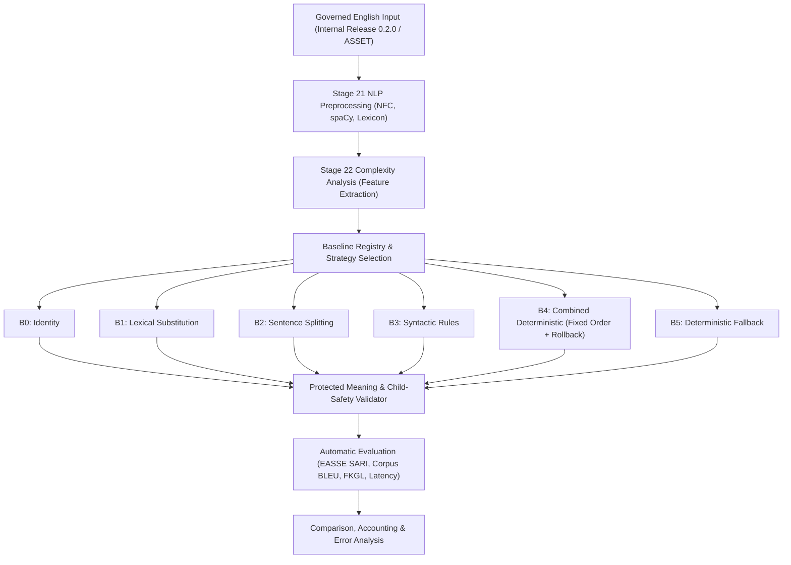

# Stage 24 — Establish English Baseline Simplification Methods

**Project:** AI-Powered Adaptive Child-Friendly Language Simplification System  
**Component:** Component 3 — AI/NLP-Based Language Simplification  
**Language:** English  
**Target age:** 4–8 years  
**Stage type:** Baseline development, controlled evaluation and governance  
**Prerequisites:** Stages 11–23 completed; `stage-23-complete-v2` is the authoritative Stage 23 checkpoint  
**Planned tag:** `stage-24-complete`  
**Document version:** 2.1.0 — Authoritative Corrected Implementation Plan  
**Status:** Approved for execution  

---

## 1. Purpose

Stage 24 establishes transparent, reproducible, and deterministic English simplification baselines. These methods provide the empirical and engineering comparison foundation for the controlled personalized simplification engine in Stage 25 and later pretrained generative model / LLM experiments.

The baselines developed in this stage are research and engineering comparators. Their outputs are provisional and are not approved for direct child delivery.

---

## 2. Objectives

1. **Implement Versioned Deterministic Baselines:** Develop transparent baseline methods (B0–B5) with explicit versioning, fixed rule execution sequences, and reproducible configurations.
2. **Component Separation & Evaluation:** Evaluate lexical (B1), structural splitting (B2), and syntactic simplification (B3) independently, as well as in a fixed-order combined pipeline (B4).
3. **Meaning & Safety Preservation:** Enforce strict safeguards around protected entities, quantities, colors, negation polarity, discourse relationships, and task-critical answer boundaries.
4. **Dual-Corpus Evaluation Protocol:** Evaluate on the governed internal English corpus (development, validation, locked test) and ASSET (benchmark-only) under distinct, non-contaminating protocols.
5. **Locked-Test & Adaptation Isolation:** Ensure zero leakage across 45 locked source groups / 135 locked simplification pairs (315 Stage 21 protected text instances) and 192 Adaptation Test Set activities (377 text instances), verified using IDs and cryptographic text hashes.
6. **Reproducible Metrics & Direct EASSE Parity:** Standardize corpus-level SARI (Add/Keep/Delete), corpus-level BLEU, FKGL reduction, and operational metrics with verified EASSE parity (< 0.05 points on the 0–100 scale) against direct command execution.
7. **Identify Stage 25 Benchmark Reference:** Identify a transparent, deterministic baseline to serve as the benchmark comparator for Stage 25.

---

## 3. Scope and Boundaries

### Included

- English text only (target age 4–8 years).
- Implementation of B0 (Identity), B1 (Lexical), B2 (Sentence Splitting), B3 (Syntactic Rules), B4 (Combined Deterministic), and B5 (Existing Offline Fallback).
- Stage 21 preprocessing (using spaCy) and Stage 22 complexity-feature integration.
- Internal corpus development, validation, and locked test evaluation.
- ASSET 359-group test benchmark-only evaluation.
- Meaning-preservation, answer-leakage, and child-safety validation gates.
- Automated metric calculation, latency measurement, and qualitative error analysis.

### Excluded

- Model fine-tuning (no transformer parameter updates).
- Gemini or live external LLM evaluation (offline deterministic comparator only; no live API calls in primary baseline benchmarks).
- Pretrained generative model evaluation (mT5, mBART).
- Sinhala language processing (strictly English).
- Expert clinical or diagnostic validation for child delivery.
- Modifications to Component 1 screening risk or learner profiles.
- Direct runtime integration with Components 1, 2, or 4.

---

## 4. Baseline Registry & Taxonomy

| ID | Baseline Name | Generator Method | Description | Main Purpose |
|---|---|---|---|---|
| **B0** | Identity Baseline | `identity_baseline` | Returns the input text unchanged after canonical preprocessing. | Establishes the lower-bound zero-simplification reference. |
| **B1** | Lexical Substitution | `lexical_baseline` | Replaces difficult words using the governed English lexicon, POS tags, and target content age. | Measures pure lexical-rule contribution. |
| **B2** | Sentence Splitting | `sentence_split_baseline` | Splits compound sentences at safe coordinating/subordinate boundaries; validates verbs & subjects. | Measures structural chunking contribution. |
| **B3** | Syntactic Rules | `syntactic_rule_baseline` | Applies allowlisted voice transformation, safe relative clause handling, and nominalization unpacking. | Measures syntactic transformation contribution. |
| **B4** | Combined Deterministic | `combined_deterministic` | Executes fixed-order pipeline (Syntax $\to$ Split $\to$ Lexical $\to$ Repair $\to$ Validate) with operation rollback. | Serves as the primary transparent deterministic comparator. |
| **B5** | Existing Offline Fallback | `deterministic_fallback` | Registers the existing offline heuristic comparator without LLM attribution. | Provides historical comparator continuity from Stage 23. |

Each baseline record explicitly defines:
- `method_id` (e.g., `B0`..`B5`)
- `method_version` (e.g., `1.0.0`)
- `configuration_version` (e.g., `1.0.0`)
- `configuration_hash` (`<64-character-sha256>`)
- `ordered_rules` (list of rule identifiers executed)
- `required_resources` (lexicon hashes, grammar rule configs)
- `governance_status` (`provisional_baseline_only`)

---

## 5. Dataset and Evaluation Protocol

### 5.1 Internal English Corpus & Evaluation Unit

#### Evaluation Unit Definition
The internal data contains:
- One original source item.
- Three reference simplifications: Mild, Moderate, and Strong.

B0–B5 are generic baselines and do not use learner profiles or personalized support levels. Therefore, they generate **one output per source group**, not three identical outputs for the three pairs.

```text
One original source item
       ↓
One output from each baseline
       ↓
Compared against Mild + Moderate + Strong references
```

**Locked Internal Test Set Accounting:**
| Item | Count |
|---|---|
| Source groups evaluated | 45 |
| Reference simplification pairs | 135 |
| References per source | 3 |
| Outputs per baseline | 45 |
| Total outputs across B0–B5 | 270 |

> **Authoritative Specification:**  
> Each generic Stage 24 baseline generates one output per unique source group. The output is evaluated against all three governed reference simplifications—Mild, Moderate and Strong—using multi-reference metrics. The 135 locked pairs serve as 135 references for 45 source groups; they do not produce 135 independent baseline inputs.  
>  
> *Note on Scope:* If separate Mild/Moderate/Strong outputs were generated, the baselines would require a `target_support_level` input and would become controlled/personalized baselines. That would overlap with Stage 25. The one-output-per-source approach is strictly maintained for Stage 24.

- **Data Loading:** Load the Stage 20 cumulative governed 0.2.0 release through the dataset registry and repository (`data/simplification_corpus/releases/0.2.0/`). Resolve exact release files from the versioned manifest rather than hard-coding legacy draft paths.
- **Split Governance:** Rule threshold tuning is permitted strictly on development/training and validation splits.
- **Group Integrity:** All sentence variants sharing a `source_item_id` or `source_group_id` reside in the same split.
- **Locked Test Isolation:** The locked internal test split (45 source groups, 135 simplification pairs, 315 protected Stage 21 text instances documented in `locked_test_manifest.json`) is evaluated strictly once after baseline configurations are frozen. Zero inspection or manual tuning on locked test sentences.
- **Exclusion Filters:** Unresolved `manual_review_required`, quarantined, or rights-ineligible records are excluded from evaluation.

### 5.2 ASSET Benchmark Evaluation & Target Age Policy

#### Target Age Configuration
B1 requires target age metadata to govern lexical replacement thresholds, but ASSET does not provide reliable child-age metadata.
- **Internal corpus:** Use the source item’s governed `target_content_age`.
- **ASSET corpus:** Use a frozen generic configuration: `target_age_band = "4-8"` with a documented lexical threshold.
- Do not infer a DLD support level for ASSET.
- Do not claim ASSET output is suitable for children aged 4–8.

```json
{
  "age_configuration": {
    "internal_policy": "source_item_target_age",
    "asset_policy": "fixed_generic_age_band",
    "asset_target_age_band": "4-8",
    "uses_learner_profile": false
  }
}
```

#### Meaning Validation Modes
Internal records contain explicit protected annotations, but ASSET does not. Stage 24 defines two distinct validation modes:
- **Internal Mode:** Governed protected annotations plus automatic extraction.
- **ASSET Mode:** Automatic entity, quantity, negation, and relation extraction only. ASSET checks must be labelled automated and must not be presented as expert meaning validation.

#### Benchmark Isolation & Rights
- **Data Source:** Official ASSET test split (359 source groups, 10 references each).
- **Rights Policy:** Operated under the Stage 23 rights decision (`approved_local_research`, noncommercial academic research context).
- **Non-Contamination:** Zero rule tuning or lexical mining against ASSET test sentences or references.
- **Redistribution Policy:** Raw and normalized ASSET full text remains Git-ignored. Only non-reconstructable metadata, numerical features, and aggregate evaluation results are released in `data/baseline_simplification/en/baseline-1.0.0/`.
- **Governance Posture:**
  ```json
  {
    "evaluation_protected": true,
    "training_eligible": false,
    "benchmark_eligible": true,
    "approved_for_child_delivery": false
  }
  ```

### 5.3 Prohibited Data Mixing

- Simplification corpus records are strictly isolated from runtime child tasks.
- Adaptation Test Set (192 activities, 377 extracted text instances) is never included in baseline development or training splits.
- ASSET benchmark references are never merged into internal training data.
- Historical Stage 23 baseline results are preserved and never overwritten.

---

## 6. Functional Architecture



### Directory Structure

```text
backend/app/baseline_simplification/
├── __init__.py
├── schemas.py                          # Pydantic v2 schemas for baselines and evaluation
├── registry.py                         # Baseline Registry manager
├── runner.py                           # Benchmark runner across internal and ASSET datasets
├── identity_baseline.py                # B0 implementation
├── lexical_baseline.py                 # B1 implementation (lemma, POS, sense, age)
├── sentence_split_baseline.py          # B2 implementation (safe coordinating/subordinate chunking)
├── syntactic_rule_baseline.py          # B3 implementation (voice, relative clause, nominalization)
├── combined_baseline.py                # B4 implementation (ordered orchestration + rollback)
├── offline_fallback_adapter.py         # B5 adapter
├── protected_meaning_validator.py      # Entity, quantity, color, negation, polarity validator (Dual Mode)
├── output_validator.py                 # Structural and grammar safety validator
└── evaluator.py                        # EASSE SARI, Corpus BLEU, FKGL, operational metrics

backend/tests/baseline_simplification/
├── __init__.py
├── test_identity_baseline.py
├── test_lexical_baseline.py
├── test_sentence_splitting.py
├── test_syntactic_rules.py
├── test_combined_baseline.py
├── test_offline_fallback_attribution.py
├── test_protected_meaning.py
├── test_reproducibility.py
├── test_locked_test_isolation.py
├── test_asset_rights_gate.py
├── test_metric_parity.py
└── test_stage24_end_to_end.py

scripts/stage24/
├── snapshot_stage23.py
├── build_evaluation_inputs.py
├── run_internal_baselines.py
├── run_asset_baselines.py
├── run_easse_evaluation.py
├── verify_metric_parity.py
├── generate_error_analysis.py
├── compare_baselines.py
├── verify_stage24_accounting.py
└── generate_stage24_report.py
```

---

## 7. Baseline Specifications & Ordering

### 7.1 B0 — Identity Baseline
- **Execution:** Returns canonical evaluation source text unchanged.
- **Transforms:** None.
- **Role:** Strict lower-bound reference for zero simplification.

### 7.2 B1 — Lexical Substitution
- **Lexicon Integration & Schema Verification:** Uses the Stage 20 governed English lexicon.  
  > **WP1 Schema Verification Requirement:** WP1 must inspect the registered `LexiconEntryV1` schema (`backend/app/datasets/lexicons/schemas.py`) and map the age-gating rule to existing governed fields (such as `age_band` parsing like `'4-6'`, `'6-8'` and `difficulty_tier`). Missing fields must cause configuration validation failure rather than silent assumptions.
- **Age Gating Rule:** Replaces complex words using mapped developmental age thresholds:
  - Source word is above target content age / difficulty tier.
  - Replacement candidate is within target content age / lower difficulty tier.
- **Non-Personalization Boundary:** B1 may use the educational item's `target_content_age` metadata (or the fixed ASSET band `4-8`), but must **NOT** use learner-level personalization attributes (DLD risk tier, learner test scores, learner history, or Component 4 recommendations).
- **Matching Rules:** Matches word lemma + part-of-speech tag.
- **Inflection & Capitalization:** Preserves exact casing (title, upper, lower) and grammatical inflection.
- **Protection Rules:** Excludes named entities, protected answer keys, quantities, colors, and spatial directional tokens.
- **Cycle Prevention:** Prohibits circular substitutions ($A \to B \to A$) and difficulty inversions.

### 7.3 B2 — Sentence Splitting
- **Splitting Boundaries:** Splits compound sentences at coordinating conjunctions (`and`, `but`, `so`) and subordinate boundaries (`because`, `when`, `after`) when both clauses have explicit subjects and finite verbs.
- **Fragment Prevention:** Rejects fragments using finite-verb, subject-recoverability, and dependency checks. Permits valid short imperative sentences with an implied subject (e.g., *"Sit down."*, *"Pick it."*, *"Look here."*).
- **Discourse Preservation:** Preserves original chronological action order.
- **Safety Exclusions:** Never splits within protected noun phrases, quotes, parentheticals, or mathematical/numerical expressions.

### 7.4 B3 — Syntactic Transformation
- **Allowlisted Rules:** Applies only allowlisted syntactic transformations whose preconditions are strictly satisfied.
- **Passive-to-Active:** Converts passive constructions into active voice only when the agent (`by ...`) is explicit and unambiguous.
- **Ambiguity Routing:** Routes ambiguous relative clauses, discourse markers, and parenthetical qualifiers to manual review instead of deleting or restructuring them automatically.
- **Nominalization Unpacking:** Unpacks selected abstract nominalizations into common active verbs (e.g., `made a decision` $\to$ `decided`).

### 7.5 B4 — Combined Deterministic Pipeline
- **Fixed Order of Execution:**
  1. *Protected-Element Extraction & Masking*
  2. *Allowlisted Syntactic Transformation (B3)*
  3. *Safe Sentence Splitting (B2)*
  4. *Lexical Substitution (B1)*
  5. *Inflection, Punctuation & Casing Repair*
  6. *Protected-Meaning & Safety Validation*
- **Rollback Mechanism & Outcome Decoupling:** If an individual operation causes a validation violation (e.g., answer leakage, entity loss, negation inversion), only that specific operation is reverted to its pre-step state.
- **Outcome Tracking:** Rollback is an operation event, not a final failure disposition. Reverted operations are recorded in `operation_outcomes`. A successfully reverted operation that leaves the remaining output valid receives `quality_disposition: "automatic_check_passed"`.

### 7.6 B5 — Existing Offline Fallback
- **Attribution:** Formally tagged as `generator_method = "deterministic_fallback"`, `requested_provider = "deterministic_fallback"`.
- **Integrity:** Never attributed to Gemini or external LLM providers.
- **Historical Comparison:** Clearly records whether Stage 23 results are imported for historical comparison or recomputed using Stage 24 implementations.

---

## 8. Protected Meaning, Safety & Dispositions

The following attributes are strictly protected and must be invariant under simplification:

1. **Entities & Named Participants:** Names, proper nouns, and characters.
2. **Quantities & Numbers:** Numerical digits, spelled numbers, counts, and measurements.
3. **Colors & Shapes:** Visual cue discriminators (e.g., `red`, `square`, `circle`).
4. **Negation Polarity & Scope:** `not`, `never`, `none`, `without` must retain exact polarity.
5. **Temporal & Spatial Relations:** `before`, `after`, `first`, `next`, `under`, `above`, `left`, `right`.
6. **Task Intent & Answer References:** Task goal verbs and protected solution keys.

### Output Dispositions & Rollback Decoupling

| Condition | Final Disposition | Action |
|---|---|---|
| Unsafe operation successfully reverted and final output valid | `automatic_check_passed` | Eligible for metric evaluation |
| Reverted output remains ambiguous | `manual_review_required` | Flagged for review; isolated from child delivery |
| No valid output remains | `automatic_check_failed` | Generation failed; recorded as error |
| Leakage, unsafe content or privacy violation | `quarantined` | Immediately blocked and logged |

> **Principle:** Rollback is an operation event, not a final failure disposition.

All baseline outputs carry:
```json
{
  "validation_status": "draft",
  "research_eligible": false,
  "approved_for_child_delivery": false,
  "requires_expert_review": true
}
```

---

## 9. Output Record Schema

```json
{
  "run_id": "BASE-EN-20260930-0001",
  "dataset_id": "internal_english",
  "dataset_version": "0.2.0",
  "schema_version": "1.0.0",
  "preprocessing_version": "1.0.0",
  "complexity_analyzer_version": "1.0.0",
  "evaluation_unit": "source_group",
  "reference_count": 3,
  "target_support_level": null,
  "uses_learner_profile": false,
  "protected_element_source": "governed_annotations_plus_extractor",
  "target_content_age": 6,
  "source_record_id": "SRC-EN-000001",
  "source_group_id": "GROUP-EN-000001",
  "split": "development_candidate_validation",
  "method_id": "B4",
  "method_version": "1.0.0",
  "configuration_version": "1.0.0",
  "configuration_hash": "<64-character-sha256>",
  "input_hash": "<64-character-sha256>",
  "output_hash": "<64-character-sha256>",
  "rules_applied": [
    {"rule_id": "SYN-01-PASSIVE-ACTIVE", "step": 1},
    {"rule_id": "LEX-04-VOCAB-REPLACE", "word": "commence", "replacement": "start", "step": 4}
  ],
  "operation_outcomes": [
    {"rule_id": "SYN-02-RELATIVE-APPOSITIVE", "outcome": "reverted", "reason": "ambiguous_precondition"}
  ],
  "generator_method": "combined_deterministic",
  "fallback_used": false,
  "meaning_validation_status": "passed",
  "quality_disposition": "automatic_check_passed",
  "metric_eligibility": true,
  "metric_exclusion_reason": null,
  "latency_ms": 1.45,
  "approved_for_child_delivery": false
}
```

---

## 10. Evaluation Metrics & EASSE Parity

### 10.1 Reference-Based Simplification Metrics
- **Corpus SARI (Overall):** Standard arithmetic mean of Add, Keep, and Delete scores across 1- to 4-grams produced by pinned EASSE.
- **Corpus SARI Add:** F1 score of added n-grams against reference additions.
- **Corpus SARI Keep:** F1 score of retained n-grams against reference retentions.
- **Corpus SARI Delete:** Precision of deleted n-grams against reference deletions.
- **Corpus BLEU:** Multi-reference corpus BLEU produced by the pinned EASSE implementation. Sentence-level BLEU, if calculated for error analysis, is reported separately and not mixed with the corpus-level result.
- **EASSE Parity Tolerance:** Parity between internal metric wrappers and direct EASSE command-line execution must satisfy:
  $$\Delta < 0.05 \text{ points on the 0–100 scale}$$

### 10.2 Readability & Complexity Reduction
- **FKGL (Flesch-Kincaid Grade Level):** Original, output, and grade level reduction ($\Delta \text{FKGL}$).
- **Length Metrics:** Word count compression ratio and character count compression ratio.
- **Lexical Complexity:** Difficult word count reduction and average syllable reduction.
- **Syntactic Complexity:** Clause count, subordinate clause count, and dependency depth change.

### 10.3 Meaning Preservation & Safety Rates
- Protected entity preservation rate ($100\%$ target).
- Quantity and numerical preservation rate ($100\%$ target).
- Negation consistency rate ($100\%$ target).
- Answer leakage count ($0$ target).
- Empty/invalid output rate ($0\%$ target).

### 10.4 Operational Metrics
- Mean, median, and 95th percentile latency (ms/sample).
- Throughput (samples/sec).
- Deterministic reproducibility rate ($100\%$).

---

## 11. Work Packages (WP0 – WP9)

- **WP0: Baseline Checkpoint & Environment Snapshot**
  - Verify clean working tree on `stage-23-complete-v2`.
  - Pin exact EASSE package version and document environment hash.
  - Create git tag `stage-24-start`.
  - Snapshot Stage 23 release manifest in `data/baseline_simplification/registry/stage24_baseline_snapshot.json`.

- **WP1: Schemas, Registry & Protected Meaning Validator**
  - Implement Pydantic v2 schemas in `backend/app/baseline_simplification/schemas.py`.
  - Inspect the registered `LexiconEntryV1` schema and map age-gating rules to existing governed fields. Missing fields must cause configuration validation failure rather than silent assumptions.
  - Implement baseline registry in `backend/app/baseline_simplification/registry.py`.
  - Implement `ProtectedMeaningValidator` (supporting Internal Dual Mode and ASSET Automated Mode) and `OutputValidator`.

- **WP2: Individual Baselines (B0, B1, B2, B3)**
  - Implement `IdentityBaseline` (B0).
  - Implement `LexicalSubstitutionBaseline` (B1) with mapped age gating without personalized learner scores.
  - Implement `SentenceSplitBaseline` (B2) permitting valid short imperatives with implied subjects while rejecting fragments.
  - Implement `SyntacticRuleBaseline` (B3) applying only allowlisted transformations and routing ambiguous cases to manual review.

- **WP3: Combined Pipeline (B4) & Offline Fallback (B5)**
  - Implement `CombinedDeterministicBaseline` (B4) with fixed execution order and operation-level rollback.
  - Implement `OfflineFallbackAdapter` (B5) with explicit non-LLM attribution.
  - Implement unit tests for operation-level rollback and deterministic output equality.

- **WP4: Internal Dataset Development Evaluation**
  - Load Stage 20 release 0.2.0 through dataset registry.
  - Run B0–B5 over internal training and validation splits (1 output per source group evaluated against 3 references).
  - Freeze all rule thresholds and configuration parameters.

- **WP5: Internal Locked-Test Evaluation**
  - Verify locked test manifest integrity (`locked_test_manifest.json`, 45 source groups / 135 pairs).
  - Execute frozen baselines B0–B5 on locked test split exactly once (45 outputs per baseline $\to$ 270 total outputs across B0–B5).
  - Record non-reconstructable evaluation metrics and confirm zero leakage.

- **WP6: ASSET Benchmark Evaluation & Direct EASSE Parity**
  - Run frozen baselines B0–B5 on official ASSET test split (359 groups $\to$ 359 outputs per baseline evaluated against 10 references each).
  - Execute direct EASSE evaluation command and verify parity within numerical tolerance ($\Delta < 0.05$ on 0–100 scale).
  - Save direct EASSE command outputs alongside internal wrapper metrics.

- **WP7: Comparison, Error Analysis & Baseline Selection**
  - Generate comparative performance tables across all baselines.
  - Perform qualitative error analysis (meaning shift, grammar errors, fragments, over-simplification, under-simplification).
  - Select primary reference baseline for Stage 25.

- **WP8: Release Generation & Enumerated Deliverables**
  - Serialize non-reconstructable release artifacts in `data/baseline_simplification/en/baseline-1.0.0/`.
  - Generate all **10 documentation deliverables**:
    1. `docs/stage24_baseline_policy.md`
    2. `docs/stage24_baseline_registry.csv`
    3. `docs/stage24_rule_catalogue.csv`
    4. `docs/stage24_internal_evaluation_report.md`
    5. `docs/stage24_asset_evaluation_report.md`
    6. `docs/stage24_baseline_comparison.csv`
    7. `docs/stage24_error_analysis.md`
    8. `docs/stage24_accounting_summary.md`
    9. `docs/stage24_reproducibility_record.json`
    10. `docs/stage24_completion_record.md`
  - Plus integrity artifact:
    - `docs/stage24_manifest.sha256` (*integrity artifact, not one of the ten reports*)

- **WP9: Verification, Closeout & Tagging**
  - Execute full test suite (`pytest tests/baseline_simplification/`, `pytest tests/`).
  - Execute frontend production build (`npm run build`).
  - Verify clean git status.
  - Commit, push, and create annotated tag `stage-24-complete`.

---

## 12. Accounting Equations & Mathematical Integrity

For each dataset and method, final dispositions are mutually exclusive:

$$\text{Eligible Inputs} = \text{Passed} + \text{Manual Review Required} + \text{Failed} + \text{Quarantined}$$

Processing tracking:

$$\text{Eligible Inputs} = \text{Output Generated} + \text{Generation Failed}$$

Evaluation tracking:

$$\text{Passed} + \text{Manual Review Required} + \text{Failed} + \text{Quarantined} = \text{Evaluated} + \text{Metric Excluded}$$

$$\text{Unaccounted Records} = 0$$

Every input-method combination must receive exactly one final disposition.

---

## 13. Completion Checklist

- [ ] All baselines B0–B5 implemented, versioned, and reproducible.
- [ ] Evaluation unit defined as 1 output per source group evaluated against 3 references on internal data (45 source groups $\to$ 45 outputs per baseline $\to$ 270 total outputs across B0–B5).
- [ ] B1 lexical age rule mapped to existing `LexiconEntryV1` schema fields without silent assumptions or personalized learner scores.
- [ ] ASSET evaluated using fixed generic age band (`"4-8"`) without inferring DLD support levels or claiming suitability for children aged 4–8.
- [ ] Meaning validation operates in internal mode (governed + automatic) and ASSET mode (automated only).
- [ ] B2 allows short imperatives with implied subjects while rejecting grammatical fragments.
- [ ] B3 restricts syntactic transforms to allowlisted operations and routes ambiguous constructions to manual review.
- [ ] B4 rollback decoupling verified: reverted operations do not force `automatic_check_failed`.
- [ ] Meaning-preservation and child-safety validation active on all outputs.
- [ ] Zero leakage across 45 locked source groups / 135 locked pairs and 192 Adaptation Test Set activities.
- [ ] Frozen methods evaluated on the internal locked test split and ASSET benchmark.
- [ ] Direct EASSE evaluation executed with verified metric parity (< 0.05 points on 0–100 scale).
- [ ] Historical Stage 23 results and Stage 24 recomputed runs clearly documented without mixing.
- [ ] Zero-loss accounting equations balance with 0 unaccounted instances.
- [ ] All backend regression tests pass (295+ tests).
- [ ] Frontend production build passes.
- [ ] All 10 documentation deliverables and SHA-256 integrity manifest generated.
- [ ] Git commit and `stage-24-complete` tag sealed.
