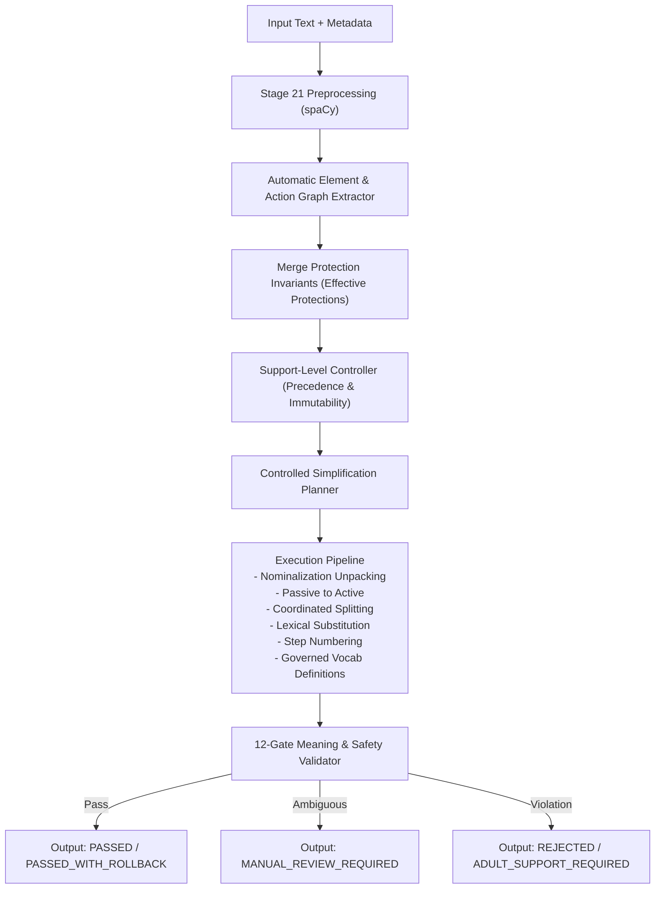

# Stage 25 — Controlled Simplification Engine Architecture

**Document ID:** STAGE25-ARCH-001  
**Engine Version:** 1.0.0  
**Configuration Hash:** `929930790f100e2873e03d9e0f60040a4f8eca7fc6af7072efba00f3b34e45b8`  
**Status:** Research & Development Candidate Engine  
**Governance Default:** `approved_for_child_delivery: false`, `requires_expert_review: true`  

---

## 1. Architectural Overview & Workflow

## 2. Core Architectural Principles
1. **Deterministic Multi-Tier Transformation:** Distinct Mild, Moderate, and Strong rule execution paths.
2. **Untrusted Caller & Auto-Detection Invariant:** Auto-detected protected entities, numbers, and action graphs cannot be removed by caller metadata.
3. **Fail-Closed Governance:** Violations trigger safe operation rollback; unresolvable transformations route to `MANUAL_REVIEW_REQUIRED`.
4. **Structured Action Graph:** Action nodes preserve chronological execution sequence and safety-critical modifiers.
5. **Privacy-Safe Auditing:** Logs record pseudonymous hashes and rule IDs without storing raw learner text.
