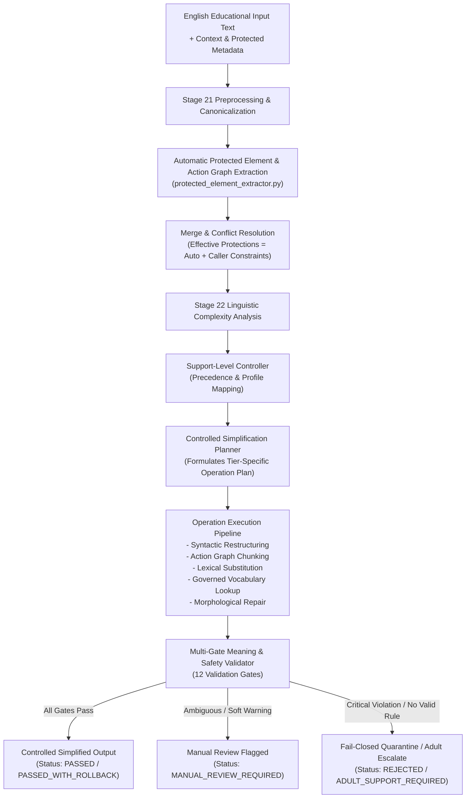
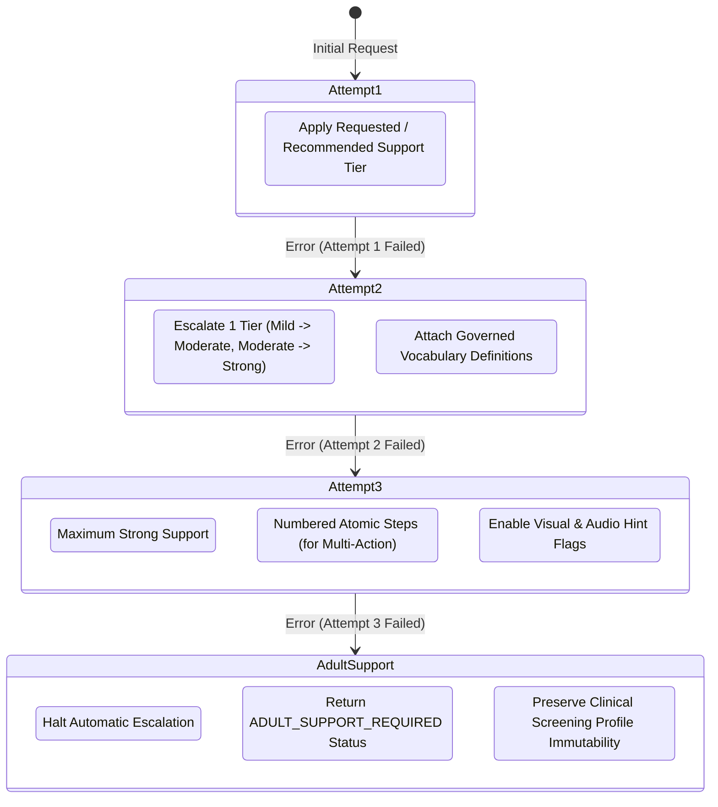
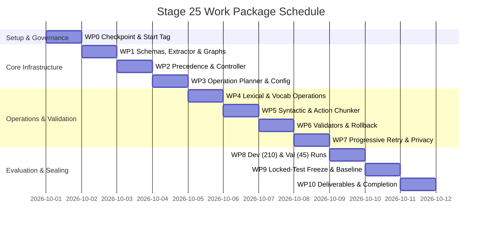

# Stage 25 — Develop the Controlled English Simplification Engine

**Project:** AI-Powered Adaptive Child-Friendly Language Simplification System  
**Component:** Component 3 — AI/NLP-Based Language Simplification  
**Language:** English  
**Target age:** 4–8 years  
**Stage type:** Controlled Simplification Engine Development, Adaptive Evaluation, and Governance  
**Prerequisites:** Stages 11–24 completed; `stage-24-complete-v2` is the authoritative Stage 24 checkpoint  
**Planned tag:** `stage-25-complete`  
**Document version:** 3.0.0 — Authoritative Final Implementation Plan  
**Status:** Approved for execution  

---

## 1. Purpose

Stage 25 builds and evaluates the **Controlled English Simplification Engine**. Using the linguistic infrastructure established in Stages 20–23 and the baseline benchmark comparator suite frozen in Stage 24, Stage 25 transitions from generic baseline comparators to a deterministic, tier-aware research and development candidate engine.

The engine coordinates deterministic lexical substitution, syntactic restructuring, sentence splitting, explicit subject insertion, and structured instructional step chunking according to the learner's target educational support level (**Mild**, **Moderate**, or **Strong**).

The engine is deterministic, rule-governed, transparent, and auditable. Pretrained generative models (mT5, mBART) and external LLM-based approaches (Gemini) are sequestered for later experimental evaluation stages. All outputs generated in Stage 25 remain research and development candidate outputs (`approved_for_child_delivery: false`, `requires_expert_review: true`) pending validation by qualified language-development professionals, educators and relevant domain experts.

---

## 2. Objectives

1. **Implement Support-Tier Controlled Simplification:** Develop a deterministic engine capable of generating differentiated, linguistically appropriate outputs for **Mild**, **Moderate**, and **Strong** educational support tiers.
2. **Coordinate Multi-Operation Simplification:** Unify lexical substitution, vocabulary explanation support, syntactic restructuring (active voice, nominalization unpacking), sentence splitting, and structured instruction chunking into a coherent, rule-planned pipeline.
3. **Enforce Robust Input Trust & Guardrail Verification:** Automatically extract protected elements and action graphs from original text, merge with caller constraints (never allowing caller metadata to weaken auto-detected protections), and detect/reject known protected-meaning violations with fail-closed routing to manual review.
4. **Implement Progressive Retry Scaffolding:** Build an adaptive retry mechanism that escalates instructional support across successive attempts without modifying clinical risk profiles.
5. **Verify Multidimensional Support-Level Monotonicity:** Empirically verify that cognitive and linguistic complexity decreases monotonically across tiers ($\text{Strong} \le \text{Moderate} \le \text{Mild} \le \text{Original}$) across a composite metric suite while no known meaning-preservation violations are detected by the defined validation framework.
6. **Execute Corresponding-Tier Evaluation on Official Splits:** Evaluate generated Mild, Moderate, and Strong outputs against corresponding governed reference tiers on the official Stage 20 release splits (Dev 210 for tuning; Val 45 for freeze; Locked Test 45 for final holdout; total 900 outputs).
7. **Benchmark Against Stage 24 Baselines:** Rigorously compare the Stage 25 engine across all tiers against frozen baselines B0–B5 across 810 comparative evaluation pairs, reporting effect sizes and paired bootstrap confidence intervals.
8. **Enforce Personalization, Privacy & Clinical Governance:** Maintain strict separation between educational adaptation controls and diagnostic/clinical risk classifications, employing privacy-safe audit logging.

---

## 3. Difference from Stage 24 Baselines

| Dimension | Stage 24 (Frozen Baselines) | Stage 25 (Controlled Engine) |
|---|---|---|
| **Role & Nature** | Generic baseline comparators (B0–B5) | Controlled, tier-aware R&D candidate engine |
| **Output per Source** | Exactly 1 generic output per source item | Distinct Mild, Moderate, or Strong outputs |
| **Support-Tier Control** | None (support-tier agnostic) | Governed by explicit `target_support_level` & profile |
| **Operation Coordination** | Isolated rules (B1, B2, B3) or rigid pipeline (B4) | Dynamic, strength-aware planning & rollback |
| **Instruction Representation** | Punctuation-based splitting | Structured Action Graph & atomic step decomposition |
| **Vocabulary Support** | Replacement only | Replacement + governed dictionary definitions & examples |
| **Retry Scaffolding** | Single-pass evaluation | Multi-attempt progressive escalation adapter |
| **Evaluation Reference** | Generic output vs all 3 references | Primary: tier-matched reference; Secondary: multi-reference |
| **Governance Status** | Research comparator baseline | Research & development candidate engine |

---

## 4. Architectural Flow & Engine Design



---

## 5. Input, Protection & Response Contract Schemas

### 5.1 Request Contract (`SimplificationRequest`)

```json
{
  "request_id": "SIMREQ-EN-000001",
  "text": "Before placing the red ball inside the box, carefully select the smaller blue object.",
  "language": "en",
  "target_content_age": 6,
  "target_support_level": "strong",
  "content_type": "instruction",
  "response_mode": "direct_action",
  "learner_profile": {
    "learner_id_hash": "ANON-LRN-8f3e1a",
    "grade_level": "Grade 1",
    "vocabulary_score": 0.42,
    "grammar_score": 0.50,
    "comprehension_score": 0.45,
    "instruction_following_score": 0.40,
    "recommended_support_level": "moderate",
    "attempt_number": 1,
    "previous_error_pattern": null
  },
  "provided_protected_elements": {
    "exact_preservation": ["red", "blue", "box", "ball"],
    "semantic_equivalence_allowed": [
      {"source": "select", "allowed": ["pick", "choose"]},
      {"source": "inside", "allowed": ["in", "into"]}
    ],
    "quantities": [],
    "forbidden_disclosure_refs": ["ANSREF-000123"],
    "forbidden_disclosure_hashes": ["sha256:e3b0c44298fc1c149afbf4c8996fb92427ae41e4649b934ca495991b7852b855"]
  },
  "provided_action_sequence": [
    {
      "sequence": 1,
      "verb": "select",
      "object": "smaller blue object",
      "modifiers": [
        {"text": "carefully", "criticality": "optional_style"}
      ]
    },
    {
      "sequence": 2,
      "verb": "place",
      "object": "red ball",
      "relation": "inside",
      "reference_object": "box",
      "modifiers": []
    }
  ]
}
```

### 5.2 Automatic Extraction & Merge Contract (`EffectiveProtectionContext`)

```json
{
  "detected_protected_elements": {
    "exact_preservation": ["red", "blue", "box", "ball"],
    "detected_quantities": [],
    "detected_relations": ["before", "inside", "smaller"],
    "detected_modifiers": [
      {"text": "carefully", "criticality": "optional_style"}
    ]
  },
  "effective_protected_elements": {
    "exact_preservation": ["red", "blue", "box", "ball"],
    "semantic_equivalence_allowed": [
      {"source": "select", "allowed": ["pick", "choose"]},
      {"source": "inside", "allowed": ["in", "into"]}
    ],
    "quantities": [],
    "forbidden_disclosure_refs": ["ANSREF-000123"],
    "forbidden_disclosure_hashes": ["sha256:e3b0..."]
  },
  "protection_conflicts": []
}
```

### 5.3 Response Contract (`SimplificationResponse`)

```json
{
  "request_id": "SIMREQ-EN-000001",
  "engine_version": "1.0.0",
  "configuration_hash": "a1b2c3d4e5f6...",
  "original_text_hash": "sha256:8f4c...",
  "simplified_text": "1. Pick the smaller blue object.\n2. Put the red ball in the box.",
  "requested_support_level": "strong",
  "recommended_support_level": "moderate",
  "applied_support_level": "strong",
  "support_level_source": "authorized_request",
  "support_override_reason": null,
  "status": "PASSED",
  "governance_metadata": {
    "validation_status": "draft",
    "approved_for_child_delivery": false,
    "requires_expert_review": true
  },
  "validation_results": {
    "language_consistency": true,
    "grammar_completeness": true,
    "exact_elements_preserved": true,
    "semantic_elements_preserved": true,
    "quantities_preserved": true,
    "colors_shapes_preserved": true,
    "negation_preserved": true,
    "spatial_temporal_preserved": true,
    "action_order_preserved": true,
    "answer_boundary_preserved": true,
    "support_compliance": true,
    "advisory_semantic_similarity": {
      "model": "sentence-transformers/all-MiniLM-L6-v2",
      "model_revision": "e4ce9877ab0b32132d0",
      "similarity_score": 0.94,
      "threshold": 0.85,
      "passed": true
    },
    "child_safe_checks_passed": true,
    "detected_violations": []
  },
  "vocabulary_explanations": [
    {
      "word": "select",
      "simplified_term": "pick",
      "simple_definition": "choose one thing",
      "example": "Pick the blue object.",
      "source": "governed_lexicon"
    }
  ],
  "applied_operations": [
    {"rule_id": "SYN_ORDER_REVERSE", "type": "syntactic", "status": "applied"},
    {"rule_id": "CHUNK_NUMBERED_STEPS", "type": "structural", "status": "applied"},
    {"rule_id": "LEX_SELECT_PICK", "type": "lexical", "status": "applied"}
  ],
  "complexity_deltas": {
    "fkgl_delta": 3.42,
    "word_count_delta": 0,
    "mean_clause_length_delta": -7.5,
    "difficult_word_ratio_delta": -0.12
  },
  "scaffolding_metadata": {
    "attempt_number": 1,
    "visual_hint_flag": true,
    "audio_hint_flag": true,
    "requires_adult_escalation": false
  }
}
```

---

## 6. Support-Level Precedence and Behavioral Matrix

### 6.1 Support-Level Precedence Hierarchy
1. **Explicit Authorized Request:** An authorized explicit `target_support_level` takes primary precedence.
2. **Learner Profile Default:** If no explicit request is supplied, use `learner_profile.recommended_support_level`.
3. **Attempt Escalation:** Successive failed attempts ($2, 3$) can escalate support by one tier (e.g. Mild $\to$ Moderate $\to$ Strong).
4. **No Silent Reduction:** The engine must never silently downgrade support below the determined tier.
5. **Auditable Source Tracking:** Every response audits `requested_support_level`, `recommended_support_level`, `applied_support_level`, `support_level_source` (`authorized_request` | `learner_profile_recommendation` | `attempt_escalation`), and `support_override_reason`.

### 6.2 Modifier Criticality Taxonomy
- **`safety_critical`** (e.g., *"gently"*, *"do not touch"*, *"with an adult"*): **Never removable** across any support tier.
- **`task_critical`** (e.g., *"slowly"* in a speed calibration task): **Never removable**; preserved intact.
- **`meaning_relevant`** (e.g., *"carefully"* where attention is essential): Preserved or replaced only by governed simple equivalent (*"with care"*).
- **`optional_style`** (e.g., purely decorative discourse adverbs): Removable in Strong/Moderate tiers to reduce cognitive clutter.

### 6.3 Support-Level Behavioral Matrix

| Control Feature | Mild Support | Moderate Support | Strong Support |
|---|---|---|---|
| **Primary Target Profile** | Emerging readers; minor vocabulary assistance needed | Developing readers; moderate syntactic & lexical scaffolding | High-need readers; requires atomic step breakdown & heavy support |
| **Difficult-Word Replacement** | Conservative (only top-decile difficult words replaced) | Regular (governed tier replacements for age appropriateness) | Extensive (all non-core words simplified or explained) |
| **Sentence Splitting** | Only long compound sentences (> 18 words) | Standard compound & coordinated sentences (> 12 words) | Short atomic sentences / steps (max 6–8 words per clause) |
| **Grammar Restructuring** | Minimal (light active voice conversion) | Controlled (voice conversion + relative clause unrolling) | Strong (active voice, unrolled nominalizations, explicit SVO) |
| **Explicit Subject Repetition** | Rare (preserves natural ellipses) | When helpful for disambiguation | Frequently repeated for clarity across clauses |
| **Step Numbering Policy** | Single action: 1 short sentence; Multi-action: Optional numbering | Single action: 1 short sentence; Multi-action: Numbered steps | Single action: 1 short sentence; **$\ge 2$ actions: Numbered atomic steps** |
| **Vocabulary Explanation** | Only most difficult words | Selected difficult domain words | All essential complex words provided with definitions |
| **Output Length & Density** | Slightly reduced lexical density | Clearly reduced density & clause depth | Shortest safe clausal structure |
| **Meaning Preservation** | Strict validation against drift | Strict validation against drift | Strict validation against drift |

---

## 7. Personalization, Privacy & Governance Boundaries

### 7.1 Permitted Educational Adaptation Inputs
- Target age (4–8 years) and grade level.
- Domain skill scores: vocabulary, grammar, comprehension, and instruction following ($0.0–1.0$).
- Recommended educational support level (`mild`, `moderate`, `strong`).
- Activity attempt number ($1, 2, 3+$) and immediate session error patterns.
- Preferred language (`en`).

### 7.2 Strict Governance Prohibitions
- **Must NOT modify `screening_risk_level`:** Component 1 screening status is strictly read-only and immutable.
- **Must NOT perform DLD or clinical diagnostic inference:** The engine adapts readability, never clinical profiles.
- **Must NOT override expert clinician decisions:** System defaults yield to authorized educator/clinician configurations.
- **Must NOT calculate or claim Component 4 longitudinal trends:** Longitudinal analytics belong strictly to Component 4 (Stage 34 integration).
- **Must NOT expose clinical scores or risk markers in child-facing payloads:** UI payloads remain strength-based.

### 7.3 Privacy-Safe Auditing (`audit.py`)
- Logs record: Request/event ID, pseudonymous learner ID (`learner_id_hash`), input/output SHA-256 hashes, applied rule IDs, validation results, tier decision, and configuration hash.
- Raw text storage is disabled by default; stored only in dedicated, encrypted research review sessions when authorized.

---

## 8. Simplification Operations & Architecture Modules

### 8.1 Protected Element Extractor (`protected_element_extractor.py`)
- Automatically extracts entities, quantities, perceptual attributes (colors, shapes), spatial/temporal prepositions, and modifiers from original text using spaCy dependency and POS tagging.
- Merges auto-extracted elements with caller-supplied constraints, establishing `effective_protected_elements`.
- Enforces invariant: Caller metadata can add protections, but **can never remove** auto-detected protected elements. Protection conflicts trigger `MANUAL_REVIEW_REQUIRED`.

### 8.2 Action Graph Representation & Validation (`action_graph.py`, `action_graph_validator.py`)
- Represents instructions as structured dependency graphs (`sequence`, `verb`, `object`, `relation`, `reference_object`, `modifiers` with criticality).
- Validates temporal reordering against logical dependency constraints.
- Enforces conditional step-numbering: single-action instructions remain unnumbered declarative sentences; multi-action instructions become numbered atomic steps.

### 8.3 Protected Elements & Semantic Equivalence (`protected_elements.py`)
- **`exact_preservation`:** Literal verification for colors, numbers, named entities, and answer tokens.
- **`semantic_equivalence_allowed`:** Verification against governed allowlisted synonym/relation map (e.g. `select` $\to$ `pick`, `inside` $\to$ `in`).
- **`forbidden_disclosure_hashes`:** Verifies non-disclosure via SHA-256 hash checks without exposing plaintext answer keys to the simplifier.

### 8.4 Lexical Operations & Governed Vocab (`lexical_operations.py`, `vocabulary_support.py`)
- Calibrated word substitution using the Stage 20/21 governed lexicon.
- POS and dependency head preservation with morphological surface repair.
- Deterministic vocabulary support: definitions and examples loaded exclusively from the governed lexicon and expert-authored templates (no unreviewed generative formulations).

### 8.5 Syntactic Operations (`syntactic_operations.py`)
- Passive-to-active voice conversion with explicit agent validation.
- Nominalization unpacking (*"make a selection"* $\to$ *"pick"*).
- Coordinated clause splitting with subject re-insertion.

### 8.6 Safe Rollback Manager (`rollback_manager.py`)
- When an operation violates a validation gate, rolls back the failing operation and re-evaluates the remaining transformation.
- Attempts alternative tier-appropriate rules where available.
- If no valid tier-compliant output is achievable, returns `MANUAL_REVIEW_REQUIRED` (never silently returns a lower-tier output as the primary result).

### 8.7 Delivery Policy & Terminal Statuses (`delivery_policy.py`)
- Valid terminal output statuses:
  - `PASSED`: All operations valid and all 12 gates satisfied.
  - `PASSED_WITH_ROLLBACK`: Valid after rolling back one or more violating operations.
  - `MANUAL_REVIEW_REQUIRED`: Ambiguous transformation, soft warning, or failure to find a valid tier rule.
  - `REJECTED`: Critical guardrail violation or severe meaning distortion.
  - `ADULT_SUPPORT_REQUIRED`: Third attempt failure requiring authorized adult intervention.
- All outputs default to `approved_for_child_delivery: false`, `requires_expert_review: true`.

---

## 9. Progressive Retry & Scaffolding Adapter (`retry_adapter.py`)



---

## 10. The 12 Deterministic Validation Gates

1. **Language Consistency:** Output must be valid English based on dictionary vocabulary and syntax structure.
2. **Grammar & Sentence Completeness:** Valid subject-verb structure with no dangling clauses or broken conjunctions.
3. **Exact Entity Preservation:** Literal preservation of protected names, IDs, colors, and shapes.
4. **Quantity & Numeric Preservation:** Exact matching of numerals, cardinals, and quantities.
5. **Semantic Element Equivalence:** Replacement of verbs and relations verified against the allowlisted semantic map.
6. **Negation Polarity Preservation:** Strict invariance of negation operators (`not`, `no`, `never`, `without`).
7. **Spatial & Temporal Relation Preservation:** Spatial prepositions and temporal markers verified for relational parity.
8. **Action-Order Preservation:** Action sequence verified against the structured Action Graph.
9. **Protected-Answer Boundary:** Zero disclosure of answer keys or distractor indicators (verified against reference hashes).
10. **Support-Level Compliance:** Structural metrics match the requested tier specifications.
11. **Advisory Semantic Similarity Specification:**
    - **Model:** Pinned `sentence-transformers/all-MiniLM-L6-v2` (revision `e4ce9877ab0b32132d0`) with deterministic token-overlap fallback when offline.
    - **Pooling:** Mean pooling over token embeddings.
    - **Metric:** Cosine similarity with calibrated threshold ($\ge 0.85$).
    - **Governance Role:** Advisory supporting evidence only. **Cannot override a failed protected-element, polarity, quantity, relation, or action-order gate.**
12. **Child-Safe Language Verification:**
    - Detects governed blocked terms and known age-inappropriate language patterns.
    - *Governance Note:* Passing this automated gate does not establish comprehensive child suitability; outputs remain subject to expert review.

---

## 11. Multidimensional Support Monotonicity

For any source item $S$, the generated outputs $O_{\text{Mild}}$, $O_{\text{Mod}}$, $O_{\text{Strong}}$ are evaluated against a composite complexity suite to prevent raw metric distortion on short instructions:

### 11.1 Composite Complexity Decision Suite
An output sequence satisfies monotonicity if the governed composite complexity score decreases across tiers:
$$\text{CompositeComplexity}(O_{\text{Strong}}) \le \text{CompositeComplexity}(O_{\text{Moderate}}) \le \text{CompositeComplexity}(O_{\text{Mild}}) \le \text{CompositeComplexity}(S)$$

Evaluated dimensions:
1. **Difficult-Word Ratio (DWR):** $\text{DWR}(O_{\text{Strong}}) \le \text{DWR}(O_{\text{Moderate}}) \le \text{DWR}(O_{\text{Mild}})$.
2. **Mean Clause Length (MCL):** $\text{MCL}(O_{\text{Strong}}) \le \text{MCL}(O_{\text{Moderate}}) \le \text{MCL}(O_{\text{Mild}})$.
3. **Dependency Tree Depth:** Depth decreases or remains equal.
4. **Subordinate Clause Count:** Decreases across tiers.
5. **Words per Step:** Mean words per atomic step decreases in Strong tier.
6. **FKGL (Supporting Metric):** Monitored alongside structural metrics.

*Monotonicity Threshold Policy:* Stage 25 cannot be marked passed if composite monotonicity is below **98%**, unless every exception is formally reviewed, explained, and accepted under a documented exception record.

### 11.2 Meaning Invariance Principle
$$\text{Meaning}(O_{\text{Strong}}) \approx \text{Meaning}(O_{\text{Moderate}}) \approx \text{Meaning}(O_{\text{Mild}}) \approx \text{Meaning}(S)$$
*Operational Standard:* No known meaning-preservation violations are detected by the defined validation framework.

---

## 12. Dataset Accounting and Evaluation Protocol

### 12.1 Dataset Splits and Roles

The evaluation strictly conforms to the governed Stage 20 0.2.0 cumulative release splits:

| Dataset Split | Source Groups | Reference Pairs | Generated Outputs per Tier | Total Stage 25 Outputs | Primary Purpose |
|---|---:|---:|---:|---:|---|
| **Development Candidate Train** | 210 | 630 | 210 | **630** | Rule development, threshold tuning, and debugging |
| **Development Candidate Validation** | 45 | 135 | 45 | **135** | Rule selection, hyperparameter tuning, and configuration freeze |
| **Locked Test Set** | 45 | 135 | 45 | **135** | Final unbiased evaluation only |
| **Total Corpus** | **300** | **900** | **300** | **900** | — |

*Smoke Test Samples:* Designated explicitly as `development_smoke_sample` ($N=10$) and `validation_smoke_sample` ($N=10$).

### 12.2 Strict Locked Test History & Quarantine Protocol
- **History & Lineage:** The Stage 20 locked test set ($45$ source groups / $135$ pairs) was previously evaluated under Stage 24 frozen baselines. For Stage 25, it serves as a **reused benchmark**.
- **Execution Freeze:** The locked test set is executed **exactly once** only after Stage 25 rules, thresholds, tier configurations, validation gates, engine version, and configuration hashes are completely frozen.
- **Zero Leakage:** No Stage 25 rules or thresholds may be tuned using Stage 25 locked-test results. Any modification after testing requires a version increment and a formally recorded new run. A fresh, expert-reviewed holdout will be reserved in later stages for clinical claims.

### 12.3 Fair Stage 24 Comparative Benchmark Design

| Stage / Method | Source Groups | Outputs Generated | Comparison Pairs Evaluated |
|---|---|---|---|
| **Stage 25 Engine** | 45 locked groups | $45 \times 3 = 135$ outputs | $135$ tier-matched comparisons |
| **Stage 24 Baselines (B0–B5)** | 45 locked groups | $45 \times 6 = 270$ outputs | $45 \times 6 \times 3 = \mathbf{810}$ metric comparisons |

#### Two Distinct Comparison Views:
1. **View A (Tier-Matched Performance):** Stage 25 Mild, Moderate, and Strong evaluated against their respective Mild, Moderate, and Strong references.
2. **View B (Cross-Baseline Comparison):** Each frozen Stage 24 baseline (B0–B5) evaluated against each tier reference ($810$ comparisons).
3. **Statistical Significance:** Paired bootstrap resampling ($10,000$ iterations) computing $95\%$ confidence intervals and Cohen's $d$ effect sizes alongside mean scores.

### 12.4 Comprehensive Reporting Metrics
- Multi-reference SARI (EASSE-standard formulation), SARI-Add, SARI-Keep, SARI-Delete.
- Corpus BLEU (SacreBLEU 13a) as a supporting metric.
- FKGL reduction delta, mean clause length, word count ratio, difficult-word ratio reduction.
- Operation activation coverage, rule firing distributions, no-change rate, and rollback rate.
- Validation pass rate, manual review rate, failure rate, and rejection reasons.
- Observed protected-element preservation rates.
- Operational latency: mean, median, and p95 (microseconds).

---

## 13. Implementation File Structure

```text
backend/app/controlled_simplification/
├── __init__.py
├── schemas.py                      # Request, response, profile, validation schemas
├── registry.py                     # Rule catalogue, operation registry, config hashes
├── tier_config.py                  # Mild, Moderate, Strong configuration definitions
├── protected_element_extractor.py  # Automatic extraction of entities, quantities, modifiers
├── action_graph.py                 # Structured action representation & step unrolling
├── action_graph_validator.py       # Action sequence & temporal dependency validator
├── protected_elements.py           # Exact vs semantic equivalence protection maps
├── support_controller.py           # Precedence resolution & learner profile mapper
├── operation_planner.py            # Strength-aware rule sequence planner
├── lexical_operations.py           # Tier-specific lexical substitution & morphological repair
├── syntactic_operations.py         # Voice conversion, nominalization unpacking, clause splitting
├── vocabulary_support.py           # Governed dictionary lookup & template definitions
├── rollback_manager.py             # Operation-level rollback & alternative rule selector
├── delivery_policy.py              # Terminal statuses & draft governance policies
├── retry_adapter.py                # Progressive multi-attempt scaffolding adapter
├── monotonicity_validator.py       # Composite complexity monotonicity audit module
├── meaning_validator.py            # Entity, quantity, relation, polarity validator
├── output_validator.py             # 12-gate quality, safety, and grammar validator
├── evaluation_protocol.py          # Tier-matched and multi-reference evaluation orchestrator
├── engine.py                       # Main ControlledSimplificationEngine orchestrator
└── audit.py                        # Privacy-safe execution logging & auditing

backend/tests/controlled_simplification/
├── __init__.py
├── test_protected_element_extractor.py    # Auto-extraction & merge with caller constraints
├── test_action_graph_validator.py         # Action graph extraction & dependency validation
├── test_support_precedence.py             # Target level vs recommended level precedence
├── test_mild_simplification.py            # Mild tier operational tests
├── test_moderate_simplification.py        # Moderate tier operational tests
├── test_strong_simplification.py          # Strong tier operational tests
├── test_single_step_instruction.py        # Single vs multi-action step numbering tests
├── test_action_graph_preservation.py      # Action sequence & temporal ordering tests
├── test_exact_vs_semantic_protection.py   # Literal vs allowlisted semantic equivalence
├── test_modifier_criticality.py           # Safety-critical vs optional modifier tests
├── test_forbidden_disclosure_hashes.py    # Hash-based answer protection tests
├── test_lexical_operations.py             # Lexical substitution & POS preservation tests
├── test_syntactic_operations.py           # Voice, nominalization, and clause splitting tests
├── test_advisory_semantic_similarity.py   # Similarity gate non-override & offline fallback tests
├── test_protected_meaning.py              # 12 validation gate tests
├── test_composite_monotonicity.py         # Multidimensional monotonicity verification tests
├── test_retry_escalation.py               # Progressive retry and hint escalation tests
├── test_risk_immutability.py              # Clinical profile immutability assurance tests
├── test_fail_closed_delivery.py           # Fail-closed rollback & terminal status tests
├── test_privacy_safe_audit.py             # Privacy-safe logging & hash storage tests
├── test_draft_delivery_governance.py      # Draft status & delivery flag verification
├── test_locked_test_isolation.py          # Split isolation & benchmark history logging
├── test_operation_activation_coverage.py  # Rule firing and activation coverage tests
├── test_reproducibility.py                # Determinism and hash stability tests
└── test_stage25_end_to_end.py             # Full pipeline integration tests

scripts/stage25/
├── run_controlled_engine.py               # Interactive & batch execution runner
├── evaluate_internal_corpus.py            # Evaluation across Dev (210), Val (45), Locked Test (45)
├── benchmark_against_baselines.py         # Stage 25 vs Stage 24 B0–B5 comparative benchmark (810 pairs)
├── verify_monotonicity.py                 # Composite monotonicity audit script
└── generate_stage25_report.py             # Documentation & reproducibility generator
```

---

## 14. Work Package Breakdown (WP0 – WP10)



### WP0: Checkpoint Verification & Start Tag
- Verify repository state on authoritative commit `stage-24-complete-v2`.
- Confirm backend test suite ($313+$ tests) and frontend build pass with 0 errors.
- Create git tag `stage-25-start`.

### WP1: Schemas, Auto-Extractor, Action Graph & Protection Contracts
- Implement `schemas.py`, `protected_element_extractor.py`, `action_graph.py`, `action_graph_validator.py`, and `protected_elements.py`.
- Define `exact_preservation`, `semantic_equivalence_allowed`, modifier criticality, and hash-based answer protection.

### WP2: Support-Level Controller & Precedence Resolver
- Implement `support_controller.py` and `tier_config.py`.
- Enforce explicit precedence hierarchy and auditable `support_level_source` tracking.
- Guarantee clinical screening metric immutability.

### WP3: Operation Planner & Rule Catalogue
- Implement `operation_planner.py` and `registry.py`.
- Formulate deterministic, strength-aware execution plans for Mild, Moderate, and Strong tiers.

### WP4: Lexical Operations & Governed Vocabulary Lookup
- Implement `lexical_operations.py` and `vocabulary_support.py`.
- Load definitions and examples strictly from governed lexicon and expert templates.

### WP5: Syntactic Restructuring & Structured Instruction Chunking
- Implement `syntactic_operations.py` and integrate `action_graph.py`.
- Enforce single-action vs multi-action step numbering, modifier preservation, and temporal reordering.

### WP6: 12-Gate Validator, Rollback Manager & Delivery Policy
- Implement `meaning_validator.py`, `output_validator.py`, `rollback_manager.py`, `delivery_policy.py`, and `monotonicity_validator.py`.
- Implement terminal statuses (`PASSED`, `PASSED_WITH_ROLLBACK`, `MANUAL_REVIEW_REQUIRED`, `REJECTED`, `ADULT_SUPPORT_REQUIRED`).

### WP7: Progressive Retry & Privacy-Safe Auditing
- Implement `retry_adapter.py` and `audit.py`.
- Implement attempt tracking ($1 \to 2 \to 3 \to \text{Adult Support}$) with progressive visual/audio scaffolding flags and pseudonymous audit logging.

### WP8: Development (210) & Validation (45) Evaluation
- Run evaluation across Development candidate train ($N=210 \times 3 = 630$) and Validation ($N=45 \times 3 = 135$).
- Evaluate operation activation coverage, rollback rates, and gate pass rates.

### WP9: Configuration Freeze & Locked-Test (45) Baseline Benchmark
- **Freeze engine configuration and rule hashes.**
- Execute single-pass evaluation on Locked Test Set ($N=45 \times 3 = 135$).
- Run direct comparative benchmark against frozen Stage 24 baselines B0–B5 ($810$ comparative evaluations) with bootstrap confidence intervals and effect sizes.

### WP10: Deliverables, Integrity Manifests & Completion Tag
- Generate all 10 Stage 25 documentation deliverables and `stage25_manifest.sha256`.
- Run full regression suite ($340+$ tests) and frontend production build.
- Commit all deliverables and seal authoritative annotated tag `stage-25-complete`.

---

## 15. Stage 25 Documentation Deliverables

| Deliverable File | Description |
|---|---|
| `docs/stage25_implementation_plan.md` | Authoritative Stage 25 implementation plan (this document). |
| `docs/stage25_engine_architecture.md` | Architectural specification, action graph model, auto-extractor, and rule workflows. |
| `docs/stage25_support_matrix.md` | Detailed matrix of Mild, Moderate, and Strong transformation parameters. |
| `docs/stage25_rule_catalogue.csv` | Comprehensive catalogue of lexical, syntactic, and structural rules with hashes. |
| `docs/stage25_internal_evaluation_report.md` | Corresponding-tier evaluation report across Dev (210), Val (45), and Locked Test (45). |
| `docs/stage25_baseline_comparison.csv` | Direct comparative benchmark results (Stage 25 Mild/Mod/Strong vs Stage 24 B0–B5 across 810 comparisons). |
| `docs/stage25_monotonicity_report.md` | Empirical verification report on composite complexity monotonicity and meaning invariance. |
| `docs/stage25_accounting_summary.md` | Complete accounting of all 300 source groups, 900 outputs, and dispositions. |
| `docs/stage25_reproducibility_record.json` | Machine-readable configuration, git tags, rule hashes, and metric seeds. |
| `docs/stage25_completion_record.md` | Formal sign-off record and completion verification checklist. |
| `docs/stage25_manifest.sha256` | SHA-256 cryptographic checksum manifest for all Stage 25 deliverables. |

---

## 16. Stage 25 Completion Criteria Checklist

- [ ] **Deterministic Support Tiers:** Mild, Moderate, and Strong simplification pipelines fully implemented and operational.
- [ ] **Auto-Extraction & Protection Merge:** Auto-detection of entities and action graphs operational; caller cannot remove auto-detected protections.
- [ ] **Official Split Accounting:** Official 210/45/45 source-group splits (900 total outputs) strictly respected.
- [ ] **Locked Test Governance:** Reused benchmark status documented; locked test executed strictly once after configuration freeze.
- [ ] **Protected Elements Integrity:** Zero detected critical protected-element violations among outputs marked `PASSED`.
- [ ] **Modifier Preservation:** Safety-critical and task-critical modifiers preserved across all tiers.
- [ ] **Fail-Closed Governance:** Every ambiguous transformation or soft warning routed to `MANUAL_REVIEW_REQUIRED`.
- [ ] **Draft Child-Delivery Status:** All outputs default to `approved_for_child_delivery: false`, `requires_expert_review: true`.
- [ ] **Multidimensional Monotonicity:** At least $98\%$ measurable composite complexity monotonicity ($\text{Strong} \le \text{Mod} \le \text{Mild} \le \text{Orig}$) with all outliers documented.
- [ ] **Clinical Immutability & Privacy:** Screening risk level remains strictly read-only; audit logs use pseudonymous IDs and hashes.
- [ ] **Auditable Precedence:** Support-tier sources, overrides, and attempt escalations are fully auditable.
- [ ] **Zero Answer Leakage:** Answer protection verified via hash checks without plaintext exposure.
- [ ] **Stage 24 Comparative Benchmark:** Comparative benchmark against Stage 24 baselines (810 comparisons) completed with bootstrap CIs and effect sizes.
- [ ] **Coverage & Diagnostic Reporting:** Operation activation coverage, no-change rate, rollback rate, and failure reasons documented.
- [ ] **Testing & Integrity:** Full test suite ($340+$ tests) and frontend production build pass with 0 errors.
- [ ] **Deliverables & Tag:** All 10 documentation deliverables, checksum manifest, and `stage-25-complete` git tag sealed.
