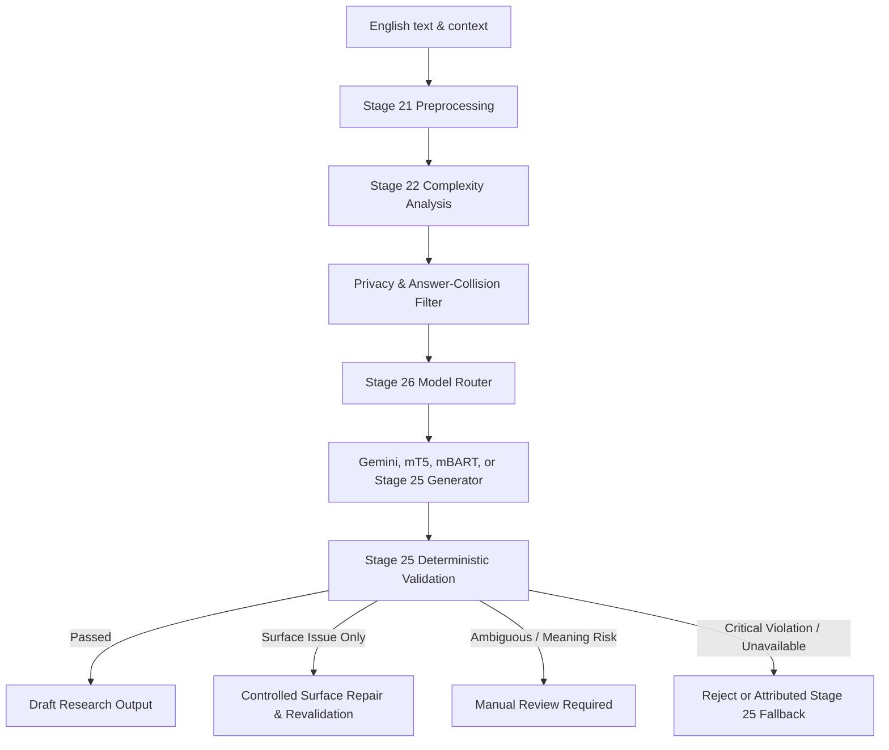

# Stage 26 — Add and Evaluate Pretrained Model/LLM-Based English Simplification

**Project:** AI-Powered Adaptive Child-Friendly Language Simplification System  
**Component:** Component 3 — AI/NLP-Based Language Simplification  
**Language:** English  
**Target age:** 4–8 years  
**Stage type:** Pretrained-model integration, controlled generation, hybrid validation, comparative evaluation, and governance  
**Authoritative prerequisite:** `stage-25-complete-v2` (Commit: `6b785502b860d4e93d2d31b86bd653c33a210ac9`)  
**Planned restart branch:** `feature/stage26-v2`  
**Planned start tag:** `stage-26-v2-start`  
**Planned completion tag:** `stage-26-complete-v2`  
**Historical checkpoints (preserved, immutable):** `stage-26-start`, `stage-26-complete`  
**Document version:** 2.1.0 — Stage 26 Approved Restart Plan  
**Status:** Approved implementation plan

---

## 1. Purpose

Stage 26 adds pretrained transformer and external LLM-based English simplification to the deterministic controlled engine completed in Stage 25. The purpose is to determine whether generative models can produce higher quality Mild, Moderate, and Strong simplifications while the Stage 25 engine remains the mandatory safety, validation, audit, and fallback layer.

This stage is an experimental comparison and hybrid-engine development stage. It does not establish clinical validity, expert approval, child suitability, or permission for automatic child-facing delivery.

---

## 2. Stage 26 Objectives

1. Define one common provider-neutral interface for pretrained and LLM simplification models.
2. Integrate configurable adapters for Gemini, mT5, and mBART with strictly verified live/native inference and explicit mode labeling (`pretrained_zero_shot`, `pretrained_prefix_prompt`, `fine_tuned_internal_pilot`).
3. Generate explicitly controlled Mild, Moderate, and Strong English candidates.
4. Prevent protected-element changes, answer leakage, unsupported task transformation, and modification of screening risk.
5. Use keyed HMAC and opaque internal references for answer boundaries; check protected elements against answer boundaries before dispatch, and never transmit answers, hashes, or answer IDs to external providers.
6. Enforce whole-group eligibility exclusions for all source groups contaminated by task reformulations (recalculated independently from `dataset_issue_register.json`, not hardcoded).
7. Pass every generated candidate through the Stage 25 validation and delivery-policy pipeline.
8. Implement transparent fallback without attributing fallback results to the requested AI provider.
9. Compare zero-shot, prompted, optionally fine-tuned, deterministic, and hybrid approaches under identical eligible units.
10. Measure quality, meaning preservation, rejection rate, manual-review rate, native latency, provider reliability, and cost. Separate cached-output metrics from native-run metrics.
11. Report dual locked benchmarks: the full historical locked set and a predeclared group-clean text-simplification subset.
12. Preserve the locked-test boundary, preserve the byte-for-byte source corpus, and create a reproducible model and prompt registry.
13. Select a research candidate configuration for later expert validation; do not approve it for unsupervised child delivery.

---

## 3. Scope and Non-Scope

### 3.1 Included

- English simplification for ages 4–8.
- Mild, Moderate, and Strong support tiers.
- Gemini API live inference through an explicitly discovered, smoke-tested, and dynamically verified model identifier.
- Local Hugging Face inference for candidate mT5 and mBART checkpoints with recorded weights, hashes, and execution metrics.
- Zero-shot and controlled prompt/template experiments.
- Optional supervised fine-tuning only when passing the formal prerequisite decision gate.
- Stage 25 protected-element extraction, action graph, validation, controlled surface repair, rollback, and delivery policy.
- Internal development/validation evaluation and a final frozen locked-test run (reported on full and clean subsets).
- Optional ASSET benchmark evaluation under the approved non-commercial research rights policy.

### 3.2 Excluded

- Sinhala generation or evaluation.
- Real Component 1, AR, or Component 4 network integration.
- Clinical diagnosis or DLD-risk prediction.
- Automatic modification of `screening_risk_level`.
- Training on ASSET under the current rights decision.
- Training on locked-test, validation, quarantined, review-pending, task-reformulation, or group-contaminated records.
- Transmission of raw child identifiers, screening risk, educational scores, raw answers, or answer hashes to external APIs.
- Automatic promotion of generated text into the governed corpus.
- Automatic child-facing delivery.

---

## 4. Mandatory Governance Invariants

Every Stage 26 candidate output must retain:

```json
{
  "validation_status": "draft",
  "research_eligible": false,
  "approved_for_child_delivery": false,
  "requires_expert_review": true
}
```

Additional invariants:

- **Screening Risk Ownership:** Component 1 owns the screening-risk indicator; Stage 26 treats it as strictly read-only.
- **Longitudinal Claims:** Component 4 owns official longitudinal trends and recommendations.
- **Minimal Context:** The model receives only the minimal educational text needed for linguistic simplification.
- **Privacy & Answer Confidentiality:** Raw child IDs, screening labels, educational scores, session histories, raw answers, answer hashes, and internal answer boundary references are never transmitted to external providers.
- **Candidate Status:** Provider output is always an untrusted candidate requiring deterministic validation.
- **Fail-Closed & Attributed Fallback:** A provider failure must never be presented as a provider output. The Stage 25 deterministic engine acts as a separately attributed fallback.
- **Corpus Immutability:** Stage 20 draft records remain byte-for-byte unchanged; pilot-training decisions are stored in derived manifests only.

---

## 5. Group-Safe Dataset Eligibility & Defect Handling

Stage 25 identified **326 task reformulations among 900 Stage 20 draft pairs**.

> [!IMPORTANT]
> **Dynamic Recalculation:** Expected contaminated groups based on the Stage 25 audit: **203**. The Stage 26-v2 eligibility script must independently recalculate this count from `dataset_issue_register.json` and report any discrepancy:
> $$326\text{ directly flagged pairs} \rightarrow N\text{ contaminated source groups} \rightarrow 3N\text{ total group-excluded pairs}$$
> Do not hardcode 203 into the eligibility logic.

### 5.1 Required Record Taxonomy

Each record is classified into:
1. `text_simplification`
2. `instruction_rephrasing`
3. `activity_format_transformation`
4. `question_generation`
5. `response_mode_adaptation`

### 5.2 Group-Safe Eligibility Pipeline Order

Eligibility execution must strictly follow this order:
1. **Identify Reformulation Groups:** Find every source group containing at least one Stage 25 reformulation record directly from `dataset_issue_register.json`.
2. **Exclude Entire Source Groups:** Exclude the whole source group (all 3 tiers) to prevent partial-group contamination.
3. **Split Isolation:** Exclude validation and locked-test groups from training candidates.
4. **Three-Tier Completeness Check:** Verify that every remaining group contains exactly 3 tiers (Mild, Moderate, Strong).
5. **Schema, Quality, Rights & Review Gates:** Apply Stage 14 schema validation, Stage 15 quality checks, data rights verification, and check for unresolved manual reviews.
6. **Generate Derived Manifest:** Produce the final group-safe training manifest without modifying source records.

### 5.3 Exact Pair-Disposition Precedence

Every audited pair must receive exactly one final disposition according to the following strict priority:

1. `direct_task_reformulation_excluded` (Directly flagged pair in issue register)
2. `source_group_reformulation_excluded` (Unflagged Mild/Moderate/Strong companion within a contaminated group)
3. `non_development_split_excluded` (Belongs to validation or locked-test split)
4. `incomplete_group_excluded` (Source group lacks exactly 3 complete tiers)
5. `rights_or_governance_excluded` (Missing required rights/authoring permission)
6. `quality_failed` (Failed automated schema or linguistic quality checks)
7. `manual_review_unresolved` (Has pending unresolved human review flag)
8. `eligible_internal_training` (Passed all gates; approved for derived training manifest)

### 5.4 Split Policy

| Split | Permitted Use |
|---|---|
| Development candidate train | Prompt development, adapter development, and eligible fine-tuning |
| Development candidate validation | Configuration selection and early stopping only (Evaluation-Eligible Validation Subset) |
| Locked test | Final frozen evaluation (reported on full set and clean subset) |
| ASSET validation/test | External benchmark-only use under registered rights policy |

### 5.5 Derived Pilot Training Decision Format

```json
{
  "source_group_id": "SRCGRP-EN-000001",
  "source_record_modified": false,
  "internal_training_decision": "approved_for_pilot_fine_tuning",
  "approved_by": "authorized_reviewer",
  "decision_version": "1.0.0"
}
```

---

## 6. Proposed Hybrid Architecture



---

## 7. Common Model Adapter & Data Contracts

### 7.1 Separation of Runtime and Evaluation DTOs

Runtime generation requests and responses contain only execution and validation data. Aggregate benchmark metrics (SARI, SacreBLEU, FKGL delta) are strictly isolated into batch-level `ModelEvaluationResult`.

### 7.2 Generation Request DTO (Internal)

```json
{
  "request_id": "GENREQ-EN-000001",
  "text": "Before placing the red ball inside the box, select the smaller blue object.",
  "language": "en",
  "target_age": 6,
  "support_level": "strong",
  "content_type": "instruction",
  "response_mode": "direct_action",
  "protected_elements": {
    "exact_preservation": ["red", "blue", "ball", "box"],
    "semantic_equivalence_refs": ["SEMREF-001"],
    "answer_boundary_ref": "ANSBOUND-000001"
  },
  "action_graph_ref": "ACTGRAPH-EN-000001",
  "generation_config_id": "GENCFG-EN-001"
}
```

### 7.3 Dispatch Sequence & Allowlist Serialization

To guarantee zero leakage of answers or synonyms:

```text
Internal Request
  ──> Privacy Filter (Strip learner ID, screening risk, scores, history)
  ──> Protected-Element vs Answer-Boundary Check (Collision detection)
  ──> Provider Allowlist Serializer (Strip answer_boundary_ref, internal keys)
  ──> Final Serialized-Payload Inspection
  ──> External API Dispatch
```

If an exact-preservation term overlaps the protected answer boundary, dispatch is blocked immediately and routed to authorized review.

```json
{
  "text": "Before placing the red ball inside the box, select the smaller blue object.",
  "target_age": 6,
  "support_level": "strong",
  "exact_preservation": ["red", "blue", "ball", "box"],
  "prompt_instructions": "..."
}
```

### 7.4 Runtime Generation Result DTO

```json
{
  "request_id": "GENREQ-EN-000001",
  "requested_provider": "gemini",
  "configured_model": "${GEMINI_MODEL_ID}",
  "resolved_model": "provider_verified_model_id",
  "model_resolution_status": "verified",
  "execution_status": "live_provider_inference",
  "provider_calls_attempted": 1,
  "candidate_text": "1. Pick the smaller blue object.\n2. Put the red ball in the box.",
  "native_validation": {
    "disposition": "passed",
    "failed_gates": [],
    "similarity_score": 0.91
  },
  "latency_ms": 1780.2,
  "input_token_count": 84,
  "output_token_count": 22,
  "estimated_cost": 0.000021,
  "fallback_used": false,
  "generator_method": "gemini_prompted",
  "prompt_template_version": "2.1.0"
}
```

### 7.5 Cached-Output Metric Separation

Cached outputs are valid for reproducible quality re-evaluation, but must not be used to claim live latency, reliability, or current cost:

```json
{
  "execution_status": "cached_native_output",
  "original_execution_status": "live_provider_inference",
  "original_run_id": "RUN-GEMINI-20261006-01",
  "quality_metrics_permitted": true,
  "current_latency_metrics_permitted": false,
  "current_provider_reliability_metrics_permitted": false
}
```

---

## 8. Provider Modules, Privacy & Verification

### 8.1 Required Security & Privacy Modules

1. `privacy_filter.py`: Strips learner, profile, and session metadata.
2. `provider_payload_serializer.py`: Enforces allowlist serialization for external payloads.
3. `hmac_answer_guard.py`: Performs local-only answer boundary validation via normalized string matching, collision checking against protected elements, and keyed HMAC.

Unit Tests:
- `test_payload_allowlist_serialization.py`
- `test_answer_reference_not_transmitted.py`
- `test_raw_answer_not_transmitted.py`
- `test_answer_hash_not_transmitted.py`
- `test_protected_element_answer_collision_blocks_dispatch.py`
- `test_final_provider_payload_contains_no_answer_variant.py`
- `test_cached_output_metric_restrictions.py`
- `test_model_resolution_change_aborts_run.py`

### 8.2 Execution Status Categories

To prevent simulated or fixture results from contaminating model benchmarks, every execution records one of:
- `live_provider_inference`
- `local_native_inference`
- `cached_native_output`
- `offline_fixture` (Unit tests only; forbidden in performance reports)
- `simulated_adapter`
- `identity_fallback`
- `stage25_fallback`
- `not_executed`

### 8.3 Gemini Verification

1. Discover models via API.
2. Verify generation capability for configured model ID.
3. Run one live smoke test before batch evaluation.
4. Record exact resolved model string, pricing source, and retrieval date.
5. Abort immediately if model resolution changes unexpectedly during evaluation.
6. Never report simulated responses under `live_provider_inference`.

### 8.4 mT5 and mBART Verification

1. Record Hugging Face repo name, pinned commit SHA, tokenizer revision, weight-file hashes, and verified licence.
2. Record PyTorch/Transformers versions, device (`cpu`/`cuda`), datatype (`float32`/`bfloat16`), load duration, inference duration, and peak memory.
3. Use deterministic decoding (pinned beam search/seed).
4. Label modes accurately: `pretrained_zero_shot`, `pretrained_prefix_prompt`, `fine_tuned_internal_pilot`.

---

## 9. Controlled Surface Repair Policy

Controlled repair is strictly limited to surface formatting.
- **Permitted Surface Repairs:**
  - Whitespace normalization
  - Safe punctuation repair
  - Casing correction
  - Valid JSON/structured-output markdown extraction
- **Forbidden Repairs (Must Route to Rejection or Manual Review):**
  - Missing entities or keywords
  - Changed quantities or numbers
  - Negation modifications
  - Action-order or temporal alterations
  - Spatial relation changes
  - Answer leakage or disclosure
  - Hallucinated facts

---

## 10. Formal Fine-Tuning Decision Gate

Fine-tuning requires an explicit decision record (`docs/stage26_training_decision_record.md`) before `run_optional_finetuning.py` can run.

### Decision Outcomes:
- `APPROVED_FOR_PILOT_FINE_TUNING`
- `NOT_APPROVED_INSUFFICIENT_ELIGIBLE_DATA`
- `NOT_APPROVED_RIGHTS`
- `NOT_APPROVED_RESOURCE_LIMIT`
- `NOT_REQUIRED_ZERO_SHOT_SUFFICIENT`

---

## 11. Dual Locked-Benchmark & Invalid-Execution Policy

Because Stage 25 identified task reformulations in the locked test set, Stage 26 reports two benchmark views:
1. **Full Reused Locked Benchmark (Historical Continuity):** Complete accounting across all locked records.
2. **Predeclared Clean Text-Simplification Subset (Pure Evaluation):** Frozen group-clean simplification pairs only.

### Invalid Execution Policy:
If network, hardware, or runtime infrastructure interrupts the locked evaluation run:
- Mark run as `INVALID_EXECUTION`.
- Preserve partial logs and configuration hashes.
- Do not record as official locked run.
- Permit rerun only with identical configuration hashes.

---

## 12. Reconciled Accounting Formulas

### 12.1 Provider Request Accounting
$$\text{LogicalRequests} = \text{NativeSuccess} + \text{TerminalProviderFailure}$$
$$\text{ProviderAttempts} = \text{InitialAttempts} + \text{RetryAttempts}$$

### 12.2 Native Output Accounting
$$\text{NativeOutputs} = \text{NativePassed} + \text{RepairAttempted} + \text{NativeManualReview} + \text{NativeRejected}$$

### 12.3 Surface Repair Accounting
$$\text{RepairAttempted} = \text{RepairPassed} + \text{RepairManualReview} + \text{RepairRejected}$$

### 12.4 Final Outcomes & Delivery Accounting
$$\text{FinalOutcomes} = \text{NativeDelivered} + \text{RepairDelivered} + \text{FallbackDelivered} + \text{ManualReviewRequired} + \text{Rejected}$$

$$\text{SuccessfulDraftDeliveries} = \text{NativeDelivered} + \text{RepairDelivered} + \text{FallbackDelivered}$$

*(All categories are strictly mutually exclusive. Fallback outputs are never credited to the failed provider).*

---

## 13. Proposed Code & File Structure

```text
backend/app/model_simplification/
├── __init__.py
├── schemas.py                          # Runtime DTOs
├── evaluation_schemas.py               # Batch evaluation DTOs
├── adapter.py                          # Common adapter protocol
├── registry.py                         # Model registry
├── router.py                           # Model router
├── prompt_registry.py                  # Versioned prompt templates
├── privacy_filter.py                   # Context & ID sanitizer
├── provider_payload_serializer.py      # Allowlist external serializer
├── hmac_answer_guard.py                # Local HMAC answer validator & collision checker
├── generation_service.py               # Generation service
├── hybrid_pipeline.py                  # Hybrid Stage 25 validation & surface repair
├── provider_result_attribution.py      # Attribution engine
├── cost_tracker.py                     # Token & pricing tracker
├── model_manifest.py                   # Checkpoint & hash manifest
├── adapters/
│   ├── __init__.py
│   ├── gemini_adapter.py
│   ├── mt5_adapter.py
│   ├── mbart_adapter.py
│   └── stage25_adapter.py
└── training/
    ├── eligibility.py                  # Group-safe eligibility engine (dynamic recalculation)
    ├── dataset_builder.py              # Training dataset builder
    ├── train_seq2seq.py                # Fine-tuning runner
    ├── evaluate_checkpoint.py          # Checkpoint evaluation
    └── memorization_check.py           # Overfitting & memorization audit

backend/tests/model_simplification/
├── test_adapter_contract.py
├── test_model_registry.py
├── test_prompt_registry.py
├── test_privacy_filter.py
├── test_payload_allowlist_serialization.py
├── test_answer_reference_not_transmitted.py
├── test_raw_answer_not_transmitted.py
├── test_answer_hash_not_transmitted.py
├── test_protected_element_answer_collision_blocks_dispatch.py
├── test_final_provider_payload_contains_no_answer_variant.py
├── test_hmac_answer_guard.py
├── test_gemini_adapter.py
├── test_mt5_adapter.py
├── test_mbart_adapter.py
├── test_provider_attribution.py
├── test_retry_policy.py
├── test_no_silent_fallback.py
├── test_hybrid_validation.py
├── test_controlled_surface_repair.py
├── test_training_eligibility.py
├── test_eligibility_disposition_precedence.py
├── test_group_safe_exclusion.py
├── test_original_corpus_immutability.py
├── test_complete_three_tier_group_requirement.py
├── test_training_decision_gate.py
├── test_fixture_excluded_from_performance_report.py
├── test_cached_output_metric_restrictions.py
├── test_model_resolution_change_aborts_run.py
├── test_stage25_comparator_hash_immutability.py
├── test_locked_run_invalidation.py
├── test_split_leakage.py
├── test_locked_test_guard.py
├── test_tier_monotonicity.py
├── test_cost_tracking.py
├── test_reproducibility.py
└── test_stage26_end_to_end.py

scripts/stage26/
├── snapshot_stage25.py
├── build_training_eligibility_manifest.py
├── run_zero_shot_models.py
├── run_gemini_evaluation.py
├── run_local_transformer_evaluation.py
├── record_training_decision.py
├── run_optional_finetuning.py
├── evaluate_hybrid_pipeline.py
├── freeze_stage26_configuration.py
├── run_locked_benchmark_once.py
├── run_asset_benchmark.py
├── generate_model_comparison.py
├── verify_stage26_accounting.py
└── generate_stage26_report.py
```

---

## 14. Work Packages (WP0–WP10)

- **WP0 — Restart Checkpoint:** Create branch `feature/stage26-v2` directly from `stage-25-complete-v2` (`6b785502b860d4e93d2d31b86bd653c33a210ac9`). Verify clean working copy and tag `stage-26-v2-start`.
- **WP1 — Group-Safe Eligibility & Rights:** Process all 900 records, independently recalculate contaminated source groups from `dataset_issue_register.json`, exclude whole contaminated source groups, verify 3-tier completeness, enforce exact pair precedence, and generate derived pilot training manifest.
- **WP2 — Common Contracts & Model Registry:** Implement runtime/evaluation schemas, adapter protocols, and checkpoint registry with hashes.
- **WP3 — Privacy, Allowlist Serializer & HMAC Answer Guard:** Implement collision checking between protected elements and answer boundaries, local answer verification, and external payload allowlisting.
- **WP4 — Gemini Integration & Smoke Testing:** Live model discovery, smoke testing, dynamic model verification, structured prompt templates, retry backoff, and cost tracking.
- **WP5 — mT5 & mBART Native Adapters:** Pinned HF checkpoint adapters with deterministic decoding, hardware logging, and zero-shot/prefix modes.
- **WP6 — Formal Fine-Tuning Decision Gate:** Evaluate baseline results, record formal decision enum, and conditionally execute pilot fine-tuning.
- **WP7 — Hybrid Validation & Controlled Surface Repair:** Pass all candidates through Stage 25 validation gates with restricted surface repair and attributed fallback.
- **WP8 — Dev/Val Evaluation & Configuration Freeze:** Run comparisons on evaluation-eligible validation subset and freeze all configuration hashes before locked testing.
- **WP9 — Dual Locked Benchmark & ASSET:** Execute frozen locked run reporting both full and clean-subset benchmarks. Run ASSET evaluation if authorized.
- **WP10 — Accounting, Documentation & Completion Tagging:** Reconcile all accounting formulas (`FinalOutcomes` & `SuccessfulDraftDeliveries`), generate reports, verify full test suite, and tag `stage-26-complete-v2`.

---

## 15. Required Documentation Deliverables

1. `docs/stage26_implementation_plan.md`
2. `docs/stage26_dataset_eligibility_report.md`
3. `docs/stage26_model_registry.csv`
4. `docs/stage26_prompt_registry.md`
5. `docs/stage26_privacy_and_provider_policy.md`
6. `docs/stage26_training_decision_record.md`
7. `docs/stage26_internal_evaluation_report.md`
8. `docs/stage26_asset_evaluation_report.md` (or `NOT_EXECUTED` statement)
9. `docs/stage26_model_comparison.csv`
10. `docs/stage26_error_analysis.md`
11. `docs/stage26_accounting_summary.md`
12. `docs/stage26_reproducibility_record.json`
13. `docs/stage26_completion_record.md`
14. `docs/stage26_manifest.sha256`

---

## 16. Verification Commands

```powershell
# Stage 26 tests
Push-Location backend
python -m pytest tests/model_simplification/ -v

# Regression suites
python -m pytest tests/datasets/ tests/nlp_preprocessing/ tests/complexity_analysis/ tests/baseline_simplification/ tests/controlled_simplification/ -v

# Complete backend suite
python -m pytest tests/ -q
Pop-Location

# Frontend production build
Push-Location frontend
npm run build
Pop-Location
```

---

## 17. Final Completion Criteria

- [ ] Restart branch `feature/stage26-v2` created directly from `stage-25-complete-v2` (`6b785502b860d4e93d2d31b86bd653c33a210ac9`).
- [ ] Historical Stage 26 tags preserved without overwriting.
- [ ] New tags use `stage-26-v2-start` and `stage-26-complete-v2`.
- [ ] Contaminated group count recalculated from issue register (not hardcoded); whole contaminated source groups excluded; every eligible training group has exactly 3 tiers.
- [ ] Exact pair-disposition precedence strictly verified.
- [ ] Original Stage 20 corpus remains byte-for-byte unchanged.
- [ ] Protected elements checked against answer boundaries before dispatch; no answers, hashes, or answer IDs transmitted to external APIs; local validation via keyed HMAC.
- [ ] Runtime and batch evaluation DTOs strictly separated.
- [ ] No fixture output appears in model-performance tables; cached outputs restricted from current latency/reliability metrics.
- [ ] Native live/local inference verified for every evaluated model (or reported `NOT_EXECUTED`).
- [ ] Full and clean-subset locked benchmarks reported separately.
- [ ] Provider requests, native outputs, surface repairs, and fallbacks reconcile exactly under `FinalOutcomes`.
- [ ] All outputs retain draft status with read-only screening risk and no unsupervised child delivery.
- [ ] Full backend tests and frontend build pass.
- [ ] `stage-26-complete-v2` points to the final immutable commit.
