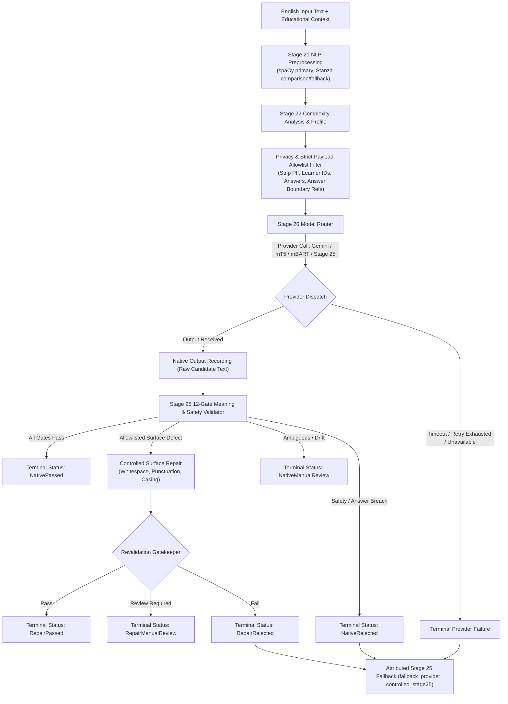

# Stage 26 — Add and Evaluate Pretrained Model/LLM-Based English Simplification

**Project:** AI-Powered Adaptive Child-Friendly Language Simplification System  
**Component:** Component 3 — AI/NLP-Based Language Simplification  
**Language:** English  
**Target age:** 4–8 years  
**Stage type:** Pretrained-model integration, controlled generation, hybrid validation, comparative evaluation, and governance  
**Authoritative prerequisite:** `stage-25-complete-v2` (`6b785502b860d4e93d2d31b86bd653c33a210ac9`)  
**Planned start tag:** `stage-26-start`  
**Planned completion tag:** `stage-26-complete`  
**Document version:** 1.3.0  
**Status:** Approved Authoritative Implementation Plan  

---

## 1. Purpose & Scope

Stage 26 introduces pretrained transformer and external Large Language Model (LLM) simplification mechanisms to the deterministic controlled engine finalized in Stage 25. The core objective is to determine whether generative and pretrained sequence-to-sequence models can achieve superior Mild, Moderate, and Strong simplification quality while strictly preserving the Stage 25 deterministic engine as a mandatory safety validator, meaning-preservation guardrail, non-disclosure firewall, and fail-closed fallback layer.

This stage represents an empirical comparative evaluation and hybrid-engine development milestone. It does not establish clinical validity, pedagogical certification, or permission for unsupervised child delivery.



---

## 2. Stage 26 Objectives

1. **Common Provider-Neutral Contract:** Define a unified `SimplificationModelAdapter` protocol and separate runtime request/result DTOs from batch evaluation metric DTOs.
2. **Dynamic Live Model Discovery:** Query live provider capabilities, verify text generation support, run a smoke test, and pin exact model IDs in manifests (abort on unverified changes).
3. **Multi-Model Integrations:** Implement adapters for Gemini API, local pinned mT5 seq2seq checkpoints, and local pinned mBART seq2seq checkpoints.
4. **Controlled Multi-Tier Simplification:** Generate explicitly differentiated Mild, Moderate, and Strong simplifications adhering to educational support budgets.
5. **Strict Provider Payload Privacy Allowlist:** Transmit only sanitized text, language, support tier, permitted protected meaning elements, response mode, and generation constraints. Forbid transmitting `answer_boundary_ref`, raw answers, hashes, learner IDs, screening risks, or scores. If sanitization fails, block external dispatch completely.
6. **Separate Native, Repaired, and Fallback Accounting:** Record raw outputs, native validation dispositions, repaired outputs, revalidated terminal dispositions, and fallback outputs independently.
7. **Stage 25 Deterministic Gatekeeper:** Route all model candidates through the 12 Stage 25 validation gates (`VAL_LANGUAGE`, `VAL_EXACT_ELEMENTS`, `VAL_SEMANTIC_EQUIVALENCE`, `VAL_ACTION_ORDER`, etc.).
8. **Transparent Metric Attribution & No Silent Fallback:** Fallback occurs after provider timeouts, retry exhaustion, native rejections, or repair rejections. Fallback is explicitly attributed to `controlled_stage25` and does not reduce provider failure counts.
9. **Eligibility Precedence Accounting:** Reconcile all 900 records and 300 source groups using strict single-disposition priority order.
10. **Formal Fine-Tuning Decision Gate:** Require formal prerequisite verification and explicit governance approval before any fine-tuning can begin.
11. **Dual Locked-Benchmark Reporting:** Report full reused locked benchmark ($N=45$ groups) for historical continuity alongside the predeclared text-simplification subset for pure simplification evaluation.
12. **Delivery Default Preservation:** Maintain `approved_for_child_delivery: false` and `requires_expert_review: true` across all outputs.

---

## 3. Scope Boundaries & Split Roles

### 3.1 Split Roles

| Split Name | Permitted Use | Governance Note |
|---|---|---|
| **Development Candidate Train** | Prompt development, adapter debugging, and eligible fine-tuning | Complete 3-tier groups only; task reformulations excluded |
| **Development Candidate Validation**| Candidate selection, early stopping, and configuration freeze | Tuning boundary; strictly excluded from training |
| **Locked Test Set** | Dual-report evaluation on reused governed benchmark | Benchmark reused from Stages 24–25; no post-test tuning |
| **ASSET Validation/Test** | Benchmark-only comparison under approved non-commercial rights | No training allowed under current rights decision |

### 3.2 Excluded
- Sinhala generation or evaluation (Component 3 English milestone).
- Direct runtime integration with Component 1, AR modules, or Component 4 longitudinal tracking.
- Autonomous clinical diagnosis or DLD screening risk score manipulation.
- Training on ASSET (restricted by licensing to evaluation only).
- Training on locked test, validation, quarantined, or task-reformulation records.
- Autonomous promotion of synthetic output into the official golden corpus.
- Direct, unsupervised child delivery.

---

## 4. Mandatory Governance Invariants & Derived Manifests

### 4.1 Immutable Corpus Record Invariant
Original Stage 20 corpus records remain **100% byte-for-byte immutable** (`research_eligible: false`, `approved_for_child_delivery: false`). Original files are never modified.

### 4.2 Derived Eligibility Manifest Schema
Internal pilot training approval exists **only** in a separate derived manifest (`stage26_training_eligibility_manifest.json`):

```json
{
  "pair_id": "SIMP-EN-000001",
  "source_record_research_eligible": false,
  "source_record_modified": false,
  "internal_training_decision": "approved_for_pilot_fine_tuning",
  "approved_by": "authorized_reviewer",
  "approved_at": "2026-10-01T17:00:00Z",
  "decision_version": "1.0.0"
}
```

### Key Governance Policies:
- **Training-Governance Invariant:** Internal pilot-training approval is recorded strictly in the derived Stage 26 manifest. It is **never** interpreted as research-release eligibility or child-delivery approval (`approved_for_child_delivery` remains `false`).
- **Component 1 Read-Only Invariant:** Stage 26 treats `screening_risk_level` as an immutable read-only attribute.
- **Privacy Allowlist Enforcement:** No raw child names, IDs, dates of birth, session histories, or `answer_boundary_ref` tokens are serialized to external APIs.
- **Server-Side Keyed HMAC Answer Guard:** Leakage detection is performed locally using HMAC secrets retrieved from environment/secret storage (recording key version only, never the secret value) and normalized server-side string matching.
- **Attribution Integrity:** A failed model call that triggers a deterministic fallback is reported as a model failure and a fallback activation—never as a successful LLM output.

---

## 5. Dataset Eligibility & Precedence Accounting

Stage 25 catalogued **326 task reformulations among 900 Stage 20 draft pairs** in `data/simplification_corpus/releases/0.2.0/dataset_issue_register.json`.

### 5.1 Pair-Level Precedence Chain
Each pair receives **exactly one** mutually exclusive primary disposition:

1. `task_reformulation_excluded` (Record flagged in Stage 25 defect register)
2. `non_development_split_excluded` (Belongs to Validation or Locked Test split)
3. `incomplete_source_group_excluded` (Missing one or more required Mild/Moderate/Strong tiers)
4. `rights_or_governance_excluded` (Excluded by data rights or governance policy)
5. `quality_failed` (Failed Stage 14/15 schema or quality checks)
6. `manual_review_unresolved` (Pending manual review resolution)
7. `eligible_for_internal_model_development` (Clean, complete, verified text-simplification pair)

$$\mathbf{900\text{ Pairs}} = \sum_{i=1}^{7} \text{Count}(\text{PairDisposition}_i)$$

### 5.2 Source-Group-Level Precedence Chain ($N=300$ Groups)
A source group containing even one ineligible tier is disqualified from fine-tuning. The group inherits the highest-priority exclusion among its three pairs:

1. `task_reformulation_group_excluded` (At least one pair is a task reformulation)
2. `non_development_group_excluded` (Belongs to Validation or Locked Test split)
3. `incomplete_tier_group_excluded` (Missing one or more tiers in group)
4. `rights_or_governance_group_excluded` (Disqualified by data rights policy)
5. `quality_failed_group` (At least one pair failed quality/schema checks)
6. `manual_review_group` (At least one pair pending manual review)
7. `eligible_internal_training_group` (All 3 tiers present, clean, and verified)

$$\mathbf{300\text{ Groups}} = \sum_{j=1}^{7} \text{Count}(\text{GroupDisposition}_j)$$

---

## 6. Common Model Adapter Architecture & DTO Separation

All candidate generators adhere to the standardized Python protocol:

```python
from typing import Protocol
from app.model_simplification.schemas import (
    ModelGenerationRequest,
    ModelGenerationResult,
    ModelEvaluationResult
)

class SimplificationModelAdapter(Protocol):
    def generate(self, request: ModelGenerationRequest) -> ModelGenerationResult:
        """Executes controlled simplification for the given request."""
        ...
```

### 6.1 Strict Provider Payload Allowlist

| Field | Provider Allowed? | Purpose / Policy |
|---|---|---|
| `text` | **Yes** | Sanitized English source text |
| `language` | **Yes** | `"en"` target language identifier |
| `support_level` | **Yes** | `"mild"`, `"moderate"`, or `"strong"` |
| `protected_elements.exact_preservation` | **Yes** | Entities, quantities, and keywords to retain |
| `response_mode` | **Yes** | Target interaction format (e.g. `"direct_action"`) |
| `generation_constraints` | **Yes** | Lexical budget, clause length, step formatting rules |
| `answer_boundary_ref` | **NO (Forbidden)** | Retained strictly server-side for local leakage checking |
| `learner_id` / `screening_risk` | **NO (Forbidden)** | PII / Clinical data stripped before dispatch |
| `session_history` / `scores` | **NO (Forbidden)** | Educational profile telemetry stripped |

### 6.2 Generation Result Schema (Runtime Validation Only)

```json
{
  "request_id": "GENREQ-EN-000001",
  "requested_provider": "gemini",
  "configured_model": "${GEMINI_MODEL_ID}",
  "resolved_model": "value_confirmed_by_live_model_discovery",
  "model_resolution_status": "verified",
  "provider_calls_attempted": 1,
  "provider_outputs_received": 1,
  "candidate_text": "1. Pick the smaller blue object.\n2. Put the red ball in the box.",
  "latency_ms": 1120.5,
  "input_token_count": 285,
  "output_token_count": 24,
  "estimated_cost_usd": 0.000045,
  "native_validation": {
    "disposition": "passed",
    "failed_gates": [],
    "similarity_score": 0.91
  },
  "controlled_repair_applied": false,
  "repaired_text": null,
  "revalidated_disposition": null,
  "fallback_used": false,
  "fallback_text": null,
  "fallback_provider": null,
  "metrics_attributed_to": "native_model",
  "generator_method": "gemini_prompted",
  "prompt_template_version": "1.0.0",
  "status": "candidate_generated"
}
```

### 6.3 Batch Evaluation Metric Schema (`ModelEvaluationResult`)

```json
{
  "evaluation_id": "EVAL-EN-000001",
  "generator_method": "gemini_prompted",
  "support_level": "strong",
  "dataset_split": "locked_test_text_simplification_subset",
  "sample_count": 28,
  "sari_tier_matched": 34.20,
  "sari_multi_reference": 31.50,
  "sari_add": 2.45,
  "sari_keep": 88.10,
  "sari_del": 12.05,
  "sacrebleu": 94.10,
  "fkgl_delta": 1.85,
  "exact_element_recall": 1.00,
  "semantic_similarity_mean": 0.932,
  "native_pass_rate": 0.786,
  "repair_pass_rate": 0.107,
  "manual_review_rate": 0.107,
  "rejection_rate": 0.000,
  "fallback_rate": 0.000,
  "mean_latency_ms": 1150.2,
  "total_cost_usd": 0.00126
}
```

---

## 7. Model Strategy, Licences & Reproducibility Metadata

Pretrained base models (mT5, mBART) are sequence-to-sequence checkpoints, not ready-made child simplifiers. Stage 26 explicitly distinguishes and labels:
1. `pretrained_zero_shot`
2. `pretrained_prompt_prefix`
3. `fine_tuned_internal_eligible` (if decision gate passes)
4. `gemini_prompted`
5. `hybrid_validated`
6. `controlled_stage25`

### 7.1 Pinned Model Registry Metadata
For every model artifact evaluated, the registry stores immutable provenance:

```json
{
  "repository": "google/mt5-small",
  "revision": "full_commit_sha",
  "licence": "Apache-2.0",
  "tokenizer_revision": "full_commit_sha",
  "weight_file_sha256": "sha256_of_weights",
  "transformers_version": "4.x.x",
  "torch_version": "2.x.x",
  "device": "cpu",
  "dtype": "float32",
  "cpu_feasibility_benchmarked": true
}
```

```json
{
  "repository": "facebook/mbart-large-50",
  "revision": "full_commit_sha",
  "licence": "MIT",
  "tokenizer_revision": "full_commit_sha",
  "weight_file_sha256": "sha256_of_weights",
  "transformers_version": "4.x.x",
  "torch_version": "2.x.x",
  "device": "cpu",
  "dtype": "float32",
  "cpu_feasibility_benchmarked": true
}
```

### 7.2 Gemini Model Resolution Protocol
1. Query provider API for active supported models.
2. Confirm the configured model supports text generation.
3. Execute one controlled smoke test.
4. Pin the exact resolved model ID in the run manifest. If resolution changes, abort execution.
5. Record provider pricing source URL and retrieval date.

---

## 8. Prompt Engineering & Tier Constraints

### 8.1 Universal Mandatory Prompt Constraints
Every structured prompt must explicitly mandate:
- **Task Intent & Response Mode:** Preserve original instruction goal and response expectation.
- **Meaning Invariants:** Preserve quantities, colours, shapes, negation, relations, and action sequence.
- **Non-Disclosure:** Never reveal answers, solutions, or distractor metadata.
- **No Hallucination:** Do not introduce new facts or external context.
- **Format Integrity:** Do not convert statements into questions or instructions into different activity formats.
- **Language & Schema:** Return English only; adhere strictly to the JSON/text schema.

### 8.2 Tier Control Matrix

| Support Tier | Lexical Budget | Syntactic Policy | Step Formatting | Max Clause Words |
|---|---|---|---|---|
| **Mild Support** | Light substitution for top difficult words | Split complex conjunctions | Preserve natural sentence form | $\le 15$ words |
| **Moderate Support** | Age-appropriate word replacements | Unpack nominalizations & passives | Numbered only if verified multi-action | $\le 10$ words |
| **Strong Support** | Aggressive simplification to core vocabulary | Atomic clause separation | **Mandatory numbered steps only for verified multi-action instructions** (single-action remains one direct instruction) | $\le 7$ words |

---

## 9. Formal Fine-Tuning Decision Gate

Fine-tuning is optional and must not begin automatically. It requires satisfying all prerequisites:

### Prerequisites:
- [ ] Final eligible development record count is documented and sufficient.
- [ ] Complete 3-tier source groups are confirmed.
- [ ] Zero validation or locked-test records enter training.
- [ ] Data rights permit training.
- [ ] Zero-shot baseline results demonstrate a justified need for fine-tuning.
- [ ] GPU/runtime requirements are feasible.
- [ ] Rollback-safe checkpoint storage and manifests are prepared.
- [ ] Memorization and overfitting tests are defined.

### Formal Decision Status Outcomes:
- `APPROVED_FOR_PILOT_FINE_TUNING`
- `NOT_APPROVED_INSUFFICIENT_ELIGIBLE_DATA`
- `NOT_APPROVED_RIGHTS`
- `NOT_APPROVED_RESOURCE_LIMIT`
- `NOT_REQUIRED_ZERO_SHOT_SUFFICIENT`

---

## 10. Hybrid Validation & Controlled Surface Repair Workflow

Every generated candidate must pass the 12 Stage 25 validation gates:

```text
1. VAL_LANGUAGE              7. VAL_RELATIONS
2. VAL_GRAMMAR               8. VAL_ACTION_ORDER
3. VAL_EXACT_ELEMENTS        9. VAL_ANSWER_BOUNDARY
4. VAL_QUANTITY             10. VAL_SUPPORT_COMPLIANCE
5. VAL_SEMANTIC_EQUIVALENCE 11. VAL_SIMILARITY_ADVISORY (Cosine >= 0.85)
6. VAL_NEGATION             12. VAL_CHILD_LANGUAGE (Accepted Stage 25 limitation: partial/advisory)
```

### Execution & Repair Accounting Formulas:
$$\text{LogicalRequests} = \text{NativeSuccess} + \text{TerminalProviderFailure}$$
$$\text{ProviderAttempts} = \text{InitialAttempts} + \text{RetryAttempts}$$
$$\text{NativeOutputs} = \text{NativePassed} + \text{RepairAttempted} + \text{NativeManualReview} + \text{NativeRejected}$$
$$\text{RepairAttempted} = \text{RepairPassed} + \text{RepairManualReview} + \text{RepairRejected}$$

*Fallback outputs are tracked separately and never reduce provider failure counts.*

---

## 11. Locked-Benchmark Dual Reporting & Invalidation Procedure

### 11.1 Dual-Reporting Strategy
1. **Full Reused Locked Benchmark ($N=45$ groups / 135 outputs):** Historical continuity and full dataset accounting.
2. **Predeclared Text-Simplification Subset:** Clean source groups with no task reformulations for controlled simplification evaluation.

### 11.2 Controlled Run Invalidation Procedure
If a locked-test run fails due to environmental or infrastructure failure (e.g., API outage or network drop):
- The run is formally marked `INVALID_EXECUTION`.
- Its logs, hashes, and failure reason are immutably archived.
- It is **never** counted as the official benchmark execution.
- A rerun is permitted only after resolving the infrastructure root cause without modifying configuration or rules.

---

## 12. Implementation Work Packages

```mermaid
gantt
    title Stage 26 Work Packages
    dateFormat  YYYY-MM-DD
    section Checkpoint & Data
    WP0: Verify Checkpoint & Tag stage-26-start :2026-10-01, 1d
    WP1: Precedence Eligibility Audit & Derived Manifests :2026-10-01, 1d
    section Contracts & Privacy
    WP2: Common Contracts, Registry & DTO Separation :2026-10-02, 1d
    WP3: Privacy Filter & HTTP Allowlist Serializer :2026-10-02, 1d
    section Model Adapters
    WP4: Gemini Adapter with Live Discovery :2026-10-03, 1d
    WP5: Local mT5 & mBART Adapters :2026-10-03, 1d
    section Hybrid Pipeline & Eval
    WP6: Fine-Tuning Decision Gate Record :2026-10-04, 1d
    WP7: Hybrid Stage 25 Validation & Surface Repair :2026-10-04, 1d
    WP8: Dev/Val Evaluation & Configuration Freeze :2026-10-05, 1d
    WP9: Single Locked-Benchmark & ASSET Evaluation :2026-10-05, 1d
    WP10: Deliverables, Accounting & Tagging :2026-10-06, 1d
```

---

## 13. File & Directory Layout

```text
backend/app/model_simplification/
├── __init__.py
├── schemas.py
├── adapter.py
├── registry.py
├── router.py
├── prompt_registry.py
├── privacy_filter.py
├── generation_service.py
├── hybrid_pipeline.py
├── provider_result_attribution.py
├── cost_tracker.py
├── model_manifest.py
├── adapters/
│   ├── __init__.py
│   ├── gemini_adapter.py
│   ├── mt5_adapter.py
│   ├── mbart_adapter.py
│   └── stage25_adapter.py
└── training/
    ├── eligibility.py
    ├── dataset_builder.py
    ├── train_seq2seq.py
    ├── evaluate_checkpoint.py
    └── memorization_check.py

backend/tests/model_simplification/
├── test_adapter_contract.py
├── test_model_registry.py
├── test_prompt_registry.py
├── test_privacy_filter.py
├── test_payload_allowlist_serialization.py
├── test_protected_answer_exclusion.py
├── test_gemini_adapter.py
├── test_mt5_adapter.py
├── test_mbart_adapter.py
├── test_provider_attribution.py
├── test_retry_policy.py
├── test_no_silent_fallback.py
├── test_hybrid_validation.py
├── test_controlled_surface_repair.py
├── test_training_eligibility_precedence.py
├── test_complete_group_invariant.py
├── test_task_reformulation_exclusion.py
├── test_split_leakage.py
├── test_locked_test_guard.py
├── test_tier_monotonicity.py
├── test_cost_tracking.py
├── test_reproducibility.py
└── test_stage26_end_to_end.py

scripts/stage26/
├── snapshot_stage25.py
├── build_training_eligibility_manifest.py
├── run_zero_shot_models.py
├── run_gemini_evaluation.py
├── run_local_transformer_evaluation.py
├── run_optional_finetuning.py
├── evaluate_hybrid_pipeline.py
├── freeze_stage26_configuration.py
├── run_locked_benchmark_once.py
├── run_asset_benchmark.py
├── generate_model_comparison.py
├── verify_stage26_accounting.py
└── generate_stage26_report.py
```

---

## 14. Required Documentation Deliverables (13 Deliverables + 1 Manifest)

1. [stage26_implementation_plan.md](file:///c:/Users/Lasindu/Documents/GitHub/Language_Simplification_MVP/docs/stage26_implementation_plan.md)
2. `docs/stage26_dataset_eligibility_report.md`
3. `docs/stage26_model_registry.csv`
4. `docs/stage26_prompt_registry.md`
5. `docs/stage26_privacy_and_provider_policy.md`
6. `docs/stage26_training_decision_record.md`
7. `docs/stage26_internal_evaluation_report.md`
8. `docs/stage26_asset_evaluation_report.md` *(marked `NOT_EXECUTED` if omitted)*
9. `docs/stage26_model_comparison.csv`
10. `docs/stage26_error_analysis.md`
11. `docs/stage26_accounting_summary.md`
12. `docs/stage26_reproducibility_record.json`
13. `docs/stage26_completion_record.md`
14. `docs/stage26_manifest.sha256`

---

## 15. Verification Commands

```powershell
# Run Stage 26 tests
Push-Location backend
python -m pytest tests/model_simplification/ -v

# Run full backend regression suite (Stages 14-26)
python -m pytest tests/ -q
Pop-Location

# Verify frontend production build
Push-Location frontend
npm run build
Pop-Location
```

---

## 16. Completion Criteria

- [ ] Tag `stage-26-start` created directly at `stage-25-complete-v2` (`6b78550`).
- [ ] Original Stage 20 records remained byte-for-byte unchanged.
- [ ] Training approval exists only in a derived Stage 26 eligibility manifest.
- [ ] Every eligible training group contains exactly Mild, Moderate, and Strong pairs.
- [ ] Pair-level ($N=900$) and group-level ($N=300$) precedence accounting published.
- [ ] Provider HTTP payload allowlist verified via dedicated serialization test.
- [ ] Sanitization failure blocks external dispatch completely.
- [ ] HMAC secret comes from environment/secret storage with recorded key version (never secret value).
- [ ] Exact Hugging Face checkpoints pinned to full commit SHAs with licenses verified from pinned repositories.
- [ ] Live Gemini model discovery and verification smoke test completed.
- [ ] Provider pricing source and retrieval date recorded.
- [ ] Raw provider candidate text stored only in controlled research output—not application logs.
- [ ] Provider failures included in fallback accounting (never converted into provider successes).
- [ ] Runtime validation DTOs strictly separated from batch evaluation metric DTOs.
- [ ] Raw native, controlled surface repair, and fallback results evaluated and reported separately.
- [ ] Terminal repair accounting verified ($\text{RepairAttempted} = \text{RepairPassed} + \text{RepairManualReview} + \text{RepairRejected}$).
- [ ] Zero silent provider fallbacks; fallback attributed to `controlled_stage25`.
- [ ] `VAL_CHILD_LANGUAGE` retained as accepted Stage 25 limitation (partial/advisory).
- [ ] Fine-tuning decision gate formally recorded before any training starts.
- [ ] Dual locked-benchmark results (full reused benchmark vs text-simplification subset) reported.
- [ ] Controlled invalidation procedure documented for infrastructure interruptions.
- [ ] ASSET report marked `NOT_EXECUTED` if not run.
- [ ] 100% test pass rate across backend test suite.
- [ ] Tag `stage-26-complete` sealed on the final verified commit.
