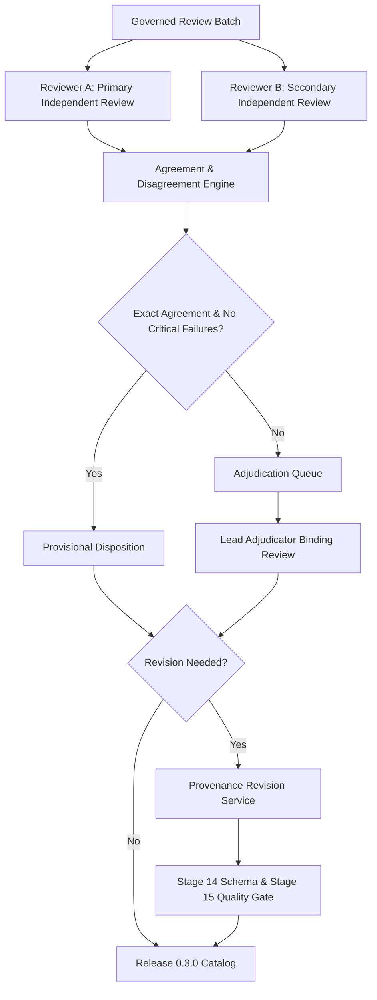

# Stage 27 Expert Review Protocol: Governance, Blinding, and Adjudication

**Component:** Component 3 — AI and NLP Based Language Simplification  
**Scope:** English educational language support for children aged 4–8  
**Prerequisite:** `stage-26-complete-v5` (`1a67bd4`)  
**Target Governed Release:** `0.3.0` (with Release `0.2.0` strictly immutable)  
**Protocol Status:** Authoritative Operating Procedure  

---

## 1. Purpose and Operational Scope

This protocol defines the formal operational rules, blinding constraints, ethical controls, and adjudication procedures for the expert review of expanded English datasets. 

The primary objective is to evaluate whether candidate text-simplification pairs, lexical substitutions, and Component 3 adaptation activities preserve core propositional meaning, demonstrate grammatical and natural English, match developmental needs of children aged 4–8, and satisfy support-tier progressions (Mild, Moderate, Strong).

### 1.1 Governance and Safety Boundaries
1. **Validation of Text Quality Only:** Expert review evaluates educational and linguistic quality. It does **not** establish a clinical diagnosis of Developmental Language Disorder (DLD), validate Component 1 clinical screening tools, or authorize unsupervised child-facing software deployment.
2. **Universal Child-Facing Safety Invariant:** Every record reviewed, revised, or published under Stage 27 retains:
   ```json
   {
     "approved_for_unsupervised_child_delivery": false,
     "requires_professional_monitoring": true
   }
   ```
3. **Decoupled Benchmark Integrity:**
   - **Historical Locked Benchmark (`historical_locked_release_0.2.0`):** Preserves byte-for-byte reproducibility of Stage 24–26 evaluations.
   - **Expert-Reviewed Benchmark (`expert_reviewed_reference_release_0.3.0`):** Publishes expert ratings, adjudicated classifications, and approved reference sets for Stage 28 comparative benchmarking.
   - Historical records, hashes, and previous benchmark scores must never be overwritten.

---

## 2. Reviewer Model and Panel Structure

The review framework operates a structured three-tier evaluation model:



### 2.1 Panel Roles
- **Reviewer A (Primary Independent Reviewer):** Performs blind evaluation across all 10 rating dimensions, 10 critical binary checks, workflow flags, and taxonomy classification.
- **Reviewer B (Secondary Independent Reviewer):** Independently evaluates the identical record under identical blinding constraints.
- **Lead Adjudicator (Senior Arbiter):** Evaluates conflicted records, assigns binding taxonomy classifications, resolves divergent ratings, and approves revisions.
- **Dataset Custodian / Administrator:** Manages batch assignments, ensures audit log integrity, enforces access revocation, and builds release packages.

---

## 3. Reviewer Blinding and Isolation Controls

To ensure objective evaluation free from cognitive anchoring or algorithm bias, the system enforces four strict blinding barriers:

1. **Model Identity Blinding:** Reviewers cannot view the origin of any candidate text (whether human-authored, deterministic rule-based, or LLM-generated).
2. **Dataset Split Blinding:** Reviewers cannot see whether a record belongs to the training, validation, or locked evaluation subsets.
3. **Automated Metric Blinding:** All automated NLP metrics (SARI, BLEU, FKGL, readability scores, and semantic cosine similarity) are stripped from the reviewer interface.
4. **Cross-Reviewer Isolation Guard:**
   - Reviewer A cannot view Reviewer B's ratings, comments, or submission timestamps.
   - Neither reviewer is notified whether the other has started, saved, or submitted an assigned item.
   - The adjudication queue unlocks only after both independent submissions are sealed.

---

## 4. Reviewer Consent, Confidentiality, and Access Controls

### 4.1 Informed Participation Agreement
Prior to batch assignment, every expert reviewer must review and sign the **Stage 27 Reviewer Participation Agreement**, which specifies:
- Research objectives of Component 3 (AI and NLP Based Language Simplification for children aged 4–8);
- Non-clinical nature of the dataset review;
- Minimum estimated review throughput and commitment.

### 4.2 Confidentiality Undertaking
Reviewers agree:
- Not to disclose, duplicate, or distribute unpublished educational stimuli, vocabulary lists, or assessment prompts;
- Not to screenshot or scrape reviewer interface screens;
- To report any accidental data leakage immediately to the Dataset Custodian.

### 4.3 Identity Protection and Privacy Controls
- Reviewer personal dossiers (name, CV, credentials) are stored in an encrypted offline administrative registry.
- All database records, review manifests, and export files use cryptographically pseudonymous identifiers (`REV-ENG-001`, `REV-ENG-002`, `ADJ-ENG-001`).
- Public releases contain only: `reviewer_id`, broad qualification category, and review round. No personal identifiable information (PII) or pseudonym hashes are published in public manifests.

### 4.4 Session Management and Account Revocation
- **Role-Based Access:** Reviewers authenticate via dedicated single-user credentials. Shared accounts are strictly prohibited.
- **Batch Expiry:** Account access to a specific batch expires upon formal completion or unassignment.
- **Revocation Protocol:** If a reviewer breaches confidentiality or exhibits non-responsive status, the administrator immediately revokes access, logs the revocation rationale, and reassigns incomplete items to a reserve reviewer.

---

## 5. Review Workflow and Batch Operations

### 5.1 Batch Architecture
- Items are grouped into manageable batches of **50 to 100 review units**.
- Each batch is assigned a unique identifier (`BATCH-ENG-P01`, `BATCH-ENG-P02`, etc.).
- Pairs sharing the same source group are assigned within the same batch so reviewers can evaluate support-tier monotonicity (`Mild` $\to$ `Moderate` $\to$ `Strong`).

### 5.2 Independent Review Submission Protocol
1. **Context Presentation:** The interface displays the source item and the target simplification pair (or lexicon entry / adaptation activity).
2. **Blinded Evaluation:** The reviewer rates the 10 quality dimensions (1–5 scale).
3. **Critical Binary Checks:** The reviewer assesses the 10 critical failure flags (meaning change, entity distortion, hallucination, answer leakage, unsafe content).
4. **Workflow Indicators:** The reviewer flags whether revision is required (`requires_revision`).
5. **Taxonomy Assignment:** The candidate pair is classified into exactly one mutually exclusive taxonomy category.
6. **Submission Seal:** Once submitted, the review submission is cryptographically hashed and sealed into an append-only ledger. Submissions are strictly immutable.

### 5.3 Batch Reconciliation Invariant
Every batch must satisfy complete accounting conservation:
$$\text{Assigned Records} = \text{Reviewed} + \text{Withdrawn} + \text{Unavailable} + \text{Unaccounted}$$
**Mandatory Invariant:** $\text{Unaccounted} = 0$.

If a record is marked `withdrawn` or `unavailable`, a formal justification record must be logged (e.g., license exclusion, corrupted source formatting, reviewer medical emergency).

---

## 6. Agreement Calculation and Adjudication Routing

### 6.1 Intra-Batch vs Corpus-Wide Agreement
- **Intra-Batch Agreement:** Cohen's kappa ($\kappa$), quadratic weighted kappa ($\kappa_w$), and Intraclass Correlation Coefficient ($\text{ICC}(3,1)$) are calculated **strictly within batches sharing the same fixed reviewer pair**.
- **Corpus-Wide Agreement:** Krippendorff's alpha ($\alpha$) is computed for aggregate corpus-level reliability across variable reviewer pairings.

### 6.2 Adjudication Triggers
A record is automatically routed to the Adjudication Queue if any of the following occur:
1. **Taxonomy Mismatch:** Reviewer A and Reviewer B assign different taxonomy classes;
2. **Critical Check Divergence:** Any of the 10 critical binary flags differs between Reviewer A and Reviewer B;
3. **Rating Discrepancy $\ge 2$ Points:** A difference of 2 or more points on Meaning Preservation, Age Appropriateness, or Overall Suitability;
4. **Opposing Dispositions:** One reviewer recommends approval while the other recommends rejection;
5. **Support-Tier Monotonicity Dispute:** One reviewer rejects the support progression across Mild, Moderate, or Strong tiers;
6. **Mandatory Reformulation Queue:** Any of the 326 flagged reformulation records without unanimous consensus.

### 6.3 Adjudication Decision Protocol
The Lead Adjudicator reviews the conflicting submissions, inspecting both reviewer ratings and written comments. The Adjudicator:
- Determines the binding taxonomy classification;
- Resolves conflicting critical failure flags;
- Specifies whether the record is accepted, rejected, or requires textual revision;
- Logs a comprehensive, audited adjudication rationale.

---

## 7. Provenance-Preserving Revision and Revalidation

When an adjudicator or authorized editor modifies candidate text:
1. **Version Linkage:** The revision is assigned a new unique identifier (`revision_id`) linked to `parent_record_id`.
2. **Hashing:** Before-and-after cryptographic SHA-256 hashes are recorded.
3. **Audit Justification:** A formal revision rationale is logged (e.g., vocabulary tuning, subordinate clause reduction).
4. **Automated Quality Revalidation:** The revised text is automatically submitted to:
   - **Stage 14 Schema Validation:** Structural integrity, required fields, and boundary constraints.
   - **Stage 15 Automated Quality Scoring:** Child safety allowlists, length ratio bounds, and lexical overlap checks.
5. **Approval Sign-Off:**
   - *Minor revisions:* Approved by the Lead Adjudicator after Stage 14/15 automated validation passes.
   - *Material semantic or pedagogical restructuring:* Routed back to both independent panel reviewers for secondary sign-off.
6. **Privacy Guard:** Public audit logs publish hashes, record IDs, and summary reasons, protecting sensitive developmental stimuli from unnecessary exposure.

---

## 8. Governed Release 0.3.0 Packaging and Handover

Upon completion of all batch reviews, adjudications, and revisions:
1. All approved text-simplification records are compiled into `data/simplification_corpus/releases/0.3.0/`.
2. Reclassified records (instruction rephrasings, activity format transformations, question generation, response mode adaptations) are partitioned into separate governed auxiliary files.
3. Unusable or rejected records are archived in `excluded_record_ids.json`.
4. The release is signed with a SHA-256 manifest: `release_manifest.sha256`.
5. Release `0.2.0` is verified to remain byte-for-byte identical to its frozen state.
6. The dataset package is handed over to Stage 28 for empirical model comparison.
