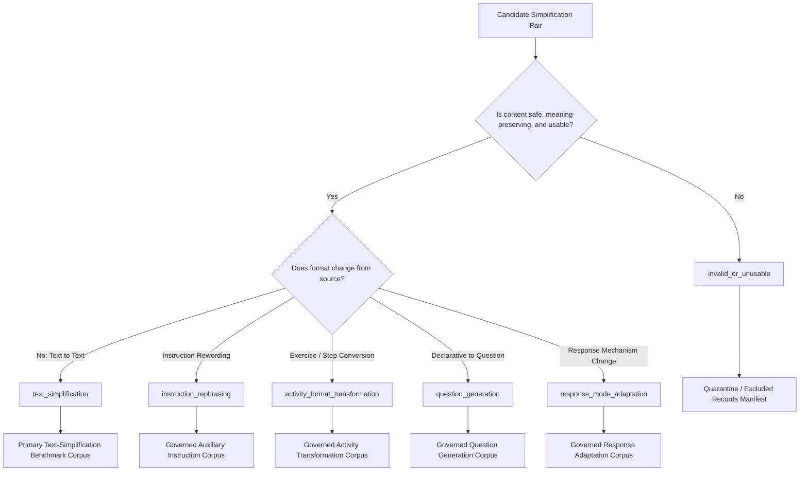
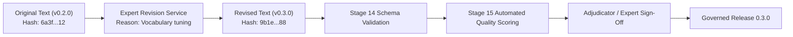
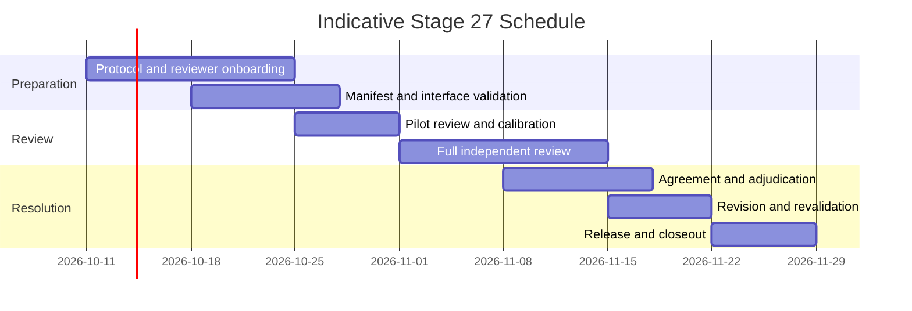

# Stage 27 Implementation Plan: Expert Review and Validation of Expanded English Datasets

**Component:** Component 3 — AI and NLP Based Language Simplification  
**Scope:** English educational language support for children aged 4–8  
**Prerequisite:** `stage-26-complete-v5` (`1a67bd4`)  
**Target Completion Tag:** `stage-27-complete`  
**Target Branch:** `feature/stage27-expert-validation`  
**Checkpoint Start Tag:** `stage-27-start`  
**Target Governed Release:** `0.3.0` (with Release `0.2.0` strictly immutable)  
**Stage Status:** Planning & Protocol Design  
**Next Stage:** Stage 28 — English Model and Simplification Comparison  

---

## 1. Executive Summary & Purpose

Stage 27 introduces structured human expert review and adjudication for the expanded English simplification datasets authored in Stage 20 (`0.2.0`). While Stages 21 through 26 developed automated NLP preprocessing, feature engineering, baseline models, controlled deterministic rule simplification, and LLM/hybrid simplification pipelines, automated metrics (such as SARI, BLEU, and FKGL) are insufficient on their own to evaluate educational suitability, pedagogical soundness, and linguistic naturalness for young learners.

The objective of Stage 27 is to **produce an expert-reviewed and adjudicated reference subset for Stage 28 research evaluation**, determining whether candidate records:
1. **Preserve propositional meaning and educational intent** without hallucination or unsupported content additions;
2. **Utilize grammatically correct, natural, and child-friendly English** appropriate for children aged 4–8;
3. **Comply with intended support-level progressions** (Mild, Moderate, Strong);
4. **Resolve all 326 historically flagged task-reformulation cases** into a defensible 6-class taxonomy;
5. **Establish human expert evidence and provisional approvals** for Release 0.3.0, distinguishing historical locked references from reviewed reference sets.

> [!IMPORTANT]
> **GOVERNANCE & SAFETY BOUNDARIES:**
> - **Dataset Validation Only:** Stage 27 validates educational text content. It does **not** diagnose Developmental Language Disorder (DLD), validate Component 1 screening processes, or authorize unsupervised child delivery.
> - **Child-Delivery Invariant:** Every record produced or reviewed in Stage 27 retains `approved_for_unsupervised_child_delivery: false` and `requires_professional_monitoring: true`.
> - **Release 0.2.0 Immutability:** Release `0.2.0` files remain byte-for-byte immutable. All approvals, taxonomy classifications, and corrections will be published in a new governed release: `0.3.0`.
> - **Dual Benchmark Integrity:** Historical locked benchmark records (`historical_locked_release_0.2.0`) and expert-reviewed reference records (`expert_reviewed_reference_release_0.3.0`) remain explicitly separated. Stage 28 will report results against both separately.

---

## 2. Dataset Scope, Ownership & Inventory Accounting

### 2.1 Scope and Ownership Boundaries
- **Component 3 Ownership:** Owns original educational items (370), simplification pairs (1,110), age-tiered English lexicon entries (378), and 192 Component 3 local adaptation-test activities and permitted integration fixtures.
- **Component 1 & Component 2 Separation:**
  * Component 1 screening tasks and screening risk models remain exclusively owned by Component 1.
  * Component 2 AR task logic, game rules, and assets remain exclusively owned by Component 2.
  * Component 3 reviews and simplifies only the language strings it is authorized to adapt.

### 2.2 Dataset Units
| Review Layer | Quantity | Unit Treatment | Governing Release |
| :--- | :---: | :--- | :---: |
| **Source Groups** | 370 | Embedded contextual reference alongside simplification pairs | Release 0.2.0 → 0.3.0 |
| **Simplification Pairs** | 1,110 | Primary assigned review target across Mild (370), Moderate (370), Strong (370) | Release 0.2.0 → 0.3.0 |
| *Newly Authored Stage 20 Pairs* | *900* | *Prioritized subset of pairs (300 source groups × 3 support tiers)* | *Release 0.2.0 → 0.3.0* |
| **Historically Flagged Reformulations** | 326 | Mandatory taxonomy classification, consensus check, and adjudication | Mandatory Resolution Queue |
| **Adaptation Activities (Component 3)** | 192 | Local adaptation-test activities & permitted fixtures (skill, safety, distractor) | Release 0.2.0 → 0.3.0 |
| **English Lexicon Entries** | 378 | Word sense, replacement difficulty, definition clarity, circularity check | Lexicon Release 0.3.0 |
| **Internal Locked Evaluation Items** | 135 | Preserved byte-for-byte; split membership, IDs, and SHA-256 hashes immutable | `historical_locked_release_0.2.0` |

### 2.3 Separate Accounting Conservation Equations
To prevent conflating disparate review units, separate accounting equations are enforced for each dataset layer:

1. **Simplification Pairs Accounting:**
   $$\text{Assigned}_{\text{pairs}} = \text{Reviewed}_{\text{pairs}} + \text{Withdrawn}_{\text{pairs}} + \text{Unavailable}_{\text{pairs}} + \text{Unaccounted}_{\text{pairs}} = 1,110$$
   *Mandatory Closeout Requirement:* $\text{Unaccounted}_{\text{pairs}} = 0$.

2. **Lexicon Entries Accounting:**
   $$\text{Assigned}_{\text{lex}} = \text{Reviewed}_{\text{lex}} + \text{Withdrawn}_{\text{lex}} + \text{Unavailable}_{\text{lex}} + \text{Unaccounted}_{\text{lex}} = 378$$
   *Mandatory Closeout Requirement:* $\text{Unaccounted}_{\text{lex}} = 0$.

3. **Adaptation Activities Accounting:**
   $$\text{Assigned}_{\text{act}} = \text{Reviewed}_{\text{act}} + \text{Withdrawn}_{\text{act}} + \text{Unavailable}_{\text{act}} + \text{Unaccounted}_{\text{act}} = 192$$
   *Mandatory Closeout Requirement:* $\text{Unaccounted}_{\text{act}} = 0$.

4. **Reformulation Queue Resolution:**
   $$326 = C + A + R + U$$
   where:
   - $C$ = Consensus resolved by two independent reviewers without conflict;
   - $A$ = Adjudicated disagreement resolved by the lead adjudicator;
   - $R$ = Rejected as unusable / invalid;
   - $U$ = Unresolved.
   *Mandatory Closeout Requirement:* $U = 0$.

5. **Withdrawn, Unavailable & Reassignment Policies:**
   - Any record marked `withdrawn` or `unavailable` must have a documented justification logged (e.g., source corruption, licensing exclusion, reviewer health event).
   - If a reviewer becomes unavailable during an incomplete batch, incomplete items are formally revoked and reassigned to a qualified replacement reviewer, with all handoffs logged in audit history.

---

## 3. Reviewer Model, Qualifications, Consent & Access Controls

### 3.1 Eligibility Requirements
Reviewers must have documented qualifications, professional experience, or research expertise relevant to the assigned review dimensions:
- English language teaching (primary education / early literacy);
- Speech and language therapy / pathology;
- Early childhood development (ages 4–8);
- Linguistics / child language acquisition;
- Special or inclusive education;
- NLP-based text simplification / computational linguistics.

### 3.2 Dimension Authorization Matrix
To maintain ethical and professional integrity, specific review decisions are restricted to qualified roles:

| Decision / Dimension | Permitted Reviewer Role |
| :--- | :--- |
| **Grammar, Fluency, and Syntactic Simplicity** | English teacher, linguist, or qualified language expert |
| **Meaning Preservation & Propositional Accuracy** | Linguist, teacher, or trained linguistic reviewer |
| **Age Appropriateness (Ages 4–8)** | Early-childhood educator or developmental specialist |
| **DLD-Related Accessibility & Language Scaffolding** | Qualified speech-language or domain professional |
| **Supervised Child Delivery Recommendation** | Authorized professional under the ethics protocol |

*Unsupervised child delivery cannot be authorized by any reviewer in Stage 27.*

### 3.3 Reviewer Consent, Confidentiality and Access Controls
- **Informed Participation Agreement:** Reviewers must sign a participation agreement acknowledging research parameters and study scope.
- **Confidentiality Undertaking:** Reviewers agree not to disclose unpublished educational stimuli or proprietary test items.
- **Role-Based Authorization:** Reviewers access only their assigned batches via authenticated sessions; access expires upon batch completion.
- **Account Revocation:** Inactive or non-compliant accounts can be revoked immediately by the lead administrator.
- **Audit Logging:** Every view, draft save, and final submission is recorded in an append-only audit ledger. Shared accounts are strictly prohibited.
- **Privacy Protection:** Reviewer qualification dossiers remain confidential. Public releases contain only pseudonymous identifiers (`reviewer_id`), broad qualification categories, and review rounds. No personal identifiable information (PII) or pseudonym hashes are exposed in public manifests.

---

## 4. Reviewer Blinding and Isolation Controls

To ensure uncompromised objectivity, the evaluation pipeline enforces independent blinded expert review with cross-reviewer isolation:
- **Model Identity Blinded:** Reviewers cannot see whether text was authored by human educators, generated by deterministic rule pipelines, or output by LLM/hybrid models.
- **Dataset Split Blinded:** Reviewers cannot see whether a record belongs to the training, validation, or locked test subset.
- **Automated Metric Blinded:** SARI, BLEU, FKGL, and embedding similarity scores are suppressed.
- **Cross-Reviewer Isolation:** Reviewer A and Reviewer B review identical records independently. Neither reviewer can view the other’s ratings, rationale, or submission status until both independent submissions are sealed.
- **Adjudicator Access:** The adjudicator accesses both blinded submissions only after an automated conflict trigger occurs.

---

## 5. Review Taxonomy & Mandatory 326 Reformulation Resolution

Every candidate pair must be classified into exactly one mutually exclusive taxonomy category:



### Taxonomy Classification Definitions
1. `text_simplification`: Direct, meaning-preserving simplification within the same discourse format (declarative to simpler declarative). **Only records in this category may serve as primary text-simplification benchmarks.**
2. `instruction_rephrasing`: Rewording an action instruction for clarity without altering the target educational action.
3. `activity_format_transformation`: Converting expository or narrative text into an interactive exercise, checklist, or game activity.
4. `question_generation`: Converting declarative text into a reading comprehension or inquiry question.
5. `response_mode_adaptation`: Altering how the child demonstrates comprehension (e.g., verbal reply to pointing/matching/selection).
6. `invalid_or_unusable`: Record contains fatal semantic distortions, hallucinations, or unsolvable grammatical defects.

### Policy for the 326 Reformulation Records
1. All 326 flagged records receive two independent blinded taxonomy reviews.
2. If both reviewers assign the identical taxonomy class and report no critical failure conflicts, the consensus classification is accepted ($C$).
3. If the reviewers assign different taxonomy classes or report conflicting critical checks, the item is routed to the Adjudication Queue ($A$).
4. The adjudicator will also audit a random 10% sample of consensus items to verify taxonomy calibration.
5. All 326 records must achieve resolved status ($U = 0$).

---

## 6. Rating Framework: Separation of Critical Failures from Approval Fields

### 6.1 Five-Point Rating Scale
- **1 — Unacceptable:** Fatal defects in meaning, grammar, or safety; unusable.
- **2 — Major Revision Required:** Core pedagogical intent obscured or severe vocabulary/grammatical barrier.
- **3 — Acceptable with Revision:** Meaning intact, but minor phrasing, vocabulary, or punctuation tuning needed.
- **4 — Good:** Clear, age-appropriate, grammatically correct, and tier-compliant.
- **5 — Excellent:** Exemplary child-friendly language, highly natural, optimal support alignment.

### 6.2 Ten Evaluation Dimensions
1. **Meaning Preservation:** Preserves propositions, educational intent, and truth value.
2. **Grammatical Correctness:** Adheres to standard English syntax, morphology, and punctuation.
3. **Fluency & Naturalness:** Sounds idiomatic and natural when read aloud to a child.
4. **Vocabulary Simplicity:** Replaces low-frequency or abstract words with age-appropriate vocabulary.
5. **Sentence-Structure Simplicity:** Avoids center-embedding, passive voice, and complex subordinate clauses.
6. **Age Appropriateness:** Concepts and tone suit children aged 4–8.
7. **Support-Level Appropriateness:** Accurately reflects the declared tier (Mild, Moderate, Strong).
8. **Instruction Clarity:** Clear, unambiguous actionable guidance.
9. **Protected-Element Preservation:** Preservation of protected entities, quantities, answer constraints, negation, relations, and instructional intent, using exact matching where required and expert-confirmed semantic preservation otherwise. Answer terms must never be exposed to the child merely because they are protected.
10. **Overall Child-Language Suitability:** Holistically appropriate for early developmental comprehension.

### 6.3 Explicit Separation: Critical Failures vs Workflow Flags vs Authorizations

To ensure that approval flags do not trigger false failure overrides, the evaluation schema strictly segregates fields into three functional groups:

#### Group 1: Critical Failure Flags (Booleans)
```text
meaning_changed                     # Propositional distortion or contradiction
important_information_removed       # Essential educational fact dropped
unsupported_information_added       # Hallucination or invented detail
negation_changed                    # Polarity inverted or corrupted
quantity_or_number_changed          # Counts, numerals, or units altered
entity_changed                      # Target entity or character corrupted
spatial_relation_changed            # Positional relations flipped
temporal_or_action_order_changed    # Sequence of events/actions corrupted
answer_leakage_detected             # Prompt discloses assessment solution
unsafe_or_inappropriate_content     # Content unsuitable or harmful for children
```

**Critical Failure Invariant:**
```python
critical_failure = any([
    meaning_changed,
    important_information_removed,
    unsupported_information_added,
    negation_changed,
    quantity_or_number_changed,
    entity_changed,
    spatial_relation_changed,
    temporal_or_action_order_changed,
    answer_leakage_detected,
    unsafe_or_inappropriate_content,
])
```
*If `critical_failure == True`, the record cannot receive provisional expert approval regardless of high numerical ratings.*

#### Group 2: Workflow & Operational Flags (Booleans)
```text
requires_revision                   # Flagged for textual correction or minor tuning
requires_adjudication               # Reviewer divergence requires arbiter resolution
requires_expert_recheck             # Material revision requires secondary expert sign-off
```

#### Group 3: Final Authorization Decisions
```text
approved_for_research_evaluation    # Certified for Stage 28 research benchmarking
approved_for_supervised_child_delivery # Conditional authorization under professional monitoring
approved_for_unsupervised_child_delivery # UNIVERSAL INVARIANT: ALWAYS FALSE in Stage 27
```

### 6.4 Disposition Precedence
Final disposition is assigned according to strict hierarchical precedence:
1. Safety or Answer-Leakage Rejection (`rejected_safety`)
2. Meaning Change Rejection (`rejected_meaning_change`)
3. Invalid Taxonomy / Unusable (`invalid_or_unusable`)
4. Manual Revision Required (`manual_revision_required`)
5. Approved with Revision (`approved_with_revision`)
6. Expert Approved (`expert_approved`)

*(Note: `insufficient_agreement` is an evaluation-level metric and is not used as a record-level quality disposition. Individual records with reviewer divergence are flagged as `requires_adjudication` until resolved).*

---

## 7. Support-Tier Progression & Lexicon Review Protocols

### 7.1 Support-Tier Progression & Monotonicity
Reviewers evaluate all 3 simplified tiers alongside the source item:
$$\text{Source Text} \longrightarrow \text{Mild Tier} \longrightarrow \text{Moderate Tier} \longrightarrow \text{Strong Tier}$$

```text
[Progression Expectations]
- Mild:     High lexical overlap, minimal syntactic restructuring, basic synonym replacement.
- Moderate: Marked lexical simplification, sentence splitting, active voice transformation.
- Strong:   Shortest clauses, essential vocabulary only, explicit sequenced steps where appropriate.
```

Reviewers record:
- `support_progression_valid`: `true` / `false`
- `mild_tier_appropriate`: `true` / `false`
- `moderate_tier_appropriate`: `true` / `false`
- `strong_tier_appropriate`: `true` / `false`
- `meaning_preserved_across_tiers`: `true` / `false`
- `recommended_tier_change`: `None` / `promote_to_mild` / `demote_to_moderate` / `demote_to_strong`
- `support_progression_issue`: Categorical failure description (e.g., "Moderate tier exhibits higher syntactic complexity than Mild tier").

### 7.2 English Lexicon Review Protocol
The 378 English lexicon entries are evaluated across 12 linguistic criteria:
1. **Normalized Headword:** Standard lowercased lemma.
2. **Intended Word Sense:** Clearly defined lexical sense in educational context.
3. **Part of Speech:** Valid syntactic category.
4. **Suggested Replacement:** Appropriate candidate synonym.
5. **Replacement Difficulty:** Genuinely simpler than headword based on developmental age norms.
6. **Target Age Band:** Validated for children aged 4–8.
7. **Child-Friendly Definition:** Expressed without meta-linguistic jargon or complex clauses.
8. **Example Sentence:** Exemplifies meaning in an everyday child context.
9. **Circular Definition Check:** Definition does not use headword or derivational cognate.
10. **Sense Mismatch Check:** Replacement matches exact semantic context of target sentences.
11. **Simplicity Verification:** Replacement has verified lower developmental acquisition age.
12. **Coverage Gap Flagging:** Identification of missing child synonyms.

**Lexicon Dispositions:** `approved`, `approved_with_revision`, `wrong_word_sense`, `replacement_not_simpler`, `age_tier_incorrect`, `definition_not_child_friendly`, `circular_definition`, `rejected`.

---

## 8. Adaptation Activity Review Protocol

The 192 Component 3 local adaptation-test activities and permitted integration fixtures are evaluated against structural safety and clarity criteria:
- **Instruction Clarity:** Direct, child-comprehensible phrasing suitable for children aged 4–8.
- **Skill Alignment:** Validly assesses declared skill (vocabulary, grammar, sequencing).
- **Distractor Independence & Non-Disclosure:** Distractors do not duplicate or disclose the correct answer.
- **Sequence Determinism:** Sentence-ordering tasks have exactly one logically defensible solution.
- **Answer Protection:** Prompt text does not reveal the answer key.
- **Cognitive Load:** Layout and syntax minimize non-essential working memory burden.
- **Child-Facing Isolation:** Reviewer notes, difficulty scores, answer hashes, and risk metadata are completely stripped from child-facing views.

---

## 9. Inter-Rater Agreement & Statistical Formulation

Agreement statistics are calculated according to formal study design criteria rather than computed indiscriminately:

| Evaluation Dimension | Data Type | Statistical Method | Predefined Project Target | Design Criteria & Assumptions |
| :--- | :---: | :---: | :---: | :--- |
| **Critical Binary Checks** | Binary (0/1) | Cohen's Kappa ($\kappa$) | $\kappa \ge 0.75$ | Two raters per item; nominal binary agreement |
| **Taxonomy Classification** | Nominal (6 classes) | Unweighted Cohen's $\kappa$ | $\kappa \ge 0.70$ | Two raters; multi-class nominal categorization |
| **Dimension Ratings (1–5)** | Ordinal (1–5) | Quadratic Weighted Cohen's $\kappa_w$ | $\kappa_w \ge 0.70$ | Penalizes distance squared between ordered ratings |
| **Missing / Multi-Rater Items** | Ordinal / Nominal | Krippendorff's Alpha ($\alpha$) | $\alpha \ge 0.75$ | Supports variable rater subsets and missing observations |
| **Continuous Composite Scores** | Continuous | Intraclass Correlation Coefficient (ICC) | $\text{ICC} \ge 0.75$ | Document model: `ICC(3,1)` for fixed expert panel, or `ICC(2,1)` for random panel |
| **Raw Consensus** | Percentage | Exact Percentage Agreement ($P_o$) | $P_o \ge 85.0\%$ | Descriptive consensus baseline |

### ICC Model Specification Requirements
When reporting ICC, the evaluation report must explicitly document:
```text
number_of_reviewers: 2
reviewer_sampling_assumption: "fixed_panel" (ICC 3,1) or "random_sample" (ICC 2,1)
consistency_or_absolute_agreement: "absolute_agreement"
single_or_average_measure: "single_measure"
selected_icc_form: "ICC(3,1)"
selection_rationale: "Reviewers represent the designated expert panel rather than a random draw from all educators"
```
*Agreement targets (e.g., $\kappa \ge 0.75$) represent project calibration thresholds, not universal laws.*

### Adjudication Triggers
Records are automatically routed to the Adjudication Queue if any of the following occur:
1. Taxonomy classification mismatch (`tax_A != tax_B`);
2. Conflict on any of the 10 critical binary checks (`crit_A != crit_B`);
3. Discrepancy $\ge 2$ points on Meaning Preservation, Age Appropriateness, or Overall Suitability;
4. Opposing dispositions (e.g., `expert_approved` vs `rejected_meaning_change`);
5. Dispute on Support-Tier progression validity;
6. Mandatory reformulation item without exact consensus.

---

## 10. Revision History, Provenance & Privacy Guard

When an adjudicator or authorized editor revises text, complete provenance is preserved:



### Privacy-Preserving Revision Records
- **Internal Protected Store:** Contains full original text, revised text, linguistic justification, and editor identity.
- **Public Audit Exports:** Contain only `revision_id`, `record_id`, `original_hash`, `revised_hash`, `revision_reason_category`, and automated validation status. Raw sensitive or developmental stimuli are not needlessly exposed.

### Revalidation Policy
- Minor grammatical or vocabulary revisions: Certified by the lead adjudicator following automated Stage 14 schema and Stage 15 quality checks.
- Material pedagogical or semantic revisions: Routed back to both independent reviewers for secondary verification.

---

## 11. System Architecture & Backend Package Design

### 11.1 Package Structure
```text
backend/app/datasets/expert_review/
├── __init__.py
├── schemas.py                   # Pydantic models for ratings, critical checks, authorizations
├── reviewer_registry.py         # Onboarding, qualification mapping, consent, access revocation
├── manifest_repository.py       # Frozen review manifests across pairs, lexicon, and activities
├── assignment_service.py        # Blinded batch assignment and cross-reviewer isolation guard
├── review_service.py            # Review submission, critical failure validation, idempotency guard
├── agreement.py                 # Cohen's kappa, weighted kappa, Krippendorff's alpha, ICC(3,1)
├── adjudication.py              # Conflict detection, adjudication queue, resolution service
├── revision_service.py          # Provenance-preserving revision with Stage 14/15 automated revalidation
├── release_builder.py           # Release 0.3.0 packaging, checksum generation, immutability guard
└── export_service.py            # Sanitized authorized research and professional-review exports
```

### 11.2 API Endpoints (`/api/v1/expert-review/`)
- `GET /batches`: List assigned batches for authenticated reviewer.
- `GET /batches/{batch_id}/next`: Fetch next unreviewed item with blinding enforcement.
- `GET /records/{record_id}`: Fetch record for review with blind protections.
- `POST /records/{record_id}/submit`: Submit review (validates ratings, critical checks, idempotency).
- `GET /disagreements`: List adjudication queue items (Adjudicator only).
- `POST /adjudications/{record_id}`: Submit final adjudication decision and rationale.
- `POST /revisions/{record_id}`: Submit textual revision with Stage 14/15 revalidation.
- `GET /progress`: Batch reconciliation metrics ($\text{Unaccounted} = 0$).
- `POST /releases/build`: Build governed Release `0.3.0` with verification manifests.

---

## 12. Indicative Execution Schedule

Reviewing 1,110 simplification pairs (dual-reviewed), 378 lexicon entries, 192 activities, disagreements, and revisions requires a realistic, phased timeline. Final duration depends on expert availability and empirical pilot timing:



---

## 13. Comprehensive Automated Test Plan

The implementation includes 15 dedicated pytest modules under `backend/tests/datasets/expert_review/`:
1. `test_reviewer_registry.py`: Qualifications, consent recording, access revocation.
2. `test_review_manifest.py`: Manifest schema validation, record count conservation equations.
3. `test_blinded_assignment.py`: Blinding guards (model, split, automated metrics hidden).
4. `test_review_submission.py`: Schema validation of 10 ratings, 10 critical checks, workflow flags.
5. `test_review_idempotency.py`: Proves duplicate submissions do not duplicate ledger records.
6. `test_critical_failure_precedence.py`: Proves critical failure flags override high numerical ratings.
7. `test_support_tier_review.py`: 3-tier support progression checks and monotonicity flags.
8. `test_taxonomy_classification.py`: 6-class mutual exclusivity and reformulation queue resolution.
9. `test_agreement_metrics.py`: Verification of Cohen's $\kappa$, weighted $\kappa$, Krippendorff's $\alpha$, and ICC(3,1).
10. `test_adjudication.py`: Conflict detection, queue routing, and adjudicator decisions.
11. `test_revision_history.py`: Provenance preservation, parent-child record linkage, and before/after hashing.
12. `test_release_builder.py`: Release 0.3.0 structural packaging and checksum integrity.
13. `test_locked_set_immutability.py`: Strict guard verifying the 135 locked-test records are unmodified.
14. `test_review_privacy.py`: Verifies zero PII or pseudonym hashes appear in public exports.
15. `test_stage27_end_to_end.py`: End-to-end simulation from review assignment to Release 0.3.0 generation.

---

## 14. Required Deliverables Manifest

```text
docs/
├── stage27_implementation_plan.md          # Comprehensive master plan (this document)
├── stage27_expert_review_protocol.md        # Governance, blinding, and ethics protocol
├── stage27_reviewer_eligibility.md          # Panel qualifications, criteria, and COI records
├── stage27_rating_rubric.md                 # 5-point scale and 10-dimension evaluation guidelines
├── stage27_taxonomy_guidelines.md           # 6-class taxonomy definitions and decision trees
├── stage27_review_manifest.csv              # Full review assignment inventory (pairs, lexicon, activities)
├── stage27_pilot_review_report.md           # Pilot evaluation, timing metrics, and calibration data
├── stage27_inter_rater_agreement.md         # Statistical report (Kappa, Alpha, ICC, consensus)
├── stage27_disagreement_report.csv          # Catalog of all detected reviewer divergences
├── stage27_adjudication_report.csv          # Adjudicator decisions, rationales, and resolutions
├── stage27_revision_log.csv                 # Textual modifications, justifications, and hashes
├── stage27_expert_validation_summary.md     # Final qualitative and empirical validation findings
├── stage27_dataset_release_report.md        # Specification of Release 0.3.0 contents
├── stage27_accounting_summary.md            # Conservation audit proving Unaccounted = 0
├── stage27_reproducibility_record.json      # Git commit, Python environment, seed, and file hashes
├── stage27_completion_record.md             # Formal sign-off and criteria verification
└── stage27_manifest.sha256                  # Cryptographic checksums of all Stage 27 artifacts
```

---

## 15. Stage 27 to Stage 28 Handover Protocol

Upon completion of Stage 27, Stage 28 (English Model and Simplification Comparison) will receive:
1. **The Certified Text-Simplification Subset:** Exactly those records classified as `text_simplification` with disposition `expert_approved` or `approved_with_revision`.
2. **Multi-Dimensional Expert Rating Benchmarks:** Ground-truth human ratings for meaning preservation, fluency, simplicity, and age appropriateness to correlate against automated SARI/BLEU/FKGL metrics.
3. **Partitioned Auxiliary Datasets:** Reclassified instructions, activity formats, questions, and response adaptations cleanly partitioned into auxiliary governed corpora.
4. **Adjudication Decisions & Disagreement Logs:** Providing transparency into linguistic edge cases.
5. **Governed Dataset Release 0.3.0:** Signed with cryptographic manifests for immediate consumption by Stage 28 comparative benchmark runners, clearly distinguishing `historical_locked_release_0.2.0` from `expert_reviewed_reference_release_0.3.0`.

---

## 16. Stage 27 Completion Criteria

Stage 27 is complete only when all of the following criteria are formally verified:

- [ ] Reviewer eligibility and authorization verified
- [ ] Reviewer consent and confidentiality recorded
- [ ] Review manifest frozen and hashed
- [ ] Pilot review completed
- [ ] Rubric version frozen
- [ ] All selected records mutually accounted for
- [ ] All 326 flagged reformulations resolved ($U = 0$)
- [ ] Agreement statistics calculated using the appropriate design
- [ ] Required disagreements adjudicated
- [ ] Critical failures override numerical averages
- [ ] Revisions preserve original versions and hashes
- [ ] Revised records pass Stage 14 and Stage 15 validation
- [ ] Release 0.2.0 remains unchanged
- [ ] Release 0.3.0 generated and verified
- [ ] Historical and expert-reviewed locked references remain distinguishable
- [ ] No record approved for unsupervised child delivery
- [ ] Stage 27 tests pass
- [ ] Full backend regression passes
- [ ] Frontend build passes
- [ ] SHA-256 manifest verifies
- [ ] Working tree clean
- [ ] `stage-27-complete` tag created without moving previous tags
