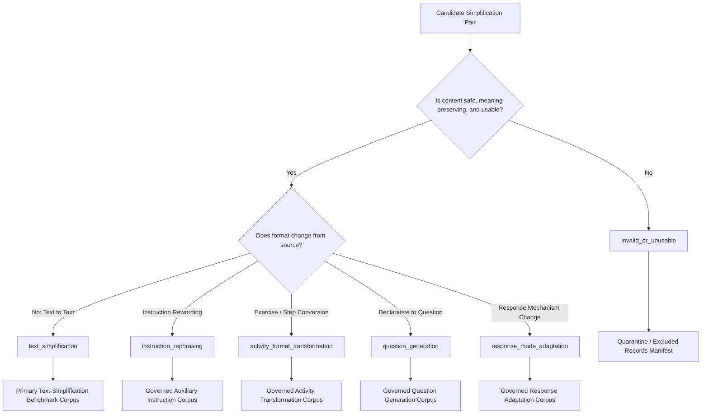
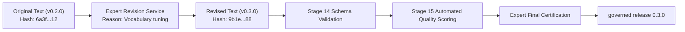

# Stage 27 Implementation Plan: Expert Review and Validation of Expanded English Datasets

**Component:** Component 3 — AI and NLP Based Language Simplification  
**Scope:** English educational language support for children aged 4–8  
**Prerequisite:** `stage-26-complete-v5` (`1a67bd4`)  
**Target Completion Tag:** `stage-27-complete`  
**Target Branch:** `feature/stage27-expert-validation`  
**Checkpoint Start Tag:** `stage-27-start`  
**Target Governed Release:** `0.3.0` (with Release `0.2.0` strictly immutable)  
**Stage Status:** Planning & Architecture Review  
**Next Stage:** Stage 28 — English Model and Simplification Comparison  

---

## 1. Executive Summary & Purpose

Stage 27 establishes the authoritative human expert validation layer for the expanded English simplification datasets developed in Stage 20 (`0.2.0`). While Stages 21 through 26 established automated NLP preprocessing, feature engineering, baseline models, controlled deterministic rule simplification, and LLM/hybrid simplification pipelines, automated metrics (such as SARI, BLEU, and FKGL) are insufficient on their own to certify educational suitability, pedagogical soundess, and linguistic naturalness for young learners.

Stage 27 introduces a structured, double-blind expert review and adjudication framework to determine whether authored and generated records:
1. **Preserve essential propositional meaning and educational intent** without hallucination or unsupported content additions;
2. **Utilize grammatically correct, natural, and child-friendly English** appropriate for children aged 4–8;
3. **Comply with intended support-level progressions** (Mild, Moderate, Strong);
4. **Resolve all 326 historically flagged task-reformulation cases** into a defensible 6-class taxonomy;
5. **Certify high-quality reference pairs for Release 0.3.0** to serve as gold-standard evidence for Stage 28 model benchmarking.

> [!IMPORTANT]
> **GOVERNANCE & SAFETY BOUNDARIES:**
> - **Dataset Validation Only:** Stage 27 validates educational text content. It does **not** diagnose Developmental Language Disorder (DLD), validate Component 1 clinical screening tools, or authorize unsupervised child delivery.
> - **Child-Delivery Invariant:** Every record produced or approved in Stage 27 retains `approved_for_unsupervised_child_delivery: false` and `requires_professional_monitoring: true`.
> - **Release 0.2.0 Immutability:** Release `0.2.0` files remain byte-for-byte immutable. All approvals, taxonomy classifications, and corrections will be published in a new governed release: `0.3.0`.
> - **Locked Benchmark Integrity:** Membership of the 135 locked-test records cannot be altered based on reviewer preferences or model performance.

---

## 2. Dataset Scope & Inventory Accounting

| Dataset Layer | Input Quantity | Stage 27 Target Treatment | Governing Release |
| :--- | :---: | :--- | :---: |
| **Original Educational Items** | 370 | Review source clarity, age relevance, and educational intent | Release 0.2.0 → 0.3.0 |
| **Total Simplification Pairs** | 1,110 | Primary expert-review target across Mild (370), Moderate (370), and Strong (370) | Release 0.2.0 → 0.3.0 |
| **Newly Authored Stage 20 Pairs** | 900 | High-priority full review (300 source groups × 3 support tiers) | Release 0.2.0 → 0.3.0 |
| **Historically Flagged Reformulations** | 326 | Mandatory taxonomy classification, inter-rater agreement, and adjudication | Mandatory Resolution Queue |
| **Adaptation Activities (Component 3)** | 192 | Review instruction clarity, target skill alignment, distractor safety, answer protection | Release 0.2.0 → 0.3.0 |
| **English Lexicon Entries** | 378 | Review word sense, replacement difficulty, definition clarity, circularity risk | Lexicon Release 0.3.0 |
| **Internal Locked Evaluation Items** | 135 | Preserved byte-for-byte; split membership, item IDs, and SHA-256 hashes immutable | Locked Test Guard |

### Invariant Batch Accounting Formula
Every assigned review batch must satisfy the strict conservation invariant:
$$\text{Assigned Records} = \text{Reviewed} + \text{Withdrawn} + \text{Unavailable} + \text{Unaccounted}$$
**Mandatory Closeout Requirement:** $\text{Unaccounted} = 0$.

---

## 3. Reviewer Panel Architecture & Blinding Model

### 3.1 Recommended Expertise & Panel Roles
The review framework operates a structured three-role model:
- **Reviewer A (Primary Independent Reviewer):** Performs primary blind evaluation.
- **Reviewer B (Secondary Independent Reviewer):** Performs secondary blind evaluation of the identical record.
- **Adjudicator (Lead Expert / Linguistic Arbiter):** Resolves disagreements when ratings diverge or critical checks conflict.

Reviewers must possess certified professional backgrounds in at least one of the following domains:
1. English Language Teaching (ELT / ESL / EFL for primary years);
2. Speech and Language Therapy / Pathology (SLT / SLP);
3. Early Childhood Education (Ages 4–8);
4. Child Language Development & Applied Linguistics;
5. Special and Inclusive Education;
6. Computational Linguistics & NLP-Based Simplification.

### 3.2 Reviewer Metadata & Privacy Protection
All reviewer personal information is strictly separated from exported datasets. Public exports and research manifests use cryptographically pseudonymous reviewer IDs (`REV-ENG-001`, `REV-ENG-002`, `ADJ-ENG-001`).

```json
{
  "reviewer_id": "REV-ENG-001",
  "pseudonym_hash": "a4f8c2...d19",
  "professional_role": "Speech-Language Pathologist / Early Literacy Specialist",
  "relevant_experience_years": 8,
  "qualification_category": "Clinical / Pedagogical",
  "language_expertise": ["en-US", "en-GB"],
  "child_age_expertise": ["4-6", "6-8"],
  "conflict_of_interest_declared": false,
  "calibration_training_completed": true,
  "calibration_agreement_score": 0.88,
  "review_start_date": "2026-10-10",
  "review_end_date": "2026-10-15"
}
```

### 3.3 Double-Blind Isolation Guarantees
To prevent bias, the review system enforces strict blinding:
- **Model Identity Blinded:** No indication of whether text was human-authored, deterministic rule-generated, or LLM-prompted.
- **Split Blinded:** No indication of Train, Validation, or Locked Test designation.
- **Metric Blinded:** Automatic SARI, BLEU, FKGL, and cosine similarity scores are hidden.
- **Cross-Reviewer Blinded:** Reviewer A cannot view Reviewer B's evaluation (or existence of submission) until both submissions are sealed.

---

## 4. Review Taxonomy & Mandatory 326 Reformulation Resolution

Every candidate pair must be classified into exactly one mutually exclusive taxonomy category:



### Taxonomy Classification Definitions
1. `text_simplification`: Direct, meaning-preserving simplification of the text within the same discourse format (declarative to simpler declarative). **Only records in this class may serve as authoritative text-simplification benchmarks.**
2. `instruction_rephrasing`: Rewording an action instruction for greater clarity without altering the target educational action or introducing interactive scaffolds.
3. `activity_format_transformation`: Converting expository or narrative text into an interactive exercise, checklist, or game activity.
4. `question_generation`: Converting declarative text into a reading comprehension or inquiry question.
5. `response_mode_adaptation`: Altering how the child demonstrates comprehension (e.g., transforming verbal reply to pointing/matching/selection).
6. `invalid_or_unusable`: Record contains fatal semantic distortions, hallucinations, or unsolvable grammatical defects.

**Mandatory Invariant:** All 326 historically flagged reformulations must receive dual independent review and adjudication, with 100% resolved taxonomy classifications.

---

## 5. Ten-Dimension Rating Framework & Critical Binary Checks

### 5.1 Five-Point Rating Scale
- **1 — Unacceptable:** Fatal defects in meaning, grammar, or safety; unusable.
- **2 — Major Revision Required:** Core pedagogical intent obscured or severe vocabulary/grammatical barrier.
- **3 — Acceptable with Revision:** Meaning intact, but minor phrasing, vocabulary, or punctuation tuning needed.
- **4 — Good:** Clear, age-appropriate, grammatically correct, and tier-compliant.
- **5 — Excellent:** Exemplary child-friendly language, highly natural, optimal support alignment.

### 5.2 Ten Evaluation Dimensions
1. **Meaning Preservation:** Preserves propositions, educational intent, and truth value.
2. **Grammatical Correctness:** Adheres to standard English syntax, morphology, and punctuation.
3. **Fluency & Naturalness:** Sounds idiomatic and natural when read aloud to a child.
4. **Vocabulary Simplicity:** Replaces low-frequency/abstract words with age-appropriate vocabulary.
5. **Sentence-Structure Simplicity:** Avoids center-embedding, passive voice, and complex subordinate clauses.
6. **Age Appropriateness:** Concepts and tone suit children aged 4–8.
7. **Support-Level Appropriateness:** Accurately reflects the declared tier (Mild, Moderate, Strong).
8. **Instruction Clarity:** Clear, unambiguous actionable guidance.
9. **Protected-Element Preservation:** 100% exact preservation of named entities, answer terms, and quantities.
10. **Overall Child-Language Suitability:** Holistically appropriate for early developmental comprehension.

### 5.3 Critical Binary Checks (Failure Overrides Average Rating)
If any critical check is marked `true`, the record **cannot** be auto-approved, regardless of whether numerical dimension ratings average 4.0 or higher:

```text
[CRITICAL CHECK LIST]
1.  meaning_changed                     (boolean) -> Propositional distortion
2.  important_information_removed       (boolean) -> Key educational fact lost
3.  unsupported_information_added       (boolean) -> Hallucination or invented detail
4.  negation_changed                    (boolean) -> Polarity inverted or corrupted
5.  quantity_or_number_changed          (boolean) -> Counts, numerals, or units altered
6.  entity_changed                      (boolean) -> Named person/place/object altered
7.  spatial_relation_changed            (boolean) -> Positional relations flipped
8.  temporal_or_action_order_changed    (boolean) -> Sequence of actions corrupted
9.  answer_leakage_detected             (boolean) -> Prompt reveals assessment answer
10. unsafe_or_inappropriate_content     (boolean) -> Age-inappropriate/harmful concept
11. requires_revision                   (boolean) -> Needs expert editor touch-up
12. approved_for_research_evaluation    (boolean) -> Eligible for research benchmarks
13. approved_for_supervised_child_deliv (boolean) -> Conditional supervised delivery
```

### Precedence of Final Dispositions
1. Safety or Answer-Leakage Rejection (`rejected_safety`)
2. Meaning Change Rejection (`rejected_meaning_change`)
3. Invalid Taxonomy / Unusable (`invalid_or_unusable`)
4. Insufficient Inter-Rater Agreement (`insufficient_agreement`)
5. Manual Revision Required (`manual_revision_required`)
6. Approved with Revision (`approved_with_revision`)
7. Expert Approved (`expert_approved`)

---

## 6. Support-Tier Progression & Monotonicity Review

Reviewers evaluate all 3 simplified tiers alongside the source item:
$$\text{Source Text} \longrightarrow \text{Mild Tier} \longrightarrow \text{Moderate Tier} \longrightarrow \text{Strong Tier}$$

```text
[Progression Expectations]
- Mild:     High lexical overlap, minimal syntactic restructuring, basic synonym replacement.
- Moderate: Marked lexical simplification, sentence splitting, active voice transformation.
- Strong:   Shortest clauses, essential vocabulary only, explicit sequenced steps where appropriate.
```

Reviewers record:
- `support_progression_valid`: `true` / `false`
- `mild_tier_appropriate`: `true` / `false`
- `moderate_tier_appropriate`: `true` / `false`
- `strong_tier_appropriate`: `true` / `false`
- `meaning_preserved_across_tiers`: `true` / `false`
- `recommended_tier_change`: `None` / `promote_to_mild` / `demote_to_moderate` / `demote_to_strong`
- `support_progression_issue`: Categorical failure description (e.g., "Moderate is more complex than Mild").

---

## 7. English Lexicon Review Protocol

The 378 English lexicon entries are evaluated across 12 specific linguistic criteria:
1. **Normalized Headword:** Standard lowercased lemma.
2. **Intended Word Sense:** Clearly defined lexical sense in context.
3. **Part of Speech:** Valid syntactic category (noun, verb, adjective, adverb).
4. **Suggested Replacement:** Appropriate candidate synonym.
5. **Replacement Difficulty:** Genuinely simpler than headword.
6. **Target Age Band:** Validated against 4–5, 6–7, or 7–8 developmental norms.
7. **Child-Friendly Definition:** Expressed without abstract or meta-linguistic jargon.
8. **Example Sentence:** Exemplifies meaning in an everyday child context.
9. **Circular Definition Check:** Definition does not use headword or derivational cognate.
10. **Sense Mismatch Check:** Replacement matches exact semantic context of target sentences.
11. **Simplicity Verification:** Replacement is verified to have lower developmental acquisition age.
12. **Coverage Gap Flagging:** Identification of missing child synonyms.

**Lexicon Dispositions:** `approved`, `approved_with_revision`, `wrong_word_sense`, `replacement_not_simpler`, `age_tier_incorrect`, `definition_not_child_friendly`, `circular_definition`, `rejected`.

---

## 8. Adaptation Activity Review Protocol

The 192 Component 3 adaptation activities are evaluated against structural safety and clarity criteria:
- **Instruction Clarity:** Direct, child-comprehensible phrasing.
- **Skill Alignment:** Validly assesses declared skill (vocabulary, grammar, sequencing).
- **Distractor Independence & Non-Disclosure:** Distractors do not duplicate or disclose the correct answer.
- **Sequence Determinism:** Sentence-ordering tasks have exactly one logically defensible solution.
- **Answer Protection:** Prompt text does not reveal the answer key.
- **Cognitive Load:** Layout and syntax minimize non-essential working memory burden.
- **Child-Facing Isolation:** Reviewer notes, difficulty scores, answer hashes, and risk metadata are completely stripped from child-facing views.

---

## 9. Inter-Rater Agreement & Statistical Formulation

The agreement calculation engine computes multi-dimensional statistics:

| Evaluation Dimension | Data Type | Primary Agreement Statistic | Benchmark Target |
| :--- | :---: | :--- | :---: |
| **Critical Binary Checks** | Binary (0/1) | Cohen's Kappa ($\kappa$) | $\kappa \ge 0.75$ |
| **Taxonomy Classification** | Nominal (6 classes) | Fleiss' Kappa / Multi-class Cohen's $\kappa$ | $\kappa \ge 0.70$ |
| **Dimension Ratings (1–5)** | Ordinal (1–5) | Quadratic Weighted Cohen's Kappa ($\kappa_w$) | $\kappa_w \ge 0.70$ |
| **Multi-Rater / Incomplete Ratings** | Mixed / Ordinal | Krippendorff's Alpha ($\alpha$) | $\alpha \ge 0.75$ |
| **Composite Score Reliability** | Continuous | Intraclass Correlation Coefficient (ICC(2,1)) | $\text{ICC} \ge 0.75$ |
| **Raw Consensus** | Percentage | Exact Percentage Agreement ($P_o$) | $P_o \ge 85.0\%$ |

### Disagreement Trigger Rules for Adjudication
A record is automatically routed to the Adjudication Queue if any of the following occur:
1. Taxonomy classification mismatch (`tax_A != tax_B`);
2. Conflict on any of the 10 critical binary checks (`crit_A != crit_B`);
3. Discrepancy $\ge 2$ points on Meaning Preservation, Age Appropriateness, or Overall Suitability;
4. Opposing dispositions (e.g., `expert_approved` vs `rejected_meaning_change`);
5. Dispute on Support-Tier progression validity;
6. Record belongs to the mandatory 326 reformulation queue without exact consensus.

---

## 10. Revision History & Provenance Tracking

When an adjudicator or editor revises a text pair, the system preserves complete audit provenance:



### Revision Record Structure
```json
{
  "revision_id": "REV-20261011-0042",
  "record_id": "PAIR-SRC-0142-MOD",
  "source_group_id": "SRC-EN-VOC-0142",
  "target_support_level": "moderate",
  "original_text": "Sara ate a warm bowl of soup.",
  "revised_text": "Sara had warm soup in a bowl.",
  "original_hash": "e3b0c44298fc1c149afbf4c8996fb92427ae41e4649b934ca495991b7852b855",
  "revised_hash": "4a7d18e22c9a87d6056b2089e9f90264027788939c3e218204b7762a5b678129",
  "revision_reason": "Replaced 'ate a warm bowl of soup' to prevent metonymic confusion for younger 4yo learners",
  "revised_by": "ADJ-ENG-001",
  "stage14_schema_validation": "PASSED",
  "stage15_quality_validation": "PASSED",
  "final_adjudication_disposition": "approved_with_revision",
  "created_at": "2026-10-11T14:32:00Z"
}
```

---

## 11. System Architecture & Backend Package Design

### 11.1 Package Structure
```text
backend/app/datasets/expert_review/
├── __init__.py
├── schemas.py                   # Pydantic schemas for ratings, reviews, revisions, releases
├── reviewer_registry.py         # Registration, qualification, and conflict management
├── manifest_repository.py       # Frozen review manifests, record lookups, batch partitioning
├── assignment_service.py        # Double-blind assignment, reviewer isolation guard
├── review_service.py            # Review submission, validation, idempotency guards
├── agreement.py                 # Cohen's kappa, weighted kappa, Krippendorff's alpha, ICC
├── adjudication.py              # Conflict detection, adjudication queue, resolution service
├── revision_service.py          # Provenance-preserving text revision and Stage 14/15 revalidation
├── release_builder.py           # Release 0.3.0 packaging, checksum generation, immutability guard
└── export_service.py            # Sanitized, anonymized research and clinical exports
```

### 11.2 API Endpoints (`/api/v1/expert-review/`)
- `GET /batches`: List assigned batches for the authenticated reviewer.
- `GET /batches/{batch_id}/next`: Fetch next unreviewed record in batch (blinded).
- `GET /records/{record_id}`: Fetch record for review with blind protections.
- `POST /records/{record_id}/submit`: Submit idempotent review (validates ratings, critical checks).
- `GET /disagreements`: List adjudication items (Adjudicator role only).
- `POST /adjudications/{record_id}`: Submit final adjudication decision and rationale.
- `POST /revisions/{record_id}`: Submit textual revision with automatic Stage 14/15 revalidation.
- `GET /progress`: Batch progress and reconciliation metrics ($\text{Unaccounted} = 0$).
- `POST /releases/build`: Build governed Release `0.3.0` with verification manifests.

---

## 12. Execution Phases & Work Packages (WP0 – WP10)

```mermaid
gantt
    title Stage 27 Execution Timeline
    dateFormat  YYYY-MM-DD
    section Setup & Protocols
    Phase 0: Safety Checkpoint & Branch Setup       :done, p0, 2026-10-10, 1d
    Phase 1: Protocol, Rubric & Taxonomy Finalization:active, p1, 2026-10-11, 2d
    section Data Preparation
    Phase 2: Review Manifest & Blinded Partitioning :p2, 2026-10-13, 2d
    section Review Execution
    Phase 3: Pilot Review & Rubric Versioning       :p3, 2026-10-15, 2d
    Phase 4: Full Double-Blind Independent Review    :p4, 2026-10-17, 4d
    section Adjudication & Release
    Phase 5: Agreement Calculation & Adjudication   :p5, 2026-10-21, 2d
    Phase 6: Revision & Stage 14/15 Revalidation    :p6, 2026-10-23, 2d
    Phase 7: Governed Release 0.3.0 Packaging        :p7, 2026-10-25, 2d
    Phase 8: Regression Testing & Closeout           :p8, 2026-10-27, 1d
```

### Phase 0 — Safety Checkpoint & Branch Initialization
- Branch from `stage-26-complete-v5` (`1a67bd4`) to `feature/stage27-expert-validation`.
- Tag initial state: `stage-27-start`.
- Verify backend regression suite (**380/380 passed**) and frontend production build.
- Snapshot Stage 26 manifests and Release 0.2.0 SHA-256 hashes.

### Phase 1 — Protocol, Rubric & Taxonomy Guidelines (WP1)
- Codify `docs/stage27_expert_review_protocol.md`.
- Finalize `docs/stage27_rating_rubric.md` and `docs/stage27_taxonomy_guidelines.md`.
- Codify reviewer eligibility, conflict declarations, and calibration criteria in `docs/stage27_reviewer_eligibility.md`.

### Phase 2 — Review Manifest & Blinded Partitioning (WP2)
- Generate `data/expert_review/manifests/review_manifest_v1.json` containing 1,110 pairs, 378 lexicon entries, and 192 activities.
- Flag the 326 mandatory reformulation records.
- Partition items into 50–100 item batches with blinded Reviewer A/B pairing.
- Lock internal evaluation items (135 items) with strict hash-immutability guards.

### Phase 3 — Pilot Review & Calibration Verification (WP3)
- Execute pilot review on 30 source groups (90 pairs), 20 lexicon entries, and 20 activities across all 4 domains.
- Measure inter-rater agreement on pilot data.
- Refine rubric examples; freeze Rubric v1.1.0 if adjustments occur.
- Publish `docs/stage27_pilot_review_report.md`.

### Phase 4 — Full Independent Double-Blind Review (WP4)
- Reviewers A and B independently review assigned batches without access to each other's work or automated metrics.
- Track real-time batch accounting ($\text{Unaccounted} = 0$).
- Guarantee zero data loss and immutable submission audit logs.

### Phase 5 — Agreement Statistics & Adjudication Queue (WP5)
- Compute Cohen's $\kappa$, weighted $\kappa$, Krippendorff's $\alpha$, and ICC per dimension.
- Route all taxonomy conflicts, critical binary mismatches, and the 326 reformulation items to the Adjudication Queue.
- Adjudicator records binding resolutions and detailed rationales.
- Publish `docs/stage27_inter_rater_agreement.md`, `docs/stage27_disagreement_report.csv`, and `docs/stage27_adjudication_report.csv`.

### Phase 6 — Textual Revisions & Quality Revalidation (WP6)
- Apply adjudicator-approved textual modifications via `RevisionService`.
- Run Stage 14 schema validators and Stage 15 automated quality checks on all revised records.
- Record before/after text hashes in `docs/stage27_revision_log.csv`.

### Phase 7 — Governed Dataset Release 0.3.0 Packaging (WP7)
- Assemble `data/simplification_corpus/releases/0.3.0/`:
  * `simplification_corpus.json`
  * `expert_review_metadata.jsonl`
  * `taxonomy_classifications.jsonl`
  * `adjudication_records.jsonl`
  * `revision_history.jsonl`
  * `approved_record_ids.json`
  * `excluded_record_ids.json`
  * `release_manifest.json` and `release_manifest.sha256`
- Verify byte-for-byte immutability of Release `0.2.0`.
- Publish `docs/stage27_dataset_release_report.md`.

### Phase 8 — Comprehensive Verification, Closeout & Handover (WP8)
- Execute complete Stage 27 test suite (15 test modules).
- Run full backend regression suite (all 380+ tests).
- Execute frontend production build.
- Rebuild SHA-256 manifest: `docs/stage27_manifest.sha256`.
- Publish `docs/stage27_completion_record.md` and `docs/stage27_reproducibility_record.json`.
- Tag repository: `stage-27-complete`.

---

## 13. Comprehensive Automated Test Plan

The implementation includes 15 dedicated pytest test suites under `backend/tests/datasets/expert_review/`:

1. `test_reviewer_registry.py`: Reviewer onboarding, conflict of interest enforcement, calibration scores.
2. `test_review_manifest.py`: Manifest schema validation, checksum verification, record count accounting.
3. `test_blinded_assignment.py`: Verifies reviewer isolation (models, automated scores, and splits are hidden).
4. `test_review_submission.py`: Schema validation of 10 ratings and 13 critical binary checks.
5. `test_review_idempotency.py`: Proves duplicate submissions do not overwrite or duplicate ledger entries.
6. `test_critical_failure_precedence.py`: Proves critical binary failures override high numerical ratings.
7. `test_support_tier_review.py`: Validation of 3-tier support progression checks and monotonicity flags.
8. `test_taxonomy_classification.py`: Validation of 6-class mutual exclusivity and reformulation queue resolution.
9. `test_agreement_metrics.py`: Mathematical verification of Cohen's $\kappa$, weighted $\kappa$, and Krippendorff's $\alpha$.
10. `test_adjudication.py`: Verification of conflict detection, queue routing, and adjudicator decisions.
11. `test_revision_history.py`: Provenance preservation, parent-child record linkage, and before/after hashing.
12. `test_release_builder.py`: Release 0.3.0 structural packaging and checksum integrity.
13. `test_locked_set_immutability.py`: Strict guard verifying the 135 locked-test records are unmodified.
14. `test_review_privacy.py`: Verifies zero PII / personal reviewer metadata in exported datasets.
15. `test_stage27_end_to_end.py`: Full end-to-end simulation from review assignment to Release 0.3.0 generation.

---

## 14. Required Deliverables Manifest

```text
docs/
├── stage27_implementation_plan.md          # Comprehensive master plan (this document)
├── stage27_expert_review_protocol.md        # Governance, blinding, and ethics protocol
├── stage27_reviewer_eligibility.md          # Panel qualifications, criteria, and COI records
├── stage27_rating_rubric.md                 # 5-point scale and 10-dimension evaluation guidelines
├── stage27_taxonomy_guidelines.md           # 6-class taxonomy definitions and decision trees
├── stage27_review_manifest.csv              # Full review assignment inventory (1,110 pairs)
├── stage27_pilot_review_report.md           # Pilot evaluation, timing metrics, and calibration data
├── stage27_inter_rater_agreement.md         # Statistical report (Kappa, Alpha, ICC, consensus)
├── stage27_disagreement_report.csv          # Catalog of all detected reviewer divergences
├── stage27_adjudication_report.csv          # Adjudicator decisions, rationales, and resolutions
├── stage27_revision_log.csv                 # Textual modifications, justifications, and hashes
├── stage27_expert_validation_summary.md     # Final qualitative and empirical validation findings
├── stage27_dataset_release_report.md        # Specification of Release 0.3.0 contents
├── stage27_accounting_summary.md            # Conservation audit proving Unaccounted = 0
├── stage27_reproducibility_record.json      # Git commit, Python environment, seed, and file hashes
├── stage27_completion_record.md             # Formal sign-off and criteria verification
└── stage27_manifest.sha256                  # Cryptographic checksums of all Stage 27 artifacts
```

---

## 15. Stage 27 to Stage 28 Handover Protocol

Upon completion of Stage 27, Stage 28 (English Model and Simplification Comparison) will receive:
1. **The Certified Text-Simplification Subset:** Exactly those records classified as `text_simplification` with disposition `expert_approved` or `approved_with_revision`.
2. **Multi-Dimensional Expert Rating Benchmarks:** Ground-truth human ratings for meaning preservation, fluency, simplicity, and age appropriateness to correlate against automated SARI/BLEU/FKGL metrics.
3. **Partitioned Auxiliary Datasets:** Reclassified instructions, activity formats, questions, and response adaptations cleanly partitioned into auxiliary governed corpora.
4. **Adjudication Decisions & Disagreement Logs:** Providing transparency into linguistic edge cases.
5. **Governed Dataset Release 0.3.0:** Signed with cryptographic manifests for immediate consumption by Stage 28 comparative benchmark runners.
