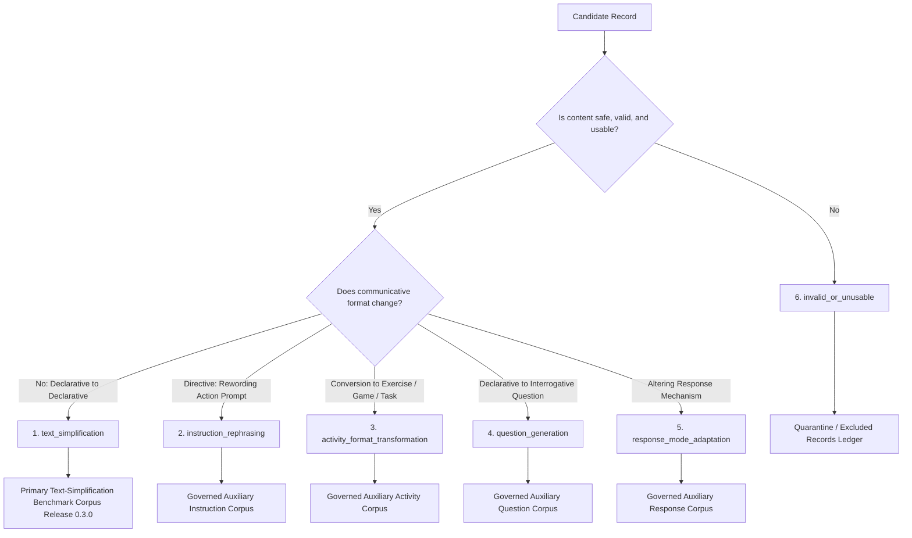

# Stage 27 Taxonomy Guidelines: Classification, Decision Trees, and Reformulation Resolution

**Component:** Component 3 — AI and NLP Based Language Simplification  
**Scope:** English educational language support for children aged 4–8  
**Prerequisite:** `stage-26-complete-v5` (`1a67bd4`)  
**Guidelines Version:** `1.0.0`  
**Protocol Status:** Authoritative Operating Standard  

---

## 1. Executive Summary & Purpose

During early dataset expansion in Stage 20, 326 records were flagged as potential task or activity reformulations rather than pure textual simplifications. When source text is converted into a game prompt, an interactive exercise, or a comprehension question, automated text-simplification metrics (e.g., SARI, BLEU) produce invalid scores because the target discourse format has changed.

These guidelines establish:
1. Formal linguistic definitions for the **six mutually exclusive taxonomy classes**;
2. A deterministic classification decision tree;
3. The mandatory resolution and adjudication policy for the **326 flagged reformulation records**;
4. Governance for auxiliary corpora storage.

---

## 2. Six Mutually Exclusive Taxonomy Classes

Every candidate simplification pair must be classified into **exactly one** category:



### Class 1: `text_simplification`
- **Definition:** Meaning-preserving simplification of the text within the **identical discourse structure and communicative function** (declarative $\to$ simpler declarative; narrative $\to$ simpler narrative).
- **Inclusion Rule:** **Only records classified as `text_simplification` may enter the primary English text-simplification benchmark dataset for Stage 28.**
- **Exemplar:**
  * *Original:* "The ferocious tiger prowled stealthily through the dense jungle undergrowth."
  * *Simplified:* "The big tiger walked quietly through the thick green forest."

### Class 2: `instruction_rephrasing`
- **Definition:** Rewording an actionable task instruction or educational directive for greater clarity and lower cognitive load, **without changing the required action, adding interactive exercises, or altering the response mechanism**.
- **Exemplar:**
  * *Original:* "Prior to commencement of the reading exercise, ensure that all relevant illustrations are inspected."
  * *Simplified:* "Look at all the pictures before you start reading."

### Class 3: `activity_format_transformation`
- **Definition:** Converting expository, narrative, or declarative text into an **interactive educational activity, exercise, scaffolded checklist, or multi-step game prompt**.
- **Exemplar:**
  * *Original:* "Photosynthesis allows green plants to convert sunlight and water into energy."
  * *Simplified:* "Let's play a plant game! Step 1: Give your plant sunshine. Step 2: Give your plant water. Watch your plant grow!"

### Class 4: `question_generation`
- **Definition:** Converting declarative information into a reading comprehension question, inquiry prompt, or quiz item.
- **Exemplar:**
  * *Original:* "Owls hunt for mice and small animals during nighttime hours because they possess excellent night vision."
  * *Simplified:* "Why do owls hunt at night? Can you tell me what they like to eat?"

### Class 5: `response_mode_adaptation`
- **Definition:** Restructuring an activity or text prompt to **alter how the learner is expected to demonstrate understanding** (e.g., transforming a verbal answer requirement into a pointing, matching, drag-and-drop, or physical action response).
- **Exemplar:**
  * *Original:* "Explain verbally why the character felt despondent."
  * *Simplified:* "Point to the picture that shows how the boy feels: happy, sad, or angry."

### Class 6: `invalid_or_unusable`
- **Definition:** The candidate pair cannot be retained in any governed dataset due to fatal semantic corruption, unresolvable grammatical failure, hallucination, or safety hazards.
- **Exemplar:**
  * *Original:* "The puppy slept soundly on the soft blue rug."
  * *Target:* "The blue rug flew into outer space and ate a rocket." *(Hallucination / total meaning loss)*

---

## 3. Classification Decision Tree & Boundary Tests

Reviewers apply the following sequential tests to classify candidate records:

```text
[STEP 1: USABILITY & SAFETY CHECK]
Is the text safe, comprehensible, and non-hallucinated?
  NO  -> Classify as 'invalid_or_unusable' (Class 6). STOP.
  YES -> Proceed to Step 2.

[STEP 2: COMMUNICATIVE FUNCTION TEST]
Does the target text convert declarative content into a question?
  YES -> Classify as 'question_generation' (Class 4). STOP.
  NO  -> Proceed to Step 3.

[STEP 3: ACTIVITY TRANSFORMATION TEST]
Does the target text convert information into an exercise, game, or scaffolded steps?
  YES -> Classify as 'activity_format_transformation' (Class 3). STOP.
  NO  -> Proceed to Step 4.

[STEP 4: RESPONSE MODE TEST]
Does the target text specify a new non-verbal or modified response mechanism (pointing, selection)?
  YES -> Classify as 'response_mode_adaptation' (Class 5). STOP.
  NO  -> Proceed to Step 5.

[STEP 5: INSTRUCTION REPHRASING TEST]
Is the source text an imperative directive reworded without task change?
  YES -> Classify as 'instruction_rephrasing' (Class 2). STOP.
  NO  -> Classify as 'text_simplification' (Class 1). STOP.
```

---

## 4. Mandatory Resolution Policy for the 326 Flagged Records

All 326 previously flagged records are subject to strict dual review and adjudication accounting.

### 4.1 Dual Independent Blinded Review
1. Reviewer A and Reviewer B independently evaluate each flagged record and assign one taxonomy class.
2. If Reviewer A and Reviewer B assign the **identical taxonomy class** and report no critical failure conflicts, the consensus classification is formally accepted ($\text{consensus\_resolved}$).
3. If Reviewer A and Reviewer B **diverge in taxonomy class** or report conflicting critical checks, the item is routed to the Adjudication Queue ($\text{adjudicated}$).
4. The Lead Adjudicator evaluates the diverged record, examines both reviewer rationales, and assigns a final binding classification.
5. In addition, the Lead Adjudicator conducts a random 10% quality audit of consensus records.

### 4.2 Decoupled Accounting Conservation Equations
To prevent conflating review routing with final dataset disposition, two separate conservation equations must be verified:

#### Review-Route Conservation Equation:
$$326 = \text{consensus\_resolved} + \text{adjudicated} + \text{unresolved}$$
*Mandatory Completion Invariant:*
$$\text{unresolved} = 0$$

#### Final-Disposition Conservation Equation:
$$326 = \text{retained\_text\_simplification} + \text{reclassified\_auxiliary} + \text{rejected} + \text{unresolved}$$
*Mandatory Completion Invariant:*
$$\text{unresolved} = 0, \quad \text{unaccounted} = 0$$

---

## 5. Storage and Governance of Auxiliary Corpora

Records reclassified as non-simplification categories are **not discarded**. If they preserve pedagogical value and child safety, they are cataloged into separate governed auxiliary corpora for downstream Component 3 adaptive modules:

| Taxonomy Class | Target Release Location | Downstream Usage |
| :--- | :--- | :--- |
| `text_simplification` | `data/simplification_corpus/releases/0.3.0/simplification_corpus.json` | Primary Stage 28 model benchmark |
| `instruction_rephrasing` | `data/simplification_corpus/releases/0.3.0/auxiliary/instruction_rephrasings.jsonl` | Component 3 prompt clearer module |
| `activity_format_transformation` | `data/simplification_corpus/releases/0.3.0/auxiliary/activity_transformations.jsonl` | Interactive game exercise generation |
| `question_generation` | `data/simplification_corpus/releases/0.3.0/auxiliary/question_generation.jsonl` | Comprehension inquiry evaluation |
| `response_mode_adaptation` | `data/simplification_corpus/releases/0.3.0/auxiliary/response_adaptations.jsonl` | Multimodal input accessibility (pointing/matching) |
| `invalid_or_unusable` | `data/simplification_corpus/releases/0.3.0/excluded_record_ids.json` | Excluded audit log with failure rationale |

Every record in both primary and auxiliary corpora carries full cryptographic provenance, reviewer IDs, adjudication notes, and original Stage 20 identifiers.
